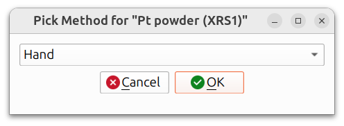
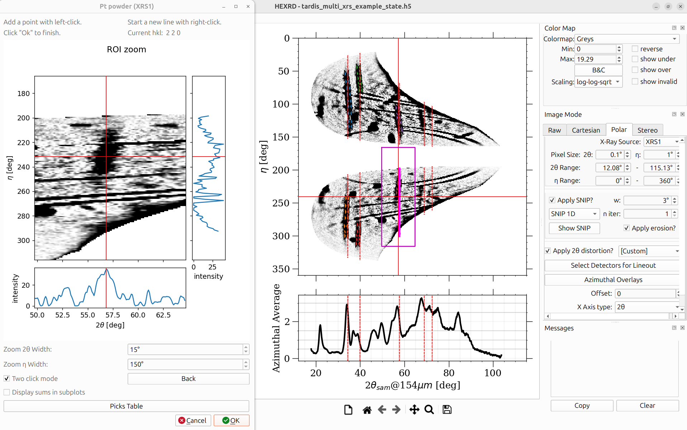
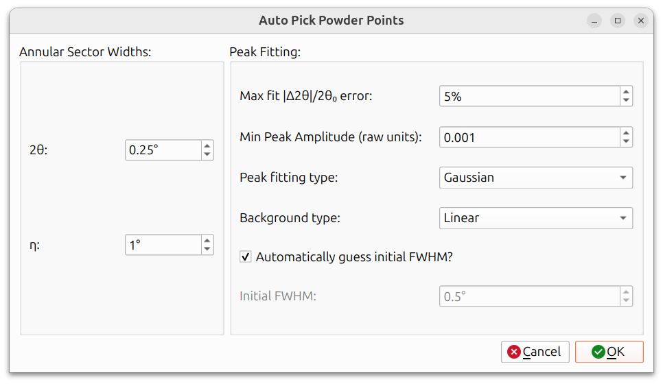
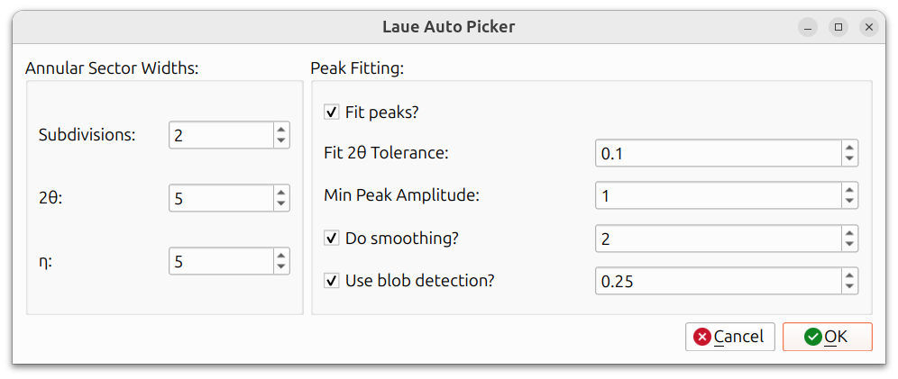
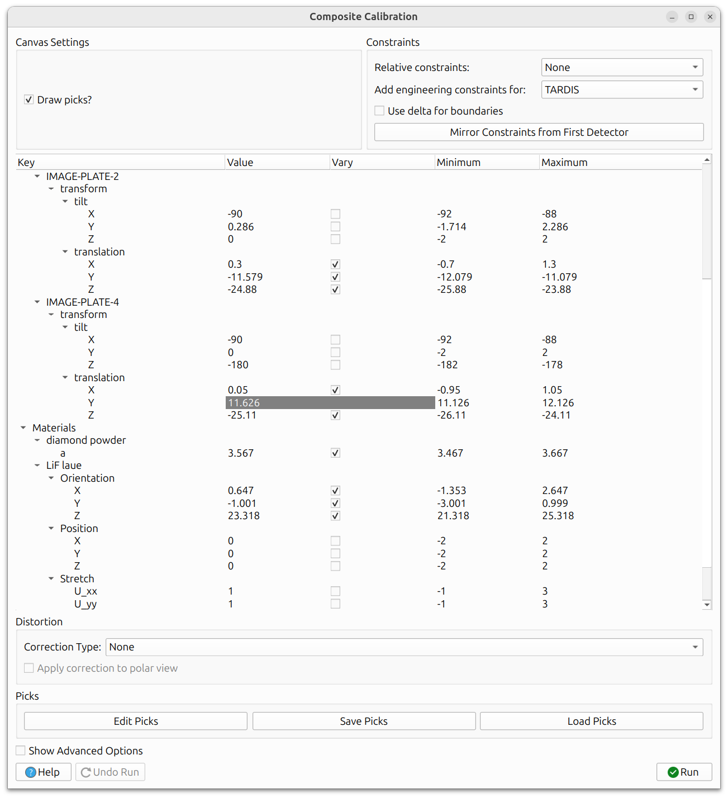

# Composite (Laue and Powder)

The Composite calibration workflow is the most flexible calibration option in
HEXRDGUI. Unlike [Fast Powder](fast_powder.md), which works with a single
powder overlay, Composite calibration supports **multiple powder and Laue
overlays simultaneously**. This makes it suitable for complex experimental
setups where both powder diffraction rings and single-crystal Laue spots
are present.

## Starting the Workflow

To begin, ensure that the overlays you want to use for calibration are
visible in the canvas. You can use any combination of:

- [Powder overlays](../configuration/overlays.md#powder-overlays) for
  Debye-Scherrer rings from known materials
- [Laue overlays](../configuration/overlays.md#laue-overlays) for
  single-crystal diffraction spots

Then navigate to `Run -> Calibration -> Composite (Laue and Powder)` from
the menu bar.

## Pick Methods

For each visible overlay, you must select how peaks/spots will be identified.
The pick method dialog presents options for each overlay independently.

The available pick methods are:

- **Previous**: Use picks from a previous session or state file. This option
  is enabled if picks already exist for this overlay (e.g., from a loaded
  state file or a prior calibration run in the current session).
- **Auto**: Automatically detect peaks/spots using an algorithm (see below
  for details on powder vs. Laue auto-picking).
- **Hand**: Manually pick points by clicking on the canvas.
- **Load**: Load previously saved picks from an HDF5 file.

### Hand Picking

If you choose to hand-pick points, a zoom box will appear, and a cursor
will be drawn at the location of your mouse pointer in the canvas.

A box is drawn in the canvas that outlines the region displayed in the
zoom box. By default, a "Two click mode" is enabled, where the main canvas
is left-clicked once to freeze the position of the zoom box, and then a
point in the zoom box is left-clicked for the point to be picked. This
results in more accurate point-picking, but can be disabled via the
"Two click mode" checkbox in the dialog.

Several other options are also available in the zoom box, including options
to modify the dimensions of the zoom box, and a `Back` button to remove
the most recently picked point. The zoom box also indicates in the labels
at the top which line or spot is being picked.

Composite hand picking highlights a specific HKL line/spot on a specific
detector. You pick points only for that particular HKL and detector combination.
When you right-click, it advances to the next entry, which may be the same HKL
on a different detector, or a different HKL on the same detector. The colors
of the cursors and points will change, indicating that a new line/spot is
being picked.

### Auto-Picking (Powder)

Auto-picking for powder overlays uses the same mechanism as
[Fast Powder](fast_powder.md#auto-picking). The data is projected into polar
format, and peaks are found within the specified 2&theta; range.

The dialog has two groups of parameters:

**Annular Sector Widths:**

- **2&theta;**: The width in 2&theta; around each simulated line to search
  for peaks. A larger value is more forgiving of misalignment but may pick
  up spurious peaks.
- **&eta;**: The angular width in &eta; for each pick. A narrower width
  produces more picks along the ring but may also produce more invalid picks.

**Peak Fitting:**

- **Max fit |&Delta;2&theta;|/2&theta;0 error**: Maximum
  allowed relative error between the fitted peak position and the expected
  position. Picks exceeding this threshold are discarded. Expressed as a
  percentage.
- **Min Peak Amplitude (raw units)**: Minimum peak amplitude for a pick to
  be accepted. This filters out picks on weak or noisy signal.
- **Peak fitting type**: The function used to fit each peak (e.g.,
  Gaussian).
- **Background type**: How the local background is estimated and subtracted
  before fitting (e.g., Linear).
- **Automatically guess initial FWHM?**: When checked, the initial FWHM
  for the peak fit is estimated automatically. When unchecked, the
  **Initial FWHM** field becomes editable so you can provide a manual
  starting value.

### Auto-Picking (Laue)

Auto-picking for Laue overlays searches for single-crystal diffraction spots
near the predicted locations.

The dialog has two groups of parameters:

**Annular Sector Widths:**

- **Subdivisions**: Number of pixel subdivisions for finer search
  resolution. Higher values search at sub-pixel positions around each
  predicted spot location.
- **2&theta;**: Search range in 2&theta; around each predicted spot.
- **&eta;**: Search range in &eta; around each predicted spot.

**Peak Fitting:**

- **Fit peaks?**: When checked, a peak shape is fitted to each detected
  spot for more precise centering. When unchecked, the raw intensity
  maximum is used.
- **Fit 2&theta; Tolerance**: Tolerance for the peak fitting step. Controls
  how far from the predicted position the fitted peak center is allowed
  to be.
- **Min Peak Amplitude**: Minimum spot intensity for a pick to be accepted.
  Spots below this threshold are discarded.
- **Do smoothing?**: When checked, smoothing is applied to the image data
  before peak detection. The value controls the smoothing sigma.
- **Use blob detection?**: When checked, spots are identified using a blob
  detection algorithm rather than simple intensity search. The value
  controls the blob detection threshold.

### Loading Picks

Previously saved picks can be loaded from an HDF5 file. This is useful when
you want to reuse picks from a previous calibration session without
re-picking. The picks in the HDF5 file are saved using cartesian coordinates
(XY coordinates on detectors), so that, unlike polar coordinates, changes
in instrument calibration parameters do not affect their location.

### Saving Picks

Picks can be exported to an HDF5 file from within the calibration dialog.
This allows you to save your picks for later reuse or sharing with
colleagues. The picks in the HDF5 file are saved using cartesian coordinates
(XY coordinates on detectors), so that, unlike polar coordinates, changes
in instrument calibration parameters do not affect their location.

### Multiple X-Ray Sources

For instruments with multiple X-ray sources (such as some TARDIS datasets),
the picking workflow handles source switching automatically. When picking is
in progress and the workflow moves to overlays associated with a different
X-ray source, the polar view automatically switches to show the projection
for that source. You do not need to manually change the view.

## Calibration Dialog

After picks are obtained for all overlays, the calibration dialog appears.

At the top of the dialog are several controls:

- **Canvas Settings**: The "Draw picks?" checkbox toggles whether the
  picked points are drawn on the main canvas.
- **Constraints**: Options for
  [relative constraints](general_calibration.md#relative-constraints),
  [engineering constraints](general_calibration.md#engineering-constraints),
  [delta boundaries](general_calibration.md#delta-boundaries), and
  [mirror constraints](general_calibration.md#mirror-constraints-from-first-detector).

The main area contains a tree view with all refinable parameters. Each
parameter has columns for **Value**, **Vary** (checkbox to mark it for
refinement), **Minimum**, and **Maximum** bounds.

The tree view is organized into sections:

- **Beam parameters**: Beam energy and beam vector components.
- **Oscillation stage**: Chi parameter and translation for the sample stage.
- **Engineering constraints**: Instrument-specific parameters such as the
  distance between image plates (for TARDIS).
- **Detector parameters** (e.g., IMAGE-PLATE-2, IMAGE-PLATE-4): Each
  detector has tilt (X, Y, Z) and translation (X, Y, Z) parameters.
- **Materials**: For powder overlays (e.g., "diamond powder"), the lattice
  parameters are refinable. For Laue overlays (e.g., "LiF laue"),
  the crystal parameters are refinable:
    - **Orientation** (X, Y, Z): The crystal orientation as exponential
      map parameters.
    - **Position** (X, Y, Z): The crystal position in the sample frame.
    - **Stretch** (U_xx, U_yy, ...): The crystal's stretch tensor, which
      encodes lattice strain.

This makes Composite calibration powerful for simultaneously refining
instrument geometry, powder lattice parameters, and single-crystal
parameters.

Below the tree view:

- **Distortion**: Pinhole distortion correction settings (Correction Type
  and whether to apply the correction to the polar view). Relevant for
  instruments like TARDIS and PXRDIP that have a pinhole in the experiment.
- **Picks**: Buttons to **Edit Picks** (modify or re-pick individual
  points), **Save Picks** (export to HDF5), and **Load Picks** (import
  from HDF5).
- **Show Advanced Options**: Reveals additional optimizer settings. See
  [Advanced Options](general_calibration.md#advanced-options) for details.
- **Run** and **Undo Run** buttons at the bottom.

## Run and Undo

Click **Run** to execute the calibration. The optimizer refines all
parameters marked with "Vary" to minimize the residual between picked
and simulated peak/spot positions. Use **Undo Run** to revert if the
results are not satisfactory.

As with other calibration workflows, an iterative approach works best:
refine a few parameters at a time, inspect results, and add more
parameters in subsequent runs.

When you are satisfied, close the dialog to finish the workflow.
It's then best to save a state file to ensure progress won't be lost.

## Example

An example of using the composite calibration workflow can be seen in
the FIDDLE tutorial shown below:

<iframe width="1008" height="567" src="https://www.youtube.com/embed/kdljExGlQOA?start=1008" title="YouTube video player" frameborder="0" allow="accelerometer; autoplay; clipboard-write; encrypted-media; gyroscope; picture-in-picture; web-share" allowfullscreen></iframe>
