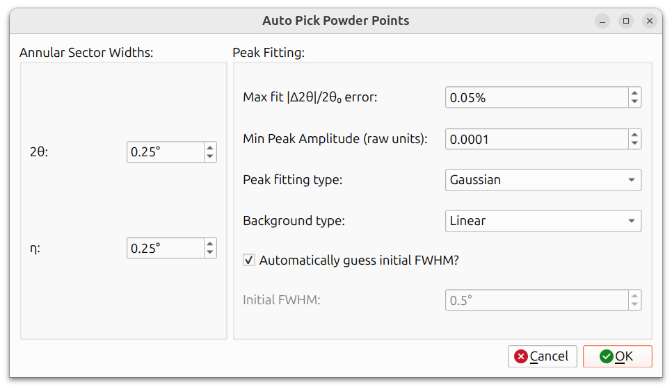
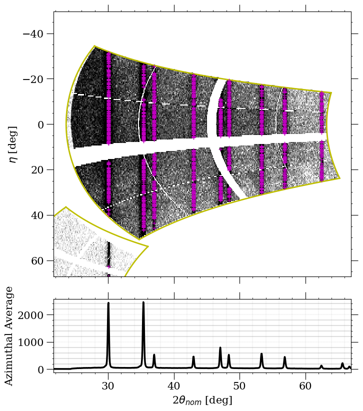
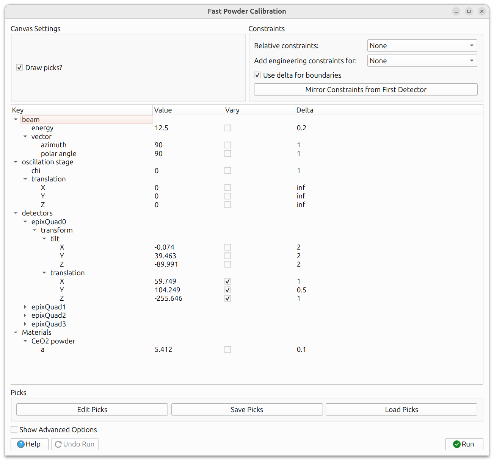

# Fast Powder

Fast Powder calibration is the quickest way to calibrate your instrument
against a known powder standard. It works with a single
[powder overlay](../configuration/overlays.md#powder-overlays) and can refine
both instrument parameters and the material's lattice parameters.

The key requirement is that the simulated powder lines must already be
**relatively close** to the observed Debye-Scherrer rings in the data, since
the fast powder calibration workflow always performs automatic point-picking.
If they are far off, you may need to manually adjust detector positions using
the [slider view](../configuration/instrument.md#slider-view) first, or use
[Composite calibration](composite_laue_and_powder.md) (which allows manual
hand-picking), or [Structureless calibration](structureless.md) instead.

## Starting the Workflow

To begin, ensure that a powder overlay corresponding to the correct material is
visible and roughly aligned with the data.

Then navigate to `Run -> Calibration -> Fast Powder` from the menu bar.

## Auto-Picking

Fast Powder calibration uses an automatic peak-picking algorithm to locate
the observed powder line positions. The auto-picker works by projecting
image data into a polar format (where Debye-Scherrer rings become horizontal
straight lines) and then finding peak intensity positions within a
user-specified 2&theta; range. Different types of peak fitting methods are
also available.

The dialog is divided into two sections:

**Annular Sector Widths:**

- **2&theta;**: The range in 2&theta; around each simulated line to search
  for peaks. A larger value is more forgiving of misalignment but may pick
  up spurious peaks.
- **&eta;**: The angular width in &eta; for each pick. A narrower width
  produces more picks along the ring but may also produce more invalid
  picks.

**Peak Fitting:**

- **Max Fit |&Delta;2&theta;|/2&theta;&#8320; error**: Picks with a fit
  error above this threshold are discarded. Lower values are more strict
  about peak quality.
- **Min Peak Amplitude (raw units)**: Picks with a peak amplitude below
  this threshold are discarded. This filters out picks on weak or noisy
  signal.
- **Peak fitting type**: The function used to fit each peak (e.g.,
  Gaussian, Lorentzian). This affects how precisely the peak center is
  determined.
- **Background type**: How the local background is estimated and subtracted
  before fitting (e.g., linear, constant).
- **Automatically guess initial FWHM?**: When checked, the initial FWHM
  is estimated automatically and the Initial FWHM field is disabled. When
  unchecked, you can specify the initial guess manually.
- **Initial FWHM**: The initial guess for the full width at half maximum of
  the peak. Only active when "Automatically guess initial FWHM?" is
  unchecked. Should be set approximately to the width of the peaks in your
  data.

## Pick Preview

After auto-picking completes, the picks are displayed on the main canvas.
You can view them in any of the available
[view modes](../views.md), including raw, Cartesian, polar, and stereographic.

The above image shows a single detector zoomed in on the polar view,
where the picks are displayed as purple plus symbols. The polar view is
particularly useful here because the powder lines appear as horizontal
straight lines, making it easy to see whether the picks are landing on
the actual data.

## Adjusting Pick Quality

Not all automatically picked points will be valid. Some may land on noise,
detector artifacts, or overlapping lines. The **Max Fit error** and
**Min Peak Amplitude** settings in the auto-pick dialog (described above)
help filter these out.

You can also adjust the **&eta;** width to control the density of picks
along each ring. A narrower &eta; width produces more picks, giving the
optimizer more data to work with, but it also increases the chance of
invalid picks. Finding the right balance depends on your data quality.

If the picks need adjustment, you can re-run the auto-picker with
different settings by navigating to `Run -> Calibration -> Fast Powder`
again.

## Refinement

The calibration dialog presents a tree view of all refinable parameters,
including instrument parameters (detector tilts, translations, beam energy,
etc.) and material lattice parameters.

Use the "Vary" checkbox to select which parameters to refine. The same
iterative strategy applies here as with other calibrations: start with a
few parameters, run, then add more. See
[General Calibration Information](general_calibration.md) for detailed
guidance on calibration strategy, constraints, delta boundaries, and
advanced options.

The residual being minimized is the distance between the auto-picked peak
positions and the simulated powder line positions.

## Running and Undoing

Click the **Run** button to execute the calibration. The refined parameters
will be applied, and you should see the simulated lines shift to better match
the data. If the result is not satisfactory, click **Undo Run** to revert
to the previous state. A full undo stack is maintained, so you can undo
multiple runs.

When you are satisfied with the calibration results, close the dialog to
finish the workflow.
