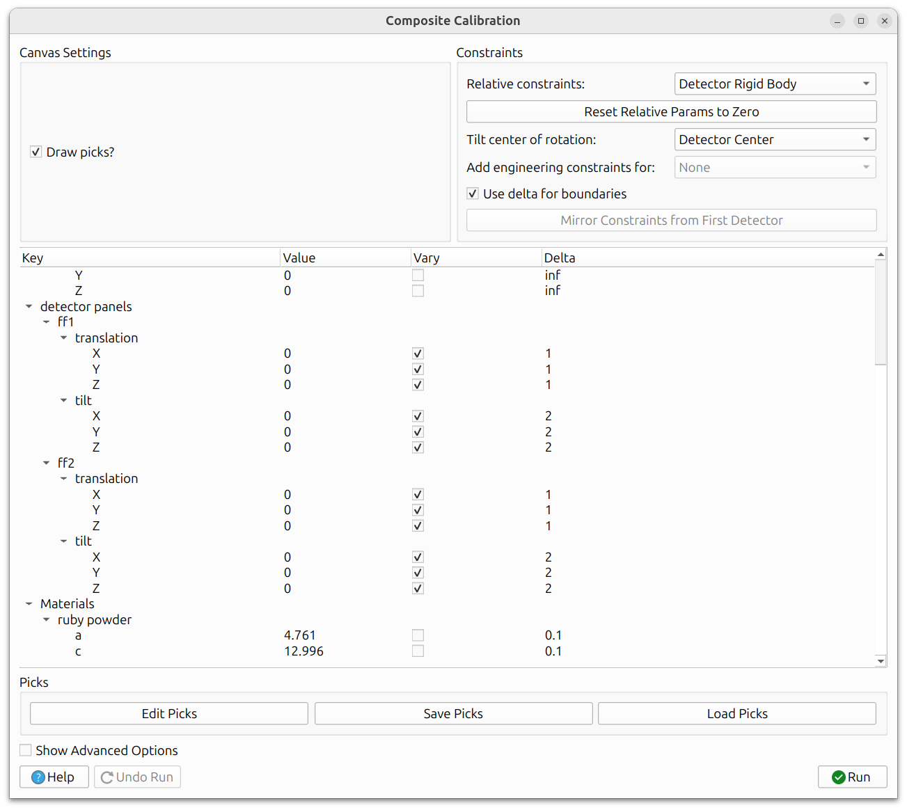
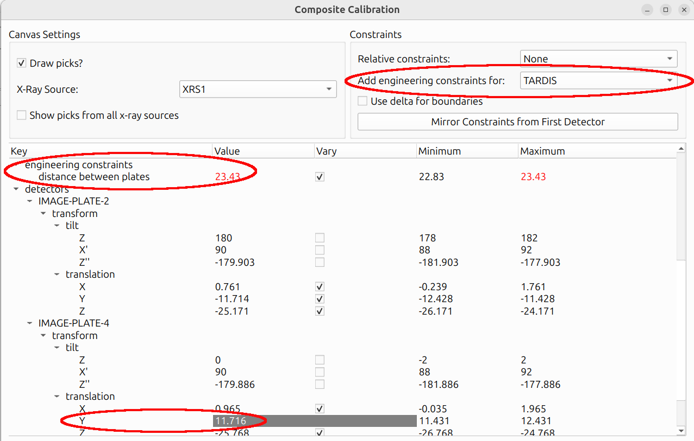
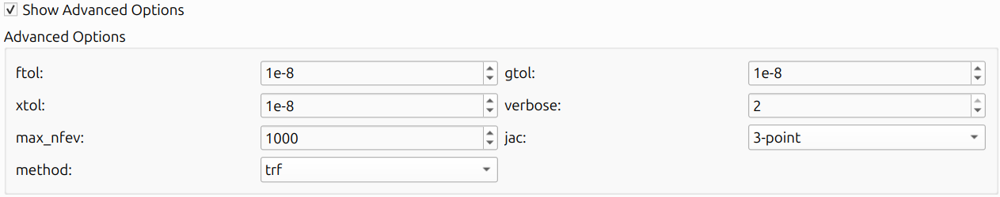

# General Calibration Information

Calibration in HEXRDGUI works by reducing the residual between observed and
simulated data. This is done by refining instrument and/or material parameters
using a least-squares optimization. The key principle is simple: **only refine
parameters that are uncertain**. If you know a parameter precisely (for example,
a beam energy measured independently), there is no reason to refine it, and
doing so can lead to unphysical results.

This page covers concepts and options that are shared across the various
calibration workflows ([Fast Powder](fast_powder.md),
[Composite Laue and Powder](composite_laue_and_powder.md),
[Structureless](structureless.md), and
[Rotation Series](rotation_series.md)).

## Calibration Strategy Tips

A successful calibration usually requires a deliberate, iterative approach
rather than refining everything at once. Here are some tips:

- **Refine a few parameters at a time.** Start with the most uncertain
  parameters (often detector translations), run the calibration, then add
  more parameters in subsequent runs. Refining all parameters simultaneously
  can cause the optimizer to get stuck in a local minimum or produce
  unphysical results.
- **Know which parameters are fixed vs. uncertain.** For example, beam energy
  may be well-known from independent measurement, but detector distances
  might only be approximate. Focus refinement effort on the uncertain
  parameters.
- **Use a logical order.** A common approach is:
    1. Detector translations (especially distance)
    2. Detector tilts
    3. Beam energy and/or beam vector (if uncertain)
    4. Material lattice parameters (if applicable)
- **Inspect results after each run.** The calibration dialog stays open after
  clicking "Run", so you can adjust refinement settings and run again. Use
  "Undo Run" if a run produces poor results.

## Relative Constraints

Relative constraints allow you to move individual subpanels or groups of detectors
together while preserving their relative positions and orientations. These are
particularly useful for multi-panel instruments where the relative alignment
between panels is known precisely.

The example above shows two Dexela detectors with the relative
constraint set to "Detector Rigid Body". Although HEXRD treats the
subpanels separately (each Dexela detector has four subpanels) to
account for misalignment between them, this setting locks the
relative tilts and translations between subpanels so that the
entire Dexela detector moves and tilts as a unit. The "Tilt center
of rotation" defines the center of rotation for tilt angle changes.

When relative constraints are used ("Instrument Rigid Body" or
"Detector Rigid Body"), the rigid body tilts and translations are
initialized to zero to track adjustments applied to the group as a
whole. They can be reset to zero at any time by clicking "Reset
Relative Params to Zero". Nonzero values represent adjustments
applied uniformly to each subpanel - for example, a translation of
5 shifts every subpanel by 5 along that axis, and a tilt rotates
every subpanel by that amount about the specified "Tilt center of
rotation".

### Detector Rigid Body

When enabled, the detector rigid body constraint keeps the relative tilts
and translations between subpanels within a detector group fixed. Instead of
refining each subpanel independently, the entire group moves as a single rigid
body. This is especially useful for Dexela detectors where the subpanel
misalignment has already been characterized, so you want to preserve that known
misalignment while adjusting the overall detector position.

### Instrument Rigid Body

The instrument rigid body constraint goes a step further: it keeps the
relative positions of *all* detectors fixed and moves the entire instrument
as one unit. This is useful in experimental setups like FIDDLE, where the
relative detector positions are known very precisely from a prior calibration
or metrology, but the overall instrument position relative to the sample may
be uncertain.

### Tilt Center of Rotation

When applying rigid body rotations, the center of rotation can be configured.
The available options are:

- **Detector Center**: Rotate about the center of the detector group.
  This is the most common choice.
- **Mean Instrument Center**: Rotate about the mean position of all
  detectors in the instrument. Useful when the instrument has multiple
  detectors arranged symmetrically.
- **Lab Origin**: Rotate about the laboratory coordinate system origin.
  This is appropriate when the sample position is well-known and the
  detectors need to rotate about it.

## Engineering Constraints

Some instruments have physical constraints that should be enforced during
calibration. Engineering constraints encode these instrument-specific
relationships.

For example, the TARDIS instrument has two image plates at a known distance
from each other. An engineering constraint can bound this distance to a
physically reasonable range, preventing the calibration from moving the
plates to an impossible configuration. The Y value of one image plate is
grayed out because it introduces no additional degree of freedom - it is
derived from the other plate's Y value and the distance between the plates.

When engineering constraints are available for the current instrument, they
appear as additional options in the calibration dialog.

The parameter tree in each calibration dialog contains the following
sections (shared across Fast Powder, Composite, and Rotation Series):

- **Beam**: energy and beam vector (azimuth, polar angle)
- **Oscillation stage**: chi and sample translation
- **Detectors**: tilts and translations for each detector/subpanel
- **Materials**: parameters that depend on the calibration type.
  Powder calibration allows lattice parameter refinement, while Laue
  and rotation series calibration allow crystal parameter refinement
  (crystal orientation, position, and stretch matrix).

Structureless calibration is slightly different: picks are placed on
abstract lines labeled "DS_ring" rather than on specific material
overlays.

## Delta Boundaries

By default, refinable parameters can have explicit minimum and maximum bounds.
Delta boundaries provide an alternative: instead of specifying absolute min/max
values, you specify a **delta** (±) around the current value. This is often
more intuitive. For example, "allow this translation to vary by ±5 mm from
its current position."

When delta boundaries are enabled (via "Use delta for boundaries" in the
Constraints panel, visible in the
[Relative Constraints image above](#relative-constraints)), the "Minimum"
and "Maximum" columns in the parameter tree view are replaced with a single
"Delta" column. The actual bounds used during refinement are computed as
`[current_value - delta, current_value + delta]`.

## Mirror Constraints from First Detector

When working with multi-detector instruments, it is common to want all
detectors to have the same refinement settings (which parameters vary, and
what their delta values are). The "Mirror Constraints from First Detector"
option copies the vary status and delta values from the first detector to all
other detectors. This saves time and ensures uniform refinement across the
instrument.

## Slider View

The [slider view](../configuration/instrument.md#slider-view) in the
instrument configuration panel provides interactive sliders for manually
adjusting detector positions and tilts. This can be useful for roughly
aligning detectors before running a calibration, getting the starting
position close enough for the optimizer to converge.

### Lock Relative Transformations

When the "Lock Relative Transformations" checkbox is enabled in the slider
view, moving one detector's slider will move all other detectors by the same
amount, preserving their relative positions. This is similar in spirit to the
rigid body constraints used during calibration, but applied to manual
adjustments.

### Group Rigid Body / Instrument Rigid Body

These options control the scope of the locked transformations:

- **Group Rigid Body**: Only detectors within the same group (e.g.,
  subpanels of the same Dexela panel) move together.
- **Instrument Rigid Body**: All detectors in the instrument move together.

## Multiple X-Ray Sources

For instruments configured with multiple X-ray sources (such as some
TARDIS datasets), the calibration dialog provides additional controls
for working with the different beams.

As shown in the [Engineering Constraints image above](#engineering-constraints),
a dropdown in the calibration dialog allows you to switch between X-ray
sources. A "Show picks from all x-ray sources" checkbox controls whether
picks from all sources are displayed simultaneously. This makes it easier
to focus on the picks for one source at a time without visual clutter.

See also the [Switching Between X-Ray Sources](../views.md#switching-between-x-ray-sources)
section in the Views documentation for how to switch source projections in
the polar view outside of calibration.

## Advanced Options

The calibration dialogs include advanced options that control the behavior
of the underlying least-squares optimizer. These can be revealed by checking
"Show Advanced Options" in the calibration dialog.

The available options are:

- **ftol**: Relative tolerance for the cost function. The optimization stops
  when the change in the cost function between iterations is smaller than this
  value.
- **xtol**: Relative tolerance for the parameter values. The optimization
  stops when the change in parameters is smaller than this value.
- **gtol**: Tolerance for the gradient. The optimization stops when the
  maximum component of the gradient is smaller than this value.
- **verbose**: Controls the amount of output printed to the console during
  optimization. Higher values produce more output, which can be useful for
  debugging convergence issues.
- **max_nfev**: Maximum number of function evaluations. If the optimization
  has not converged after this many evaluations, it stops.
- **method**: The optimization method to use (e.g., `trf`, `dogbox`,
  `lm`). The default is typically appropriate, but advanced users may want
  to experiment with alternatives.
- **jac**: The method for computing the Jacobian matrix (`2-point`,
  `3-point`, or `cs`). The default is usually fine.

Hover your mouse over each option in the dialog for a brief description.

## Help Button

Throughout HEXRDGUI, dialogs include a "Help" button that opens
documentation specific to the current dialog.
