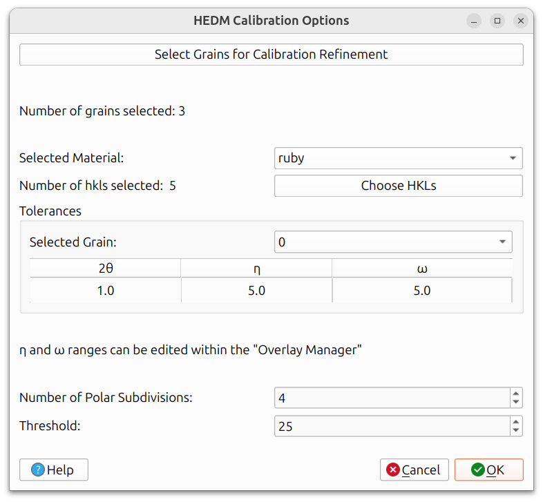
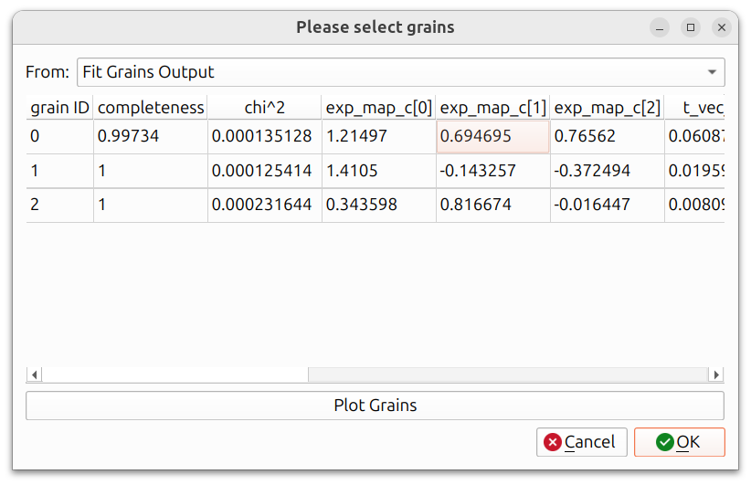
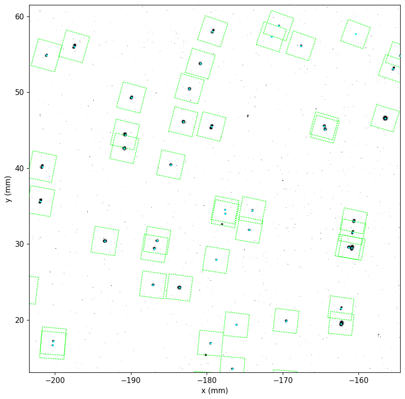
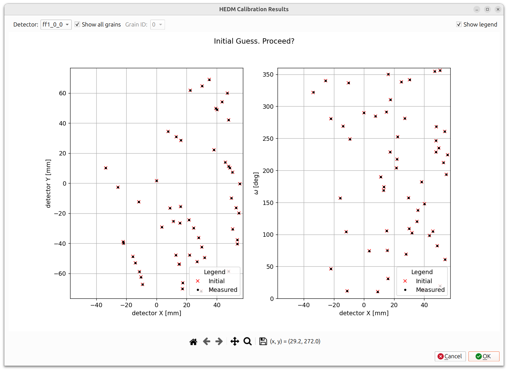
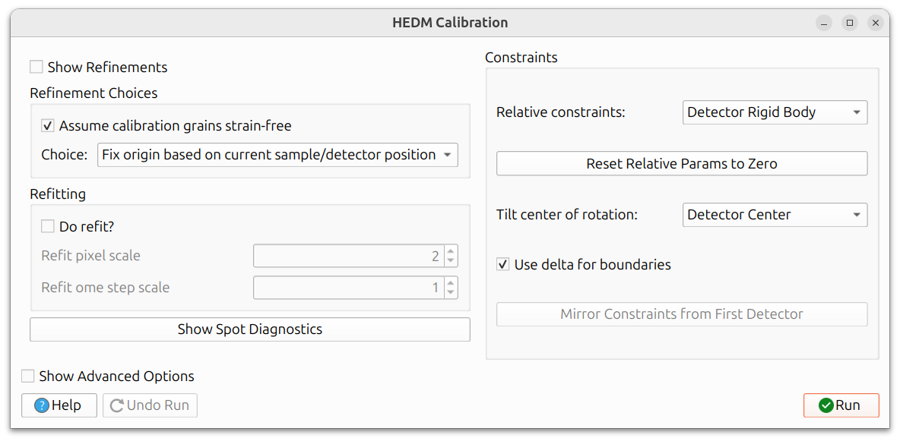
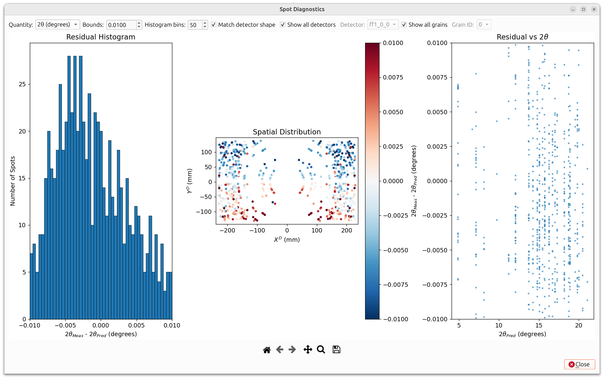
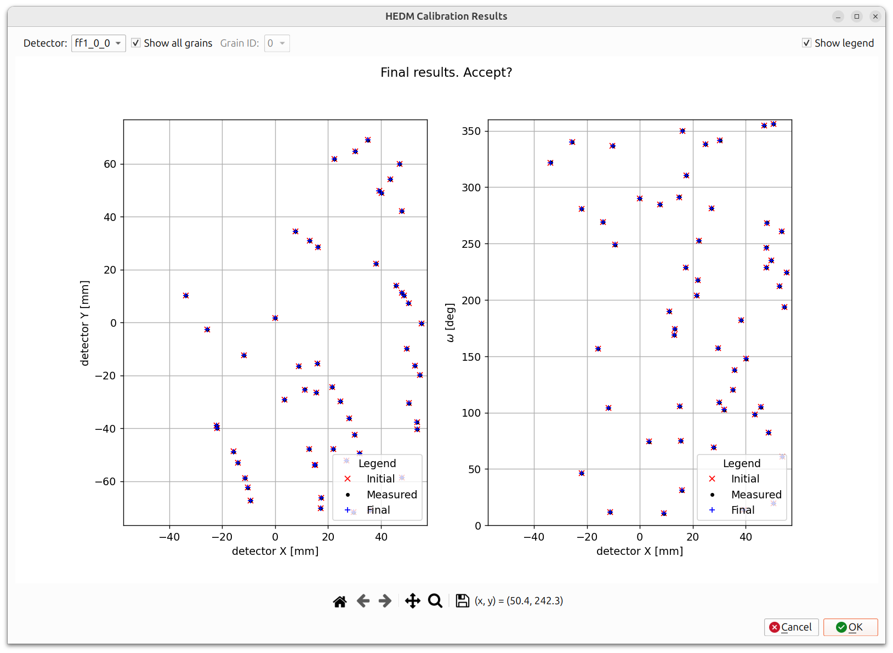

# Rotation Series (ff-HEDM)

Rotation Series calibration is designed for refining detector positions
and grain parameters using far-field HEDM (High Energy Diffraction
Microscopy) data. It works in three main steps:

1. **Configure**: Select grains and set Pull Spots options.
2. **Pull Spots**: Measure actual diffraction spot locations from the
   rotation series data.
3. **Calibration**: Refine parameters in the calibration dialog to
   minimize the residual between measured and predicted spot positions.

## Prerequisites

Before running Rotation Series calibration, you must have:

1. Loaded rotation series image data (see
   [Rotation Series Data](../workflows/hedm/indexing.md#rotation-series-data)).
2. Completed [HEDM indexing](../workflows/hedm/indexing.md) and
   [Fit Grains](../workflows/hedm/fit_grains.md) (a grains table must exist from
   these steps), or a `grains.out` file containing a pre-determined
   grains table.
3. The instrument configuration should be reasonably close to correct
   already (can be off by the eta, tth, and omega tolerances specified).
   This is necessary for Pull Spots to be able to correctly
   pair spots in the data with grains and their HKLs. You can visually
   inspect the data in the different views with the rotation series
   overlay displayed (see the [Selecting Grains](#selecting-grains)
   section for generating these) to determine if the actual spot data lies
   within the rotation series bounding boxes.

Navigate to `Run -> Calibration -> Rotation Series (ff-HEDM)` from the
menu bar to begin.

## Step 1: HEDM Calibration Options

The first dialog configures the Pull Spots options, which control
how measured spot locations are extracted from the rotation series data
and paired with specific grains and HKLs.

### Selecting Grains

Click "Select Grains for Calibration Refinement" to choose which grains
from the grains table will be used. You do not need to use all grains;
oftentimes one well-characterized grain is sufficient, but multiple
grains can optionally be used.

The "From" dropdown provides several sources for loading grains: "HEDM
Calibration Output" (a previous calibration in the current session),
"Fit Grains Output" (a previous fit-grains run in the current session),
"Find Orientations Output" (a previous find-orientations run in the
current session), or "File", where they are loaded from a grains.out
file.

After clicking OK, rotation series overlays are automatically created
for the selected grains. You can inspect these overlays in the main
canvas to verify that the predicted spot positions look reasonable.

**Important:** Check that the 2&theta; and &eta; widths of the rotation
series overlays surround most of the observed spots. These tolerances
determine which spots will be included when Pull Spots runs. If the
tolerances are too narrow, spots will be missed; if too wide, noise or
neighboring spots may be included.

The above image shows a zoomed in region of the Cartesian view, where
the image data was aggregated over all omega frames using "Maximum"
aggregation. It includes the data (black spots in the background),
the rotation series overlays (cyan dots on top of the spot data), and
green rectangles (bounding boxes for the eta and two theta widths).

### Pull Spots Options

Once you are satisfied that the overlays cover the relevant spots,
proceed to check the remaining options. These settings control how
spot data is pulled from the image data and paired with specific
grains and HKLs.

- **Selected Material**: The material to use for calibration.
- **Choose HKLs**: Select which HKL reflections to include.
- **Tolerances**: The 2&theta;, &eta;, and &omega; widths that define
  the search windows around each predicted spot. These can be set per
  grain. The &eta; and &omega; ranges can also be edited within the
  Overlay Manager.
- **Number of Polar Subdivisions**: Controls the angular resolution
  when extracting spot intensities.
- **Threshold**: The minimum intensity threshold for including a spot.

## Step 2: Pull Spots

Once you are satisfied with all Pull Spots options, click OK to run
Pull Spots. This extracts the measured spot locations from the rotation
series image data by searching within the tolerance windows defined by
the overlays.

This step may take some time depending on the size of the dataset and
the number of grains selected.

### HEDM Calibration Results Dialog

After Pull Spots completes, a results dialog appears showing the
measured spot positions (black dots) overlaid with the initial predicted
positions (red x's). Two plots are shown: the left plot shows detector
X vs. detector Y positions, and the right plot shows detector X vs.
&omega; positions. You can filter by detector and grain ID using the
dropdowns at the top.

Inspect this carefully:

- If the measured and predicted positions align well, click **OK** to
  proceed to the calibration dialog.
- If they do not look good, click **Cancel** and go back to adjust your
  tolerances, grain selection, or other parameters before trying again.

## Step 3: Calibration Dialog

After accepting the pull spots results, the calibration dialog appears.

### Refinement Choices

The "Refinement Choices" section at the top of the dialog provides
options for how the calibration handles the origin and strain:

- **Assume calibration grains strain-free**: When checked, sets all
  calibration grains' stretch tensors to identity and holds them fixed
  during refinement.
- **Fix origin based on current sample/detector position**: Holds
  detectors fixed along the Y axis during refinement.
- **Reset origin to grain centroid position**: Sets the first calibration
  grain's centroid to [0,0,0] and holds it fixed during refinement.
- **Reset Y axis origin to grain's Y position**: Sets the first
  calibration grain's Y position to zero and holds it fixed in Y during
  refinement.
- **Custom refinement parameters**: Uses the current parameter refinement
  choices as-is. **Warning**: incompatible choices can be made without
  proper consideration of the system's degrees of freedom.

The parameter tree view is hidden by default; check "Show Refinements"
to reveal it. As the "Refinement Choices" setting is changed, you can
view which parameters are automatically modified in the tree view.

Manually modifying which parameters are marked for refinement will
automatically switch the choice to "Custom refinement parameters".
This is only recommended for advanced users.

### Refitting

The "Refitting" section controls whether a second refinement pass is
performed after filtering out outlier reflections:

- **Do refit?**: When checked, the grain and instrument parameters are
  first refined, then reflections too far from predicted values are
  filtered out, and the parameters are refined again. When unchecked,
  only a single refinement pass is performed.
- **Refit pixel scale**: The maximum distance (in pixels) in x or y
  before a reflection is filtered out during the refit step.
- **Refit ome step scale**: The maximum distance in omega steps before
  a reflection is filtered out. For example, if the omega step size is
  0.25 degrees and this value is 2, reflections more than 0.5 degrees
  away in omega are filtered.

### Spot Diagnostics

The "Show Spot Diagnostics" button opens a dialog for visualizing the
residuals between predicted and measured spot positions. This is useful
for evaluating calibration quality and identifying problematic spots or
detectors.

The dialog displays three plots:

- **Residual Histogram** (left): A histogram of the residuals
  (measured - predicted) for the selected quantity. This gives an
  overall view of the residual distribution. A well-calibrated
  instrument should show a narrow, symmetric distribution centered
  near zero.
- **Spatial Distribution** (center): A scatter plot showing the
  residuals at each spot's position on the detector, color-coded by
  residual magnitude (using a red-blue colormap). This helps identify
  whether residuals are spatially correlated, which could indicate
  systematic detector misalignment.
- **Residual vs Predicted Value** (right): A scatter plot of residuals
  versus the predicted value of the selected quantity. This helps
  reveal trends, such as residuals that grow at higher 2&theta; angles.

The following controls are available along the top of the dialog:

- **Quantity**: The quantity to analyze. Options include 2&theta;,
  &eta;, &omega;, X, and Y. Each has different default bounds.
- **Bounds**: The symmetric range for the histogram and color scale.
  Adjusting this focuses the view on residuals within the specified
  range.
- **Histogram bins**: The number of bins in the residual histogram.
- **Match detector shape**: When checked, the spatial distribution
  plot is scaled to match the physical detector dimensions.
- **Show all detectors / Detector**: Filter by a specific detector or
  show all detectors combined.
- **Show all grains / Grain ID**: Filter by a specific grain or show
  all grains combined.

If the Spot Diagnostics dialog is open during calibration, it
automatically updates after each calibration run, so you can observe
how the residuals change as parameters are refined.

This dialog is also available from the
[Fit Grains Results](../workflows/hedm/fit_grains.md#spot-diagnostics)
dialog, where it can be used to evaluate spot quality before
calibration.

### Refinable Parameters

When "Show Refinements" is checked, the tree view includes:

- **Instrument parameters**: Detector tilts, translations, beam energy,
  beam vector, etc.
- **Grain parameters** (per grain):
    - **Orientation**: parameters describing the crystal orientation.
    - **Position**: The grain's position in the sample frame.
    - **Stretch Matrix**: The symmetric stretch tensor, encoding lattice
      strain.

See [General Calibration Information](general_calibration.md) for details
on constraints, delta boundaries, and advanced optimizer options.

## Running and Undoing

Click **Run** to execute the calibration. Parameters marked with "Vary"
will be refined to minimize the residual between measured and predicted
spot locations. Click **Undo Run** to revert if needed. A full undo stack
is maintained.

After running, a results dialog appears showing the initial predicted
positions (red x's), measured positions (black dots), and final predicted
positions after calibration (blue +'s). If the calibration improved the
fit, the blue markers should be closer to the black dots than the red
markers are.

As with other calibrations, an iterative approach is recommended. Use the
refinement choices as a starting point, run, inspect results, then adjust
as needed.

When you are satisfied with the results, close the dialog to finish.
