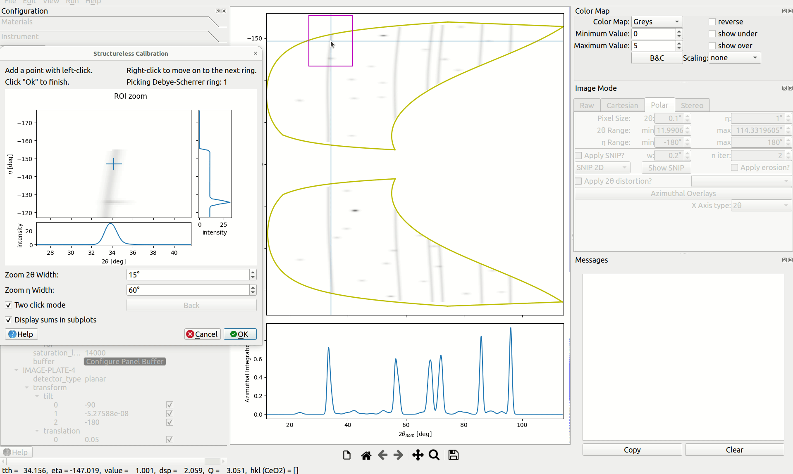

# Structureless

<iframe width="1008" height="567" src="https://www.youtube.com/embed/1897xY_4WSk" title="YouTube video player" frameborder="0" allow="accelerometer; autoplay; clipboard-write; encrypted-media; gyroscope; picture-in-picture; web-share" allowfullscreen></iframe>

If your image data contains powder diffraction (Debye-Scherrer) lines, but you
do not know what material caused them, or you do not have time to figure it
out, then you may need to use "structureless calibration" to calibrate your
instrument!

Structureless calibration is designed for calibrating the instrument to a
dataset where Debye-Scherrer lines are present, but the material is unknown.
Typically, points will be picked along each Debye-Scherrer ring,
instrument refinement options will be selected, and then the calibration will
be performed. During the calibration, a least-squares fit is performed,
and refinable parameters are modified, so that the picked points
will line up as vertical lines.

The example presented here is available in the example state files [here](https://github.com/HEXRD/examples/tree/master/state_examples/TARDIS_simulated).
Feel free to download the `tardis_simulated_structureless_calibration.h5`
file, load it into the GUI, and follow along.

## Pick methods

To begin, navigate to the polar view, then select from the menu bar at the
top `Run->Calibration->Structureless`. The following dialog will appear.

* Previous - if you have loaded a state file where structureless calibration
was performed, or you have previously performed structureless calibration in
the current session, this option will be enabled. If selected, clicking
"OK" will immediately proceed to the structureless calibration dialog.
* Hand - hand-pick points for the calibration
* Load - load hand-picked points from a structureless calibration HDF5 file
(the points are saved in Cartesian coordinates on the detector plates)

## Hand Picking

If you choose to hand-pick points to be used in the structureless calibration,
a zoom box will appear, and a cursor will be drawn at the location of your
mouse pointer in the canvas, as follows:

These are present to assist with point-picking.
A box is drawn in the polar canvas that outlines the region displayed in
the zoom box. By default, a "Two click mode" is enabled, where the main canvas
is left-clicked once in order to freeze the position of the zoom box, and then
a point in the zoom box is left-clicked for the point to be picked. This results
in more accurate point-picking, but can be disabled via the "Two click mode"
checkbox in the dialog. Here is an example of using the "Two click mode":

Several other options are also available in the zoom box, including options to
modify the dimensions of the zoom box, and a `Back` button to remove the most
recently picked point. The zoom box also indicates in the labels at the top
which Debye-Scherrer ring is being picked.

Points should be picked across all detectors for the first Debye-Scherrer line.
After point-picking for the first Debye-Scherrer line is complete, a single
right-click on the canvas moves on to the next line. Note that the text at the
top of the zoom box dialog will indicate that Debye-Scherrer ring `2` is now
being picked, and the colors of the cursors and the points will change,
indicating that a new line is being picked.

Once points have been picked for all Debye-Scherrer rings, click "OK" to end
point picking. Your points should look something like the following:

## Structureless Calibration Dialog

After points have been picked, the structureless calibration dialog will
appear.

This contains many options, including the following:

* `Draw picks?`: the ability to show/hide the picked points in the main canvas
* `Constraints`: the ability to add engineering constraints for specific instruments.
For example, for TARDIS, the distance between image plates is limited to a specified
range.
* `Pinhole Distortion`: pinhole distortion options are present if needed (for
examples such as TARDIS or PXRDIP, where a pinhole is present in the experiment).
These settings will be taken into account during the calibration. If selected, the
polar view may also be distorted using the pinhole correction settings. Points are
still editable even with the polar view distorted, but hand-picking a point in
distorted coordinates is less accurate since some precision is lost converting
it back to undistorted coordinates. If the polar view is distorted using the
pinhole settings, then after finishing the structureless calibration, these settings
will still be saved in a "[Custom]" option next to the "Apply two theta distortion?"
checkbox in the polar view. These pinhole settings get saved to state files as well.
* `Picks`: picks may be [edited](#editing-picks), saved, or a whole different
set of picks may be loaded. Picks are saved using Cartesian coordinates on the
detector plates.
* `Show Advanced Options`: if checked, additional options used in the
calibration will be displayed. Hover your mouse over them for more details.
* Finally, in the middle you can see the [tree view](#tree-view)

### Editing Picks

If you discover that some picks were not picked very well, or you wish to make
additional picks, click the `Edit Picks` button. A dialog will appear as follows:

You may select picks and press the "Delete" key to delete them. You may manually
modify the pick coordinates. If you right-click a pick, you also have the option
to re-pick it with the hand picking tool.

### Tree view

The tree view enables various instrument settings to be modified, marked as
refinable (via the `Vary` column), or limited via the `Minimum` and `Maximum`
settings (if refinable).

For certain instruments, such as TARDIS, engineering constraints may be
present as well. For TARDIS, there is an extra parameter indicating the
distance between the image plates.

At the bottom, the means for the Debye-Scherrer rings may be found:

These are present so that the mean of the lines can be moved as well
in order to optimize the calibration.

Oftentimes, you do not want to mark all parameters as refinable at once,
but should refine different parameters in different "Runs". For instance,
you may want to start by making only detector translations refinable, and
then after refining them, make the detector tilts refinable as well.
The dialog does not disappear after the "Run" button is clicked, so after
a calibration is performed, the settings may be modified a little bit,
and then "Run" clicked again.

## Running the calibration

When you are satisfied with your picks and your settings in the dialog,
click the "Run" button in order to run the calibration. Parameters that
are marked as refinable will be modified, and the points should align
more vertically. If there are any issues with the calibration, click the
"Undo Run" button to undo the changes. See the following as an example:

Oftentimes, you will want to mark some parameters as refinable, run the
calibration, then mark different parameters as refinable, run the calibration
again, and keep repeating until you obtain satisfactory results. A full "undo"
stack is kept so that "Undo Run" may be clicked as many times as "Run" has been
clicked.

When you are satisfied with the calibration results, click the "X" at the
top right corner to end the structureless calibration workflow.

Congratulations on finishing! I hope you have great results!
