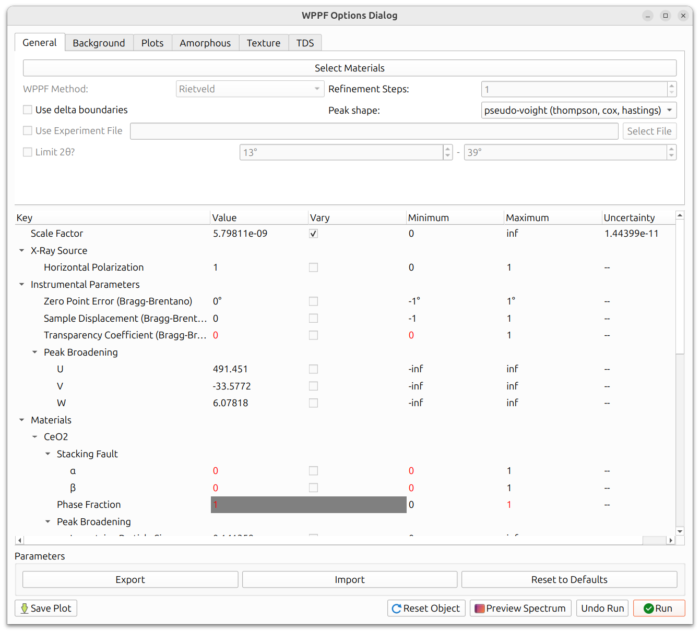

# WPPF

Whole Pattern Peak Fitting (WPPF) is a method for fitting the entire
observed powder diffraction pattern with a calculated pattern. Unlike the
other calibration workflows that refine instrument geometry, WPPF is
primarily used for **material characterization**: determining lattice
parameters, peak shapes, texture, and other material properties from powder
data.

WPPF should typically be performed **after** the instrument has already
been calibrated using one of the other workflows
([Fast Powder](fast_powder.md),
[Composite](composite_laue_and_powder.md), or
[Structureless](structureless.md)).

Two fitting methods are available:

- **Le Bail**: Extracts peak intensities without requiring a crystal
  structure model. Useful when you want to fit peak shapes and positions
  but do not have (or do not need) a full structural model.
- **Rietveld**: Uses a crystal structure model to calculate peak
  intensities. Required for texture analysis, thermal diffuse scattering,
  and structure refinement.

## Getting Started

To begin, ensure that:

1. Your instrument is already calibrated.
2. A [powder overlay](../configuration/overlays.md#powder-overlays) is
   visible for the material you want to analyze.

Then navigate to `Run -> WPPF` from the menu bar.

<!-- Screenshot needed: WPPF main options dialog showing method selection and parameter tree -->

## Method Selection

Choose between **Le Bail** and **Rietveld** based on your needs:

- Use **Le Bail** when you want to fit peak positions and shapes without
  a crystal structure model, or as a first pass to verify that the pattern
  can be fitted well before attempting a full Rietveld refinement.
- Use **Rietveld** when you need to refine structural parameters, model
  texture, or analyze thermal diffuse scattering.

## Peak Shape

Several peak shape functions are available for modeling the diffraction
peaks:

- **pvtch**: Thompson-Cox-Hastings pseudo-Voigt (recommended default)
- **pseudo-voigt**: Standard pseudo-Voigt
- **gaussian**: Pure Gaussian
- And others as available in the dropdown

The peak shape choice affects which broadening parameters (U, V, W, X, Y)
are meaningful.

## Recommended Refinement Order

Like instrument calibration, WPPF refinement works best with an iterative
approach. A recommended order (demonstrated in the GE WPPF example) is:

1. **Scaling**: Refine the overall scale factor first. This ensures the
   calculated pattern has the right intensity level.
2. **Lattice parameters**: Refine the unit cell dimensions to match peak
   positions.
3. **U, V, W**: Cagliotti peak broadening parameters (Gaussian
   contribution). These control how peak width varies with 2&theta;.
4. **X, Y**: Lorentzian broadening parameters. X relates to Scherrer
   (size) broadening and Y to microstrain broadening.
5. **U, V, W, X, Y combined**: Refine all broadening parameters together
   to allow them to adjust relative to each other.
6. **Debye-Waller factors** (Rietveld only): Thermal displacement
   parameters for each atom type.
7. **All parameters together**: A final refinement pass with everything
   enabled to allow all parameters to adjust simultaneously.

## Background

The background must be modeled for a good fit. Several methods are
available:

- **Spline**: Interactive spline with a point picker. You place control
  points on the pattern where there is only background (no peaks), and a
  spline is interpolated through them. This is often the most reliable
  method.
- **Chebyshev polynomial**: Fits a Chebyshev polynomial of a specified
  order to the background. Simpler to set up but may not capture complex
  backgrounds as well.

For the spline method, a background picker interface appears where you can
click on the pattern to place spline control points. Points should be placed
in regions between peaks where only background signal is present.

## 2-Theta Range

You can limit the 2&theta; range used for refinement by setting minimum
and maximum values. This is useful when:

- The low-angle or high-angle regions contain artifacts or unreliable data.
- You want to focus the refinement on a specific portion of the pattern.
- Certain regions have overlapping peaks from impurity phases that you do
  not want to model.

## Delta Boundaries

Delta boundaries work the same way as in other calibration workflows.
Instead of absolute min/max bounds, you specify a ±delta around the
current parameter value. See
[General Calibration Information](general_calibration.md#delta-boundaries)
for details.

## Amorphous Modeling

If your sample contains amorphous (non-crystalline) material, the
amorphous contribution to the pattern can be modeled to improve the fit.

<!-- Screenshot needed: amorphous modeling settings panel -->

Options include:

- **Enable/Disable**: Toggle amorphous modeling on or off.
- **Model Type**: Choose between experimental (loaded from data) and
  analytical models.
- **Number of Peaks**: For analytical models, the number of broad peaks
  used to model the amorphous contribution.
- **Smoothing**: Smoothing applied to the amorphous model.

When amorphous modeling is enabled, the **degree of crystallinity** is
displayed, indicating what fraction of the total scattered intensity comes
from crystalline vs. amorphous phases.

## Texture Modeling (Rietveld Only)

Texture modeling is available when using the Rietveld method. It uses a
spherical harmonic model to describe preferred orientation in the sample.

<!-- Screenshot needed: texture modeling settings panel showing spherical harmonic options -->

The available settings are:

- **Sample Symmetry**: The assumed symmetry of the sample's orientation
  distribution (e.g., triclinic, fiber).
- **ell_max**: The maximum order of the spherical harmonic expansion.
  Higher values allow more complex texture descriptions but require more
  data to constrain.
- **Azimuthal Interval**: The angular interval for azimuthal binning.
- **Integration Range**: The 2&theta; range used for texture analysis.

After refinement with texture enabled, several outputs are available:

- **Texture Index (J value)**: A scalar measure of texture strength. J = 1
  means random texture; higher values indicate stronger preferred
  orientation.
- **Simulated Polar Spectrum**: A visualization of the calculated pattern
  at different azimuthal angles.
- **Pole Figures**: Stereographic projections showing the distribution of
  specific crystal directions relative to the sample frame.

<!-- Screenshot needed: pole figure visualization from WPPF texture analysis -->

## Thermal Diffuse Scattering (Rietveld Only)

Thermal Diffuse Scattering (TDS) models the diffuse background that arises
from thermal vibrations of atoms. Two approaches are available:

<!-- Screenshot needed: TDS settings panel -->

- **Warren Model**: An analytical model based on Debye theory.
- **Experimental Model**: Uses experimentally measured TDS data.

For the Warren model, you must specify the **Debye temperature** for each
atom type in the structure. The Debye temperature characterizes the thermal
vibration amplitude and is typically available from literature values for
common materials.

## Parameters Table

The main interface for WPPF is the parameter tree view, which lists all
refinable parameters.

<!-- Screenshot needed: WPPF parameter tree showing Value, Vary, Stderr, Min/Max columns -->

Each parameter row shows:

- **Value**: The current parameter value.
- **Vary**: A checkbox controlling whether this parameter is refined.
- **Stderr**: The standard error from the last refinement (blank until
  a refinement has been run).
- **Min / Max** (or **Delta**): Bounds for the parameter during
  refinement. See [Delta Boundaries](#delta-boundaries) above.

To set up a refinement, check the "Vary" box for the parameters you want
to refine, following the [recommended order](#recommended-refinement-order)
above.

## Running and Undoing

Click **Run** to execute one or more refinement cycles. The WPPF plot
updates in real time to show the current fit.

A full undo stack is maintained. Click **Undo Run** to revert to the
previous state if a run produces poor results.

## Visualization

The WPPF plot provides several visualization options to help assess the
quality of the fit:

<!-- Screenshot needed: WPPF plot showing observed pattern, calculated fit, and difference curve -->

- **Background**: Toggle display of the modeled background curve.
- **Amorphous**: Toggle display of the amorphous contribution (if
  amorphous modeling is enabled).
- **TDS**: Toggle display of the thermal diffuse scattering contribution
  (if TDS is enabled).
- **Difference Curve**: Show the difference between observed and calculated
  patterns. Can be displayed as absolute difference or percentage.
- **Style Customization**: Colors, line widths, and other visual properties
  can be adjusted.

The difference curve is particularly useful: a flat, near-zero difference
indicates a good fit, while systematic deviations point to parameters that
need further refinement.

## Import/Export Parameters

WPPF parameter sets can be saved to and loaded from HDF5 files. This is
useful for:

- Saving a refined parameter set for later reuse.
- Sharing parameters with colleagues working on similar data.
- Using a previously refined set as a starting point for a new dataset
  from the same material/instrument.

Use the import/export options in the WPPF dialog to save or load parameter
files.
