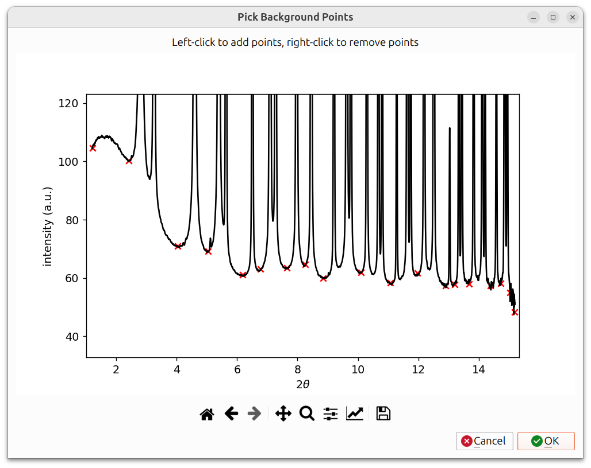
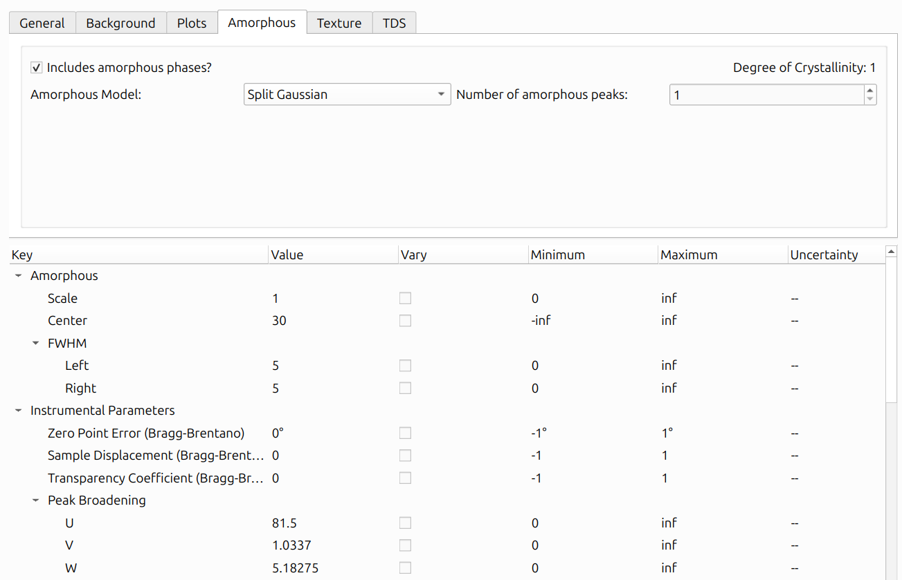
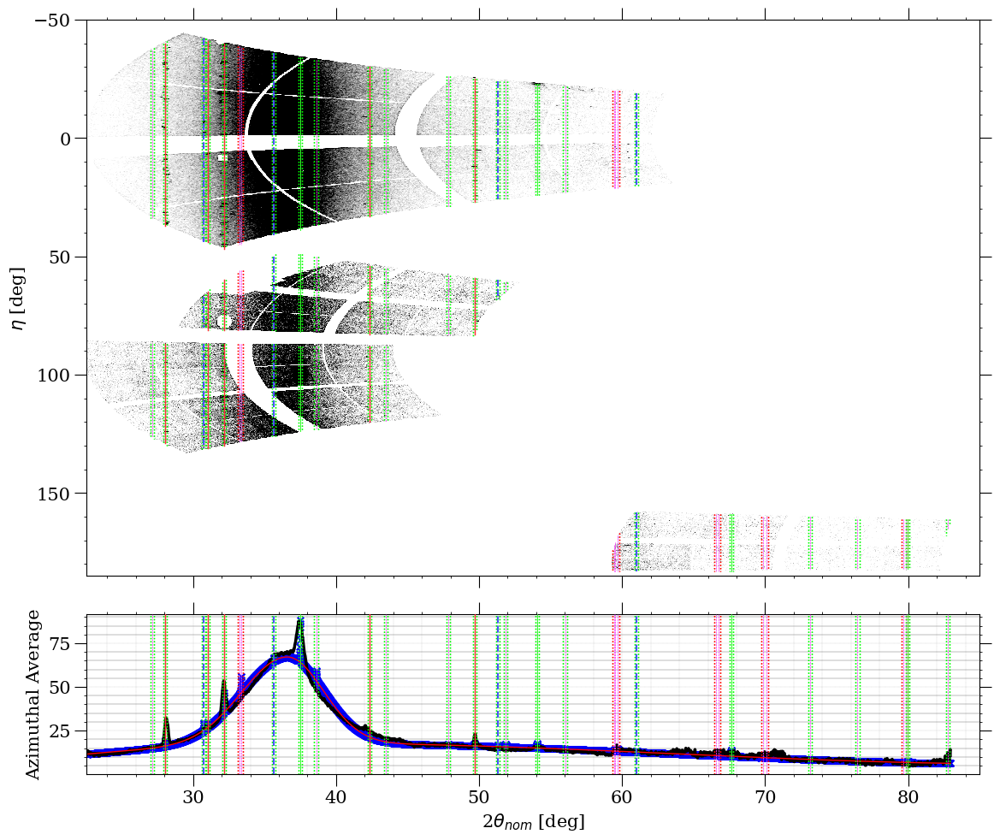
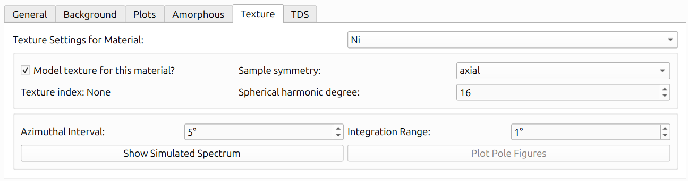
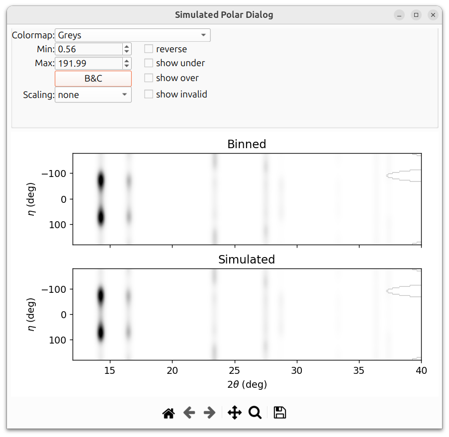
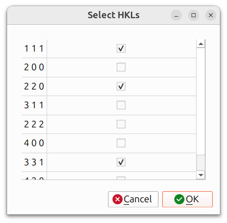
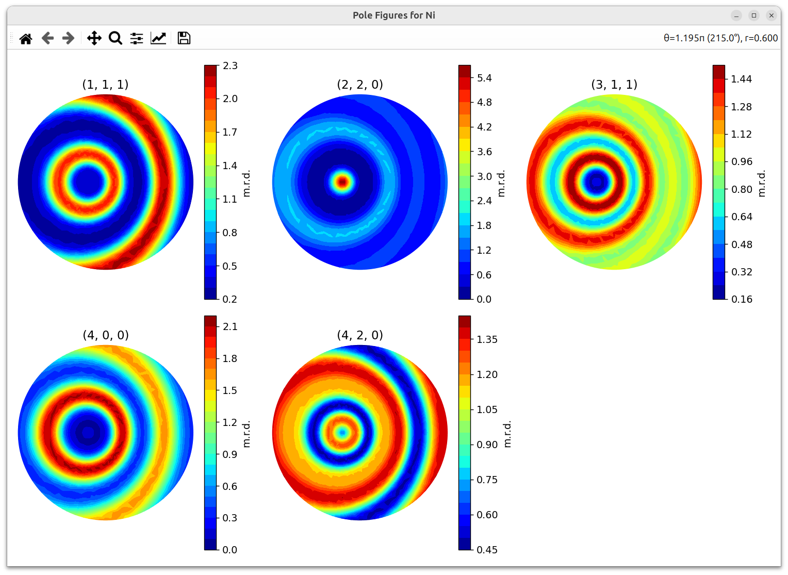
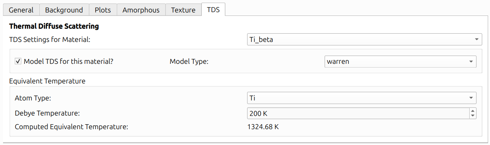
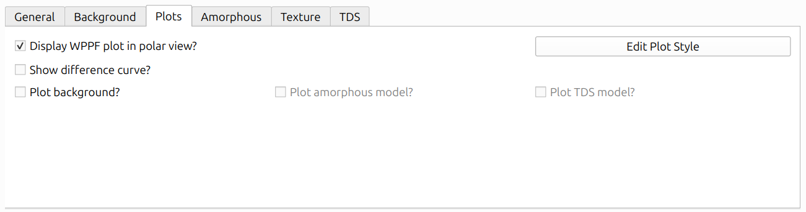
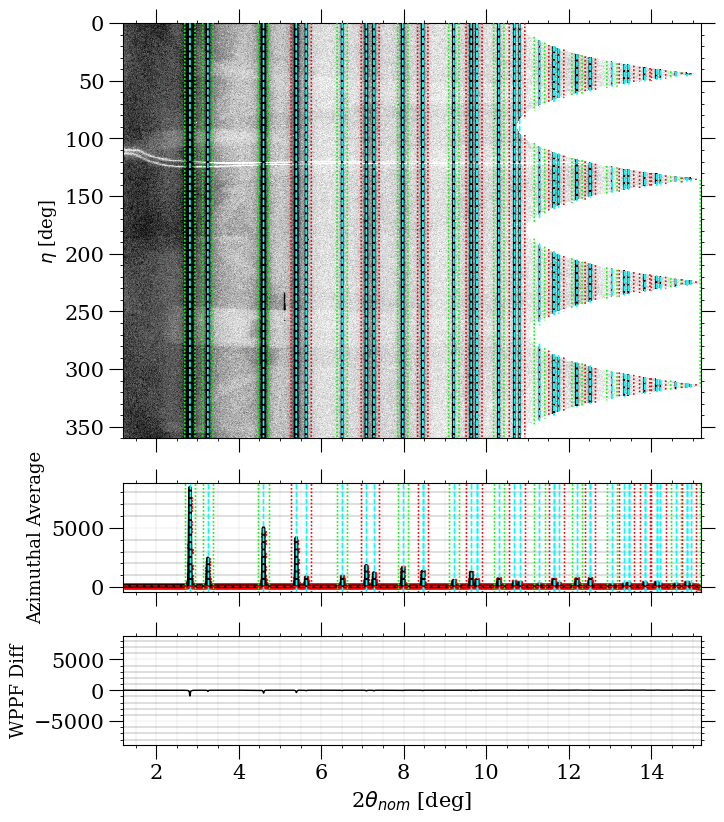

# WPPF

Whole Pattern Peak Fitting (WPPF) is a method for fitting the entire
observed powder diffraction pattern with a calculated pattern. Unlike the
other calibration workflows that refine instrument geometry, WPPF is
primarily used for **material characterization**: determining lattice
parameters, peak shapes, texture, and other material properties from powder
data.

WPPF should typically be performed **after** the instrument has already
been calibrated using one of the other workflows
([Fast Powder](fast_powder.md),
[Composite](composite_laue_and_powder.md), or
[Structureless](structureless.md)).

Two fitting methods are available:

- **Le Bail**: Extracts peak intensities without requiring a crystal
  structure model. Useful when you want to fit peak shapes and positions
  but do not have (or do not need) a full structural model.
- **Rietveld**: Uses a crystal structure model to calculate peak
  intensities. Required for texture analysis, thermal diffuse scattering,
  and structure refinement.

## Getting Started

To begin, ensure that:

1. Your instrument is already calibrated.
2. [Powder overlays](../configuration/overlays.md#powder-overlays) are
   visible for the materials you want to analyze.
3. You are viewing the data in
   [Polar View](../views.md#polar-view) mode.

Then navigate to `Run -> WPPF` from the menu bar.

The WPPF Options Dialog contains several tabs (General, Background,
Plots, Amorphous, Texture, TDS) along with a parameter table and
controls for running the refinement.

## Select Materials

The "Select Materials" button at the top of the General tab opens
a dialog to choose which materials to include in the fit. These
should correspond to the crystalline phases present in your sample.
Materials with visible powder overlays will be checked by default.

## Method Selection

The "WPPF Method" dropdown selects between **Le Bail** and
**Rietveld**:

- Use **Le Bail** when you want to fit peak positions and shapes
  without a crystal structure model, or as a first pass to verify
  that the pattern can be fitted well before attempting a full
  Rietveld refinement.
- Use **Rietveld** when you need to refine structural parameters,
  model texture, or analyze thermal diffuse scattering.

## Peak Shape

The "Peak shape" dropdown selects the peak profile function used to
model the diffraction peaks. All three options share the same
broadening parameters (U, V, W, Gaussian Particle Size, Lorentzian
Particle Size, and Microstrain) but differ in how they handle peak
asymmetry and axial divergence:

- **Pseudo-Voigt (Thompson, Cox, Hastings)**: Standard symmetric
  pseudo-Voigt profile. No additional instrumental parameters beyond
  the shared broadening parameters.
- **Pseudo-Voigt (Finger, Cox, Jephcoat)**: Adds axial divergence
  correction with two additional parameters:
    - **H/L**: Horizontal (axial) divergence parameter.
    - **S/L**: Slit/specimen divergence parameter.
- **Pseudo-Voigt (von Dreele)**: Uses an asymmetric peak shape with
  four additional parameters:
    - **alpha0**, **alpha1**: Asymmetry coefficients controlling the
      leading edge of the peak.
    - **beta0**, **beta1**: Asymmetry coefficients controlling the
      trailing edge of the peak.

The shared broadening parameters are:

- **U, V, W**: Cagliotti instrumental broadening parameters
  (Gaussian contribution). These control how peak width varies with
  2&theta;.
- **Gaussian Particle Size (P)**: Gaussian Scherrer broadening from
  crystallite size.
- **Lorentzian Particle Size (X)**: Lorentzian Scherrer broadening
  from crystallite size.
- **Microstrain (Y)**: Lorentzian microstrain broadening.

## Recommended Refinement Order

Like instrument calibration, WPPF refinement works best with an iterative
approach. A recommended order (demonstrated in the [GE WPPF example](https://github.com/HEXRD/examples/tree/master/state_examples/GE_WPPF)) is:

1. **Scaling**: Refine the overall scale factor first. This ensures
   the calculated pattern has the right intensity level.
2. **Background parameters** (if Chebyshev background): Refine the
   Chebyshev polynomial coefficients so the background model fits
   the data.
3. **Lattice parameters**: Refine the unit cell dimensions to match
   peak positions.
4. **U, V, W**: Cagliotti peak broadening parameters (Gaussian
   contribution). These control how peak width varies with 2&theta;.
5. **Lorentzian Particle Size, Microstrain**: Lorentzian broadening
   parameters. Lorentzian Particle Size relates to Scherrer (size)
   broadening and Microstrain to microstrain broadening.
6. **All broadening parameters combined**: Refine U, V, W,
   Lorentzian Particle Size, Gaussian Particle Size, and
   Microstrain together to allow them to adjust relative to each
   other.
7. **Debye-Waller factors** (Rietveld only): Thermal displacement
   parameters for each atom type.
8. **All parameters together**: A final refinement pass with
   everything enabled to allow all parameters to adjust
   simultaneously.

## Background

The background must be modeled for a good fit. Three methods are
available:

- **Spline**: Interactive spline with a point picker. You place control
  points on the pattern where there is only background (no peaks), and a
  cubic spline is interpolated through them. This is often the most
  reliable method.
- **Chebyshev polynomial**: Fits a Chebyshev polynomial of a specified
  degree to the background. Simpler to set up but may not capture complex
  backgrounds as well. The Chebyshev polynomial has refinable
  parameters; the background should typically be refined in step
  2 of the [recommended refinement order](#recommended-refinement-order).
- **SNIP1D**: Uses the Statistics-sensitive Non-linear Iterative
  Peak-clipping (SNIP) algorithm to automatically estimate the
  baseline background. This method iteratively clips peaks from the
  spectrum to isolate the background, without requiring manual point
  selection or polynomial fitting. It has two parameters:
    - **Snip Width**: The maximum peak width (in degrees) to retain
      for background estimation. Larger values remove wider peaks
      more aggressively.
    - **Snip Num Iterations**: The number of clipping iterations
      (default: 2). More iterations produce more aggressive
      background removal.

For the spline method, a "Pick Background Points" dialog appears
showing the azimuthal lineout (intensity vs. 2&theta;). Left-click
on the pattern to add spline control points (shown as red X markers),
and right-click to remove them. Points should be placed in regions
between peaks where only background signal is present. A spline is
then interpolated through these points to model the background.
Click OK when finished.

## Experiment File

The "Use Experiment File" checkbox allows you to load an external
experiment file instead of using the current azimuthal lineout
from the polar view. When checked, click "Select File" to choose
the file.

## Refinement Steps (Le Bail Only)

The "Refinement Steps" spinner is only available when using the
Le Bail method. It controls how many refinement iterations are
performed each time you click Run. Multiple steps can help the
fit converge further in a single run.

## 2-Theta Range

The "Limit 2&theta;" checkbox enables limiting the 2&theta; range
used for refinement. When checked, you can set minimum and maximum
values. This is useful when:

- The low-angle or high-angle regions contain artifacts or unreliable data.
- You want to focus the refinement on a specific portion of the pattern.
- Certain regions have overlapping peaks from impurity phases that you do
  not want to model.

## Delta Boundaries

Delta boundaries work the same way as in other calibration workflows.
Instead of absolute min/max bounds, you specify a ±delta around the
current parameter value. See
[General Calibration Information](general_calibration.md#delta-boundaries)
for details.

## Amorphous Modeling

If your sample contains amorphous (non-crystalline) material, the
amorphous contribution to the pattern can be modeled to improve the fit.

Check **"Includes amorphous phases?"** to enable amorphous modeling.
When enabled, the **Degree of Crystallinity** is displayed in the
upper-right corner, indicating what fraction of the total scattered
intensity comes from crystalline vs. amorphous phases.

### Model Types

Three amorphous model types are available in the **"Amorphous Model"**
dropdown:

- **Split Gaussian**: Models amorphous scattering as one or more broad
  peaks with independent left and right widths. Each peak adds the
  following parameters to the parameter table:
    - **Scale**: Amplitude of the peak (min: 0).
    - **Center**: Peak center position in 2&theta;.
    - **FWHM Left**: Full-width at half-maximum on the left side of
      the peak (min: 0).
    - **FWHM Right**: Full-width at half-maximum on the right side of
      the peak (min: 0).

- **Split Pseudo-Voigt**: Similar to Split Gaussian but uses a
  pseudo-Voigt profile (mixed Gaussian and Lorentzian) with independent
  left and right widths. Each peak adds the following parameters:
    - **Scale**: Amplitude of the peak (min: 0).
    - **Center**: Peak center position in 2&theta;.
    - **FWHM Gaussian Left**: Gaussian FWHM on the left side (min: 0).
    - **FWHM Lorentzian Left**: Lorentzian FWHM on the left side (min: 0).
    - **FWHM Gaussian Right**: Gaussian FWHM on the right side (min: 0).
    - **FWHM Lorentzian Right**: Lorentzian FWHM on the right side (min: 0).

- **Experimental**: Uses an experimentally measured amorphous pattern
  loaded from a file, rather than an analytical peak shape. Each peak
  adds only:
    - **Scale**: Multiplier for the experimental pattern (min: 0).
    - **Shift**: Offset in 2&theta; applied to the experimental pattern.

When "Experimental" is selected, two additional controls appear:

- **Select Experiment Files**: Opens a file dialog to load a `.xy`
  file (two-column format: 2&theta; and intensity) for each
  amorphous peak.
- **Experimental Pattern Smoothing**: Specifies the Gaussian kernel
  width used to smooth the loaded experimental data. A value of 0
  applies no smoothing.

### Number of Amorphous Peaks

The **"Number of amorphous peaks"** spinner controls how many amorphous
peaks are included in the model. For the analytical models (Split
Gaussian and Split Pseudo-Voigt), each peak gets its own set of
refinable parameters in the parameter table. For the Experimental model,
you must select one `.xy` file per peak.

### Amorphous Plot

The amorphous contributions to the lineout can be plotted separately by
checking "Plot amorphous model?" in the "Plots" tab of the WPPF Options
Dialog. An example of this can be seen below:

In the above image, the amorphous contributions to the plot, summed
together with the background, can be seen as the red line on top of the
blue "x" markers. The styles of all of the WPPF plots can also be
edited via the "Edit Plot Style" button within the "Plots" tab.

## Texture Modeling (Rietveld Only)

Texture modeling is available when using the Rietveld method. It
uses a spherical harmonic model to describe preferred orientation
in the sample.

**Important:** Before refining texture parameters, make sure all
other parameters (scaling, background, lattice parameters,
broadening, etc.) are already well-refined and the 1D lineout fit
looks good. Texture parameters cannot be refined at the same time
as the other parameters and must be refined by themselves.

The Texture tab provides per-material settings via the **"Texture
Settings for Material"** dropdown. Check **"Model texture for this
material?"** to enable texture modeling for a given material. The
available settings are:

- **Sample Symmetry**: The assumed symmetry of the sample's
  orientation distribution (e.g., triclinic, axial).
- **Spherical Harmonic Degree**: The maximum order of the spherical
  harmonic expansion. Higher values allow more complex texture
  descriptions but require more data to constrain.
- **Texture Index**: Displays the refined texture index (J value)
  after refinement, or "None" before refinement has been run.
- **Azimuthal Interval**: The angular interval (in degrees) for
  azimuthal binning.
- **Integration Range**: The 2&theta; integration range (in degrees)
  used for texture analysis.

Two buttons are available at the bottom of the Texture tab:

- **Show Simulated Spectrum**: Opens the Simulated Polar Dialog
  (described below).
- **Plot Pole Figures**: Generates pole figures for selected HKLs
  (described in [Texture Outputs](#texture-outputs) below).

### Simulated Polar Dialog

After refinement with texture enabled, the "Show Simulated Spectrum"
button opens a dialog that shows a comparison between the binned
(observed) and simulated 2D polar patterns. This is useful for visually
assessing how well the texture model reproduces the azimuthal
intensity variations in the data.

The texture example in this section is a simulated
Nickel powder sample on a GE detector.
The image below shows the simulated polar dialog **before**
texture parameters have been refined. Notice that the simulated
pattern does not capture the azimuthal intensity variations:

After refining the texture parameters, the simulated pattern
should match the binned data much more closely:

### Texture Outputs

After refinement with texture enabled, several outputs are
available:

- **Texture Index (J value)**: A scalar measure of texture
  strength. J = 1 means random texture; higher values indicate
  stronger preferred orientation.
- **Pole Figures**: Stereographic projections showing the
  distribution of specific crystal directions relative to the
  sample frame. When plotting pole figures, you can select which
  HKLs to include:

The resulting pole figures are displayed in an interactive window:

## Thermal Diffuse Scattering (Rietveld Only)

Thermal Diffuse Scattering (TDS) models the diffuse background that arises
from thermal vibrations of atoms. The TDS tab provides per-material
settings via the **"TDS Settings for Material"** dropdown. Check
**"Model TDS for this material?"** to enable TDS for a given material.

Two model types are available:

- **Warren Model**: An analytical model based on Warren's X-ray
  diffraction theory. The Warren model computes the TDS contribution
  using the material's Debye-Waller factors (U factors), atomic masses,
  form factors, and crystal structure. The U factors are the same
  Debye-Waller parameters refined under the material's atom types
  in the parameter table.
- **Experimental Model**: Uses experimentally measured TDS data,
  scaled and shifted to match the observed pattern.

### Equivalent Temperature

The **"Equivalent Temperature"** section provides a way to interpret the
refined Debye-Waller factors in terms of a physical temperature. For each
atom type, you can specify a **Debye Temperature** (a literature value
characterizing the material's lattice vibrations), and the GUI will
display a **Computed Equivalent Temperature** derived from the current
U factor and the Debye temperature using the classical Debye model.

This is purely an informational display. The Debye Temperature does not
affect the TDS model computation or its contribution to the lineout. The
TDS calculation depends only on the Debye-Waller factors (U factors) and
the crystal structure parameters.

## Parameters Table

The lower portion of the General tab contains the parameter table,
which lists all refinable parameters organized into categories:
Scale Factor, X-Ray Source, Instrumental Parameters, Peak
Broadening, and Materials (with per-material sub-parameters such
as stacking fault probabilities and phase fractions).

Each parameter row shows:

- **Key**: The parameter name.
- **Value**: The current parameter value.
- **Vary**: A checkbox controlling whether this parameter is
  refined.
- **Minimum / Maximum**: Bounds for the parameter during
  refinement. When "Use delta boundaries" is checked, these
  are replaced with delta values. See
  [Delta Boundaries](#delta-boundaries) above.
- **Uncertainty**: The standard error from the last refinement
  (shown as "--" until a refinement has been run).

To set up a refinement, check the "Vary" box for the parameters
you want to refine, following the
[recommended order](#recommended-refinement-order) above.

## Running and Undoing

The bottom of the dialog contains several action buttons:

- **Run**: Execute one or more refinement cycles (controlled by
  the "Refinement Steps" setting). The WPPF plot updates in real
  time to show the current fit.
- **Undo Run**: Revert to the previous state if a run produces
  poor results. A full undo stack is maintained.
- **Preview Spectrum**: Display the calculated pattern using the
  current parameter values without performing any refinement.
- **Reset Object**: Reset the WPPF object to its initial state.
- **Save Plot**: Save the current WPPF plot to a file.

## Visualization

The Plots tab provides options for controlling how the WPPF fit
is displayed:

- **Display WPPF plot in polar view?**: When checked, the
  calculated pattern is overlaid on the polar view alongside
  the observed data and azimuthal lineout.
- **Show difference curve?**: Display the difference between
  observed and calculated patterns below the main plot.
- **Plot background?**: Toggle display of the modeled background
  curve.
- **Plot amorphous model?**: Toggle display of the amorphous
  contribution (if amorphous modeling is enabled).
- **Plot TDS model?**: Toggle display of the thermal diffuse
  scattering contribution (if TDS is enabled).
- **Edit Plot Style**: Customize colors, line widths, and other
  visual properties.

The above image shows the WPPF fit displayed in the polar view,
with the calculated pattern overlaid on the observed data and
the azimuthal lineout shown below. The difference curve is
particularly useful: a flat, near-zero difference indicates a
good fit, while systematic deviations point to parameters that
need further refinement.

## Import/Export Parameters

The "Parameters" section at the bottom of the dialog provides
buttons for managing parameter sets:

- **Export**: Save the current parameter values to a file for
  later reuse.
- **Import**: Load a previously saved parameter set.
- **Reset to Defaults**: Restore all parameters to their default
  values.

This is useful for saving a refined parameter set, sharing
parameters with colleagues, or using a previously refined set as
a starting point for a new dataset from the same material or
instrument.
