# Image Loading

## Quick Load

The image quick load option is great for rapidly loading images that have already been processed or for loading images that you would like to preview before processing them. Simply go to `File->Open->Images`.

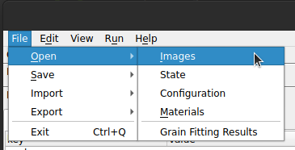

Once you have selected the image(s) you would like to load you will be presented with a second dialog where you can:

1. Confirm that correct image has been matched to the correct detector
2. Apply transforms to an image if needed

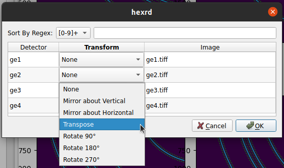

### File Pattern Matching

Did you know that you don't *have* to select each file that you need? Of course you are welcome to, but let's say that you have either one of the following directory structures:

```
images/
  all_dets/
    raw_image_detector_1.tiff
    raw_image_detector_2.tiff
    raw_image_detector_3.tiff
    raw_image_detector_4.tiff
```

```
images/
  det1/
    raw_image_detector_1.tiff
  det2/
    raw_image_detector_2.tiff
  det3/
    raw_image_detector_3.tiff
  det4/
    raw_image_detector_4.tiff
```

If you have `detector_1`, `detector_2`, `detector_3` and `detector_4`, and you select just one of the files (such as the `raw_image_detector_2.tiff` file), the remaining files can be inferred and automatically populated. Ex:

```
              SELECTED                        AUTOMATICALLY ADDED
-----------------------------------||------------------------------------
                                   -> all_dets/raw_image_detector_1.tiff
all_dets/raw_image_detector_2.tiff -> all_dets/raw_image_detector_3.tiff
                                   -> all_dets/raw_image_detector_4.tiff


                                   -> det1/raw_image_detector_1.tiff
det2/raw_image_detector_2.tiff     -> det3/raw_image_detector_3.tiff
                                   -> det4/raw_image_detector_4.tiff
```

If you have images that need to be pre-processed as a part of the HEDM worflow, see [Simple Image Series](#simple-image-series) or [Image Stack](#image-stack). For the LLNL workflow see the [LLNL Import Tool](#llnl-import-tool).

## Simple Image Series

The Simple Image Series dialog is designed to support pre-processing steps like image aggregation, transforms, dark background subtraction, toggling frame order, and setting omega ranges. To get started, open the dialog from the import menu: `File->Import->Simple Image Series`.

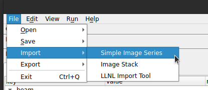


Once the import tool has opened you have the option to dock it in the main window or allow it to remain as a standalone dialog.

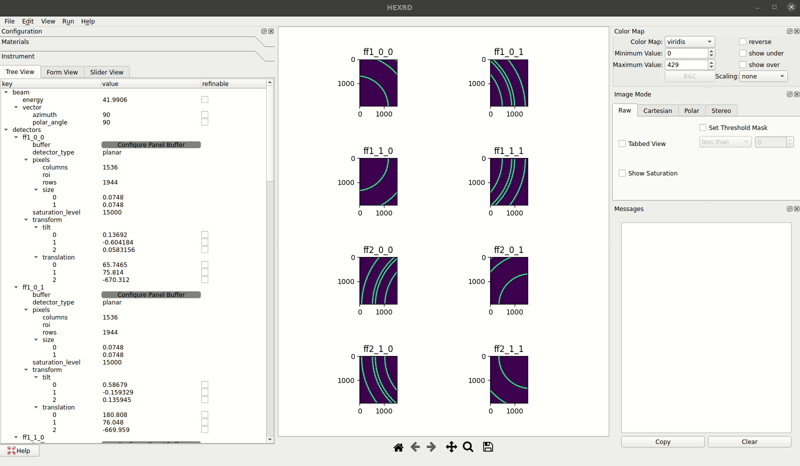

Use the `Select Image Files` to select the image(s) you need to load. See the [file pattern matching](#file-pattern-matching) section for more information on how images can be selected. The order of the frames for multi-frame images can be reversed by toggling the `Reverse Frame Order` option at any point before selecting `Read Files` or `OK`.

Multi-frame images can be aggregated into a single image by either using the maximum, median or average over all of the frames. This option is disabled for single-frame images. For longer running aggregation functions, a progress bar will be displayed as the calculations are performed.

*Note: the unaggregated images are still kept internally and used where needed, such as in the HEDM workflow.*

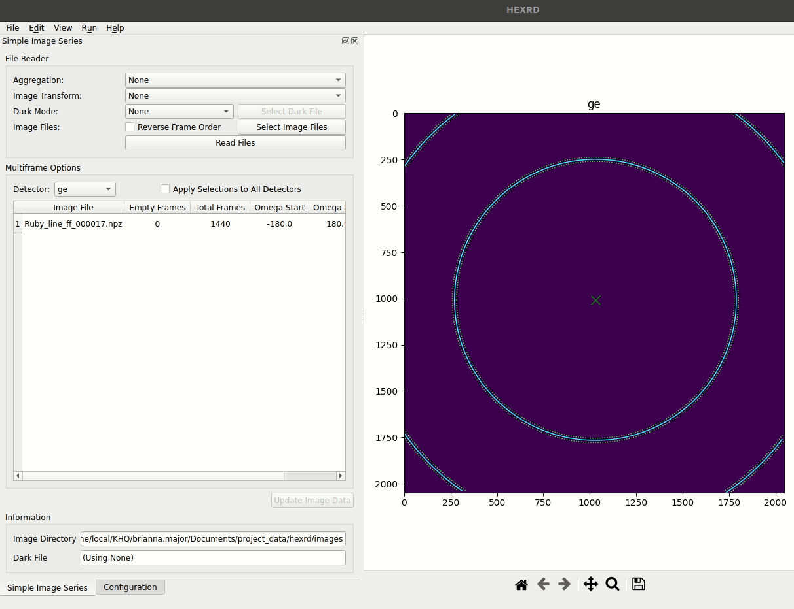

Transforms can also be applied to any or all of the detectors if they need it. Simply select the transform that you need from the drop-down menu. Apply multiple transforms in a row to combine them or apply `None` to revert any changes you've made.

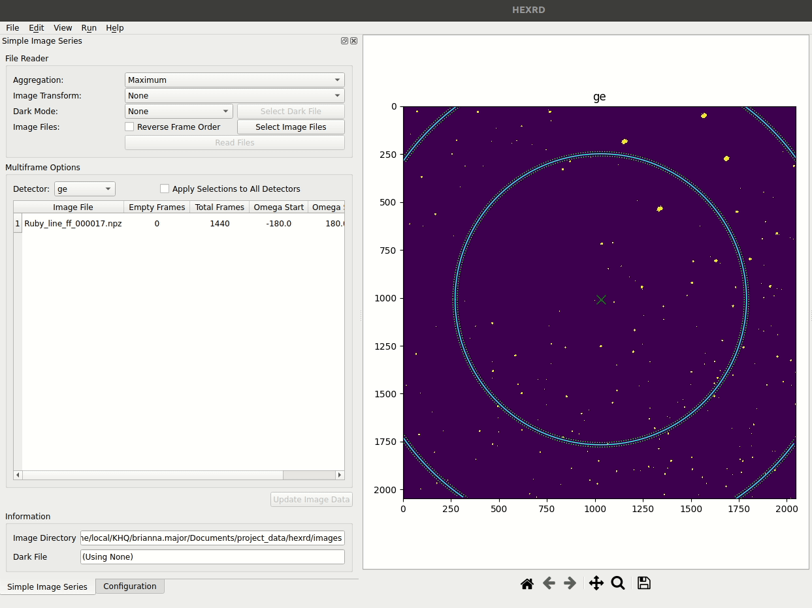

Transforms can be applied on a detector-by-detector basis or across all detectors at once. Toggle `Apply Selections to All Detectors` on to use the current setting for all detectors. Toggle the option off to set transforms per detector and use the `Detector` drop-down menu to select which detector you are applying the transform to.

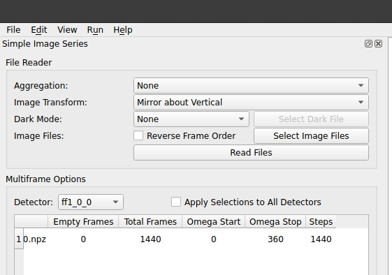

The `Dark Mode` can be used to create or load an image that will be subtracted from the image series. You can subtract the median/maximum/average aggregate image, the empty frames (discussed below), or data from a specified file. If the `File` option is selected the `Select Dark File` button will be enabled and you can select the file that you would like to use.

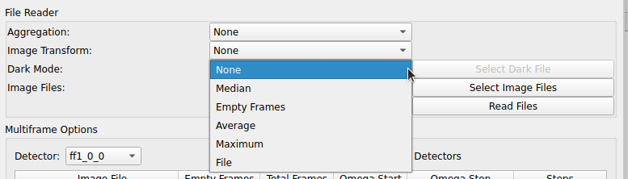

*Note*: As you progress you can use the `Read Files` button to apply and load the changes that you've made without closing the dialog and losing any of your current settings.

The image files selected earlier will be described in the `Multiframe Options` section of the dialog where you will find a table of all image files associated with the currently selected detector. Additionally you will find metadata used for reading in the file(s): `Empty Frames`, `Total Frames`, `Omega Start`, `Omega Stop`, and `Steps`. Some of these options are editable.

  - **Empty Frames**: This value determines how many frames from the beginning of the image series to ignore. Changing this value will affect the `Steps` value.
  - **Total Frames**: The total number of frames associated with the image file. This value is pulled from the image file directly and cannot be changed. This value only reflects the orignal total frames, not neccessarily how many frames will actually be used.
  - **Omega Start**: The start value of the omega wedge, which is a continuous range of evenly spaced omega values. The total omega range (stop - start) cannot be more than 360 degrees.
  - **Omega Stop**: The stop value of the omega wedge. The total omega range (stop - start) cannot be more than 360 degrees.
  - **Steps**: The number of steps in the wedge. This value is automatically computed from the omega range and the number of frames to be used (total - empty).

*Note*: In the Simple Image Series dialog, only one omega "wedge" can be set per file and the range will automatically be divided evenly and set per frame. Omega values set in this table are applied across all detectors. If you have some gaps in omega values and thus need more control over the omega wedges please see the [Image Stack](#image-stack) tool.

When an unaggregated image series is loaded, the omega range for each frame will be indicated at the bottom of the main window.

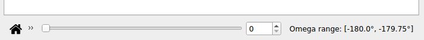

If you change the metadata, but you do not need to re-load the images because no pre-processing was changed, you can simply apply updates with the `Update Image Data` button.

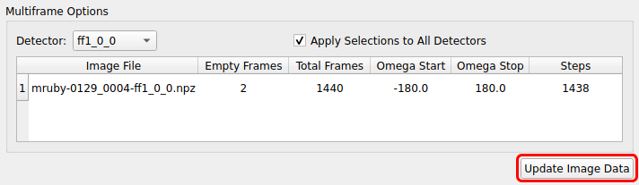

The `Information` panel at the very bottom of the tool will show the path to the parent directory containing the image(s) you've selected, as well as the path to the file used for dark background subtraction if one was loaded in.

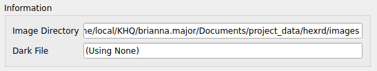

*Note*: Using the `OK` button will load the images and update the metadata just like the `Read Files` button that is located in the `File Reader` section at the top. The only difference is that if the dialog is not docked it will close after `OK` is pressed. The last used options will be remembered either way (until a new instrument config is loaded).

## Image Stack

FIXME: add content

## LLNL Import Tool

The LLNL workflow has its own import tool designed to allow one or more images to be loaded, transformed, and cropped before loading them into the GUI for analysis. To get started, launch the tool by going to `File->Import->LLNL Import Tool`.

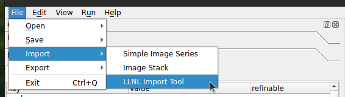

Once the import tool has opened, you have the option to dock it in the GUI or allow it to remain as a standalone dialog.

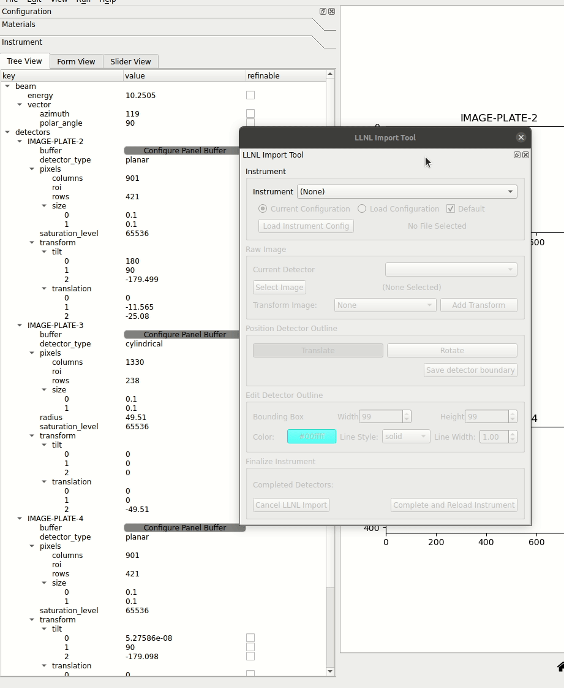

### Instrument Configuration

To begin, select the instrument you will be using, and then select an instrument configuration. This configuration will need to include information about all of the expected detectors for the selected instrument. See examples for [TARDIS](https://github.com/HEXRD/hexrd/blob/master/hexrd/resources/tardis_reference_config.yml) and [PXRDIP](https://github.com/HEXRD/hexrd/blob/master/hexrd/resources/pxrdip_reference_config.yml).

*Note*: you may skip detectors for which you do not have data

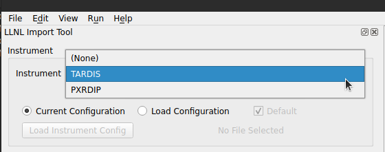

You'll notice that there are a few options for how to load a config:

1. **Current Configuration**: This will used the current instrument config
2. **Load Configuration**: If selected, you may then either use the default configuration file that we provide or load your own. Uncheck the `Default` box to load your own configuration.

If you are unsure what to use, try the default config. For more information on configuration files see the [instrument](instrument.md) section of the docs.

### Raw Image

Once the instrument and configuration have been selected the `Raw Image` portion of the form will be enabled and the list of available detectors will be populated. The detector selected from the drop-down menu will determine which template will be added to the image, as well as what default transform is suggested when the image is loaded. Use the `Select Image` button to load an image.

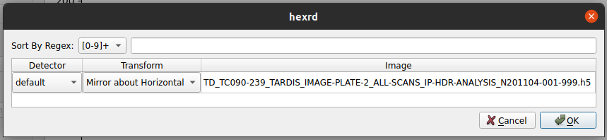

If there is a default transform associated with the current instrument or selected detector, this will automatically be set in the load image dialog. This can still be changed either on load or in the import tool after the image is loaded.

Once the image is loaded, the template will be added, and you will be able to translate it or rotate it until it is positioned over the image. Once everything looks good, you can accept this by clicking the `Save detector boundary` button.

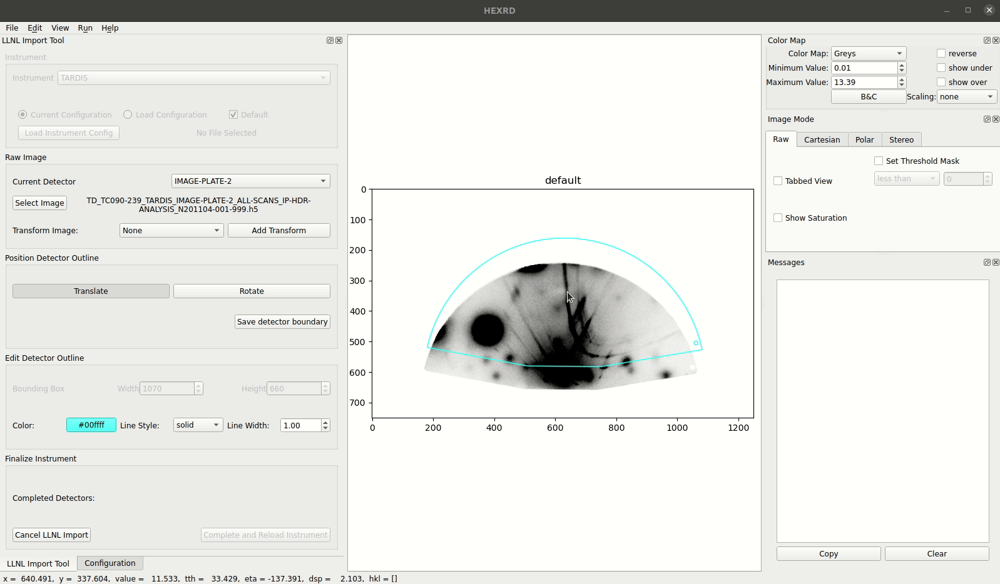

Depending on the instrument you are using, you will then follow one of two patterns for the remaining detectors:

1. **Single Image**: Instruments like PXRDIP and BBXRD have a single image with multiple detectors that will be cropped. In cases like these you can simply select a new detector from the drop-down menu and that template will be applied. As each boundary is accepted the dashed lines will remain so that it is clear what has already been cropped.
2. **Multi-Image**: Instruments like TARDIS have an image per detector. For these cases, the next detector should be chosen before the next image is loaded (although it is not neccessary, that can still be changed after) and the new template will not be applied until that new image is loaded.

For either path, toggling the selected detector before clicking `Save detector boundary` will just change the current template.

*Note*: For TARDIS Image Plate 3, the full boundary of the plate is displayed during interaction in order to make it easier to align, but after it is saved you will see the boundary shrink. This is cropping off unusable data at the edges.

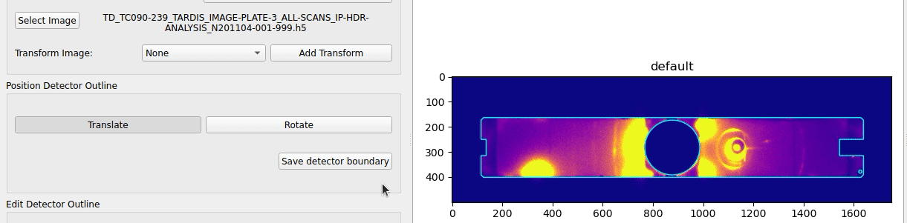

### Edit Detector Outline

Depending on the image or current color map, the default style settings for the template may make it hard to see, or you may want to differentiate between multiple detectors with different boundaries. For these needs there is the option to change the color, line style and thickness.

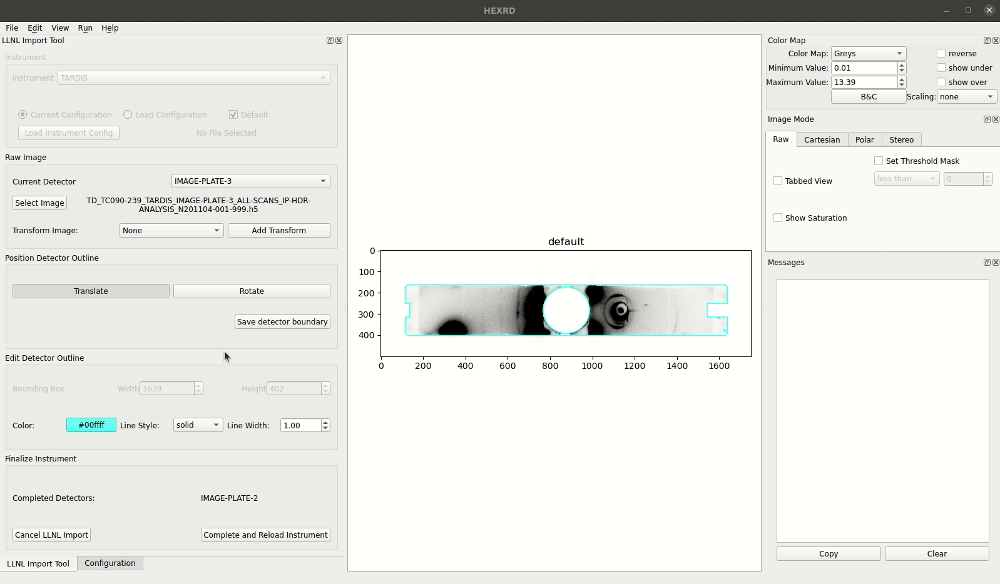

For the PXRDIP instrument the bounding box inputs will also be enabled. There is sometimes a need to edit the exact size of these templates and these inputs allow for that. At the moment this only applies to PXRDIP and only allows the boundaries to be made smaller than the defaults.

### Finalize Instrument

Each time that a template is saved its name is added to the `Finalize Instrument` section and the option to `Complete and Reload Instrument` is enabled.

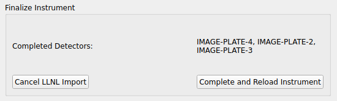

At any point in the workflow you can use the `Cancel LLNL Import` to clear the progress you've made and return everything to its defaults. This is the only way to re-enable instrument selection once the first image has been loaded.

If everything seems correct you can select `Complete and Reload Instrument`. This will crop all of the images as well as build a new configuration with updated row and column sizes as well as tilt values (if appropriate). The configuration that you selected at the very beginning will be used for this step and will just be updated internally where necessary. This new configuration as well as the newly cropped images will all be loaded into the GUI.

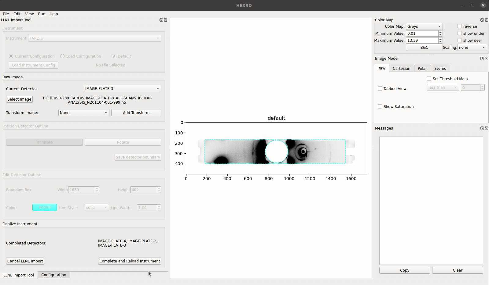

*Note*: This does **not** modify your original configuration file. You can save this new config through `File->Save->Configuration` and the images through `File->Save->Images`, or you can save everything as a state file with `File->Save->State`. For more detailed information on state files see the doc [here](state.md).
