# Instrument

The instrument configuration can be a great starting point for analysis.
This configuration includes information such as the beam energy, beam vector,
and the number, type, and positions of detectors. There are a variety of ways to
configure the instrument. A brief summary is provided below.

## Loading and Saving

The simplest way to configure an instrument is to load a pre-existing configuration.
These configurations are contained in either yaml files or HEXRD (an HDF5 file with a
`.hexrd extension`) files. Loading a state file will also set the instrument
configuration (see [state files](state.md)).

To load an instrument configuration, click `File->Open->Configuration`, and then
select an instrument configuration file. A few examples can be found here:

* [PXRDIP](https://github.com/HEXRD/hexrd/blob/master/hexrd/resources/pxrdip_reference_config.yml)
* [TARDIS](https://github.com/HEXRD/hexrd/blob/master/hexrd/resources/tardis_reference_config.yml)
* [GE](https://github.com/HEXRD/examples/blob/master/NIST_ruby/single_GE/include/ge_detector_hexrd03.yml)
* [Dexelas](https://github.com/HEXRD/examples/blob/master/NIST_ruby/multiruby_dexelas/include/dexelas_id3a_20200130.yml)

When you are satisfied with your instrument configuration, you may save it to a file
via `File->Save->Configuration`. You can then select either a yaml or HEXRD
file format. The yaml format has the benefit of being easier to read, but the HEXRD
format is necessary for configurations that include, for instance, 2D panel buffers.

There are several ways to manually configure an instrument. Those methods will be
covered below.

## Tree View

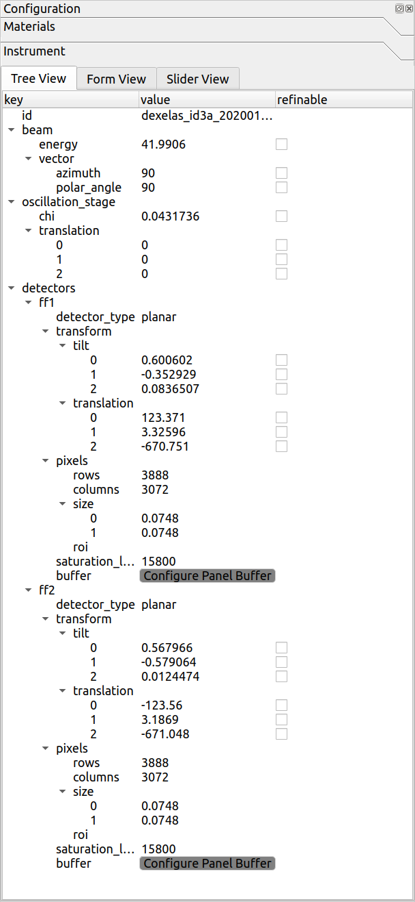

The tree view provides a yaml-like view of your instrument configuration. It can be
helpful especially if you are familiar with using the HEXRD yaml files.

In this view, you are able to see and edit most of the values in the instrument
configuration. Any edits should cause a live update in the image canvas (as long
as `View->Show Live Updates` is checked). You are also able to edit which parameters
are refinable here, which is helpful if you plan to run a calibration later (see
[refinements](../calibration/refinements.md) for more details about
calibration refinements).

There are some context menu options available if you right-click a row in the tree
view. For instance, you may collapse/show a row and all of its children, or
check/uncheck the refinable option for a row and all of its children.

## Form View

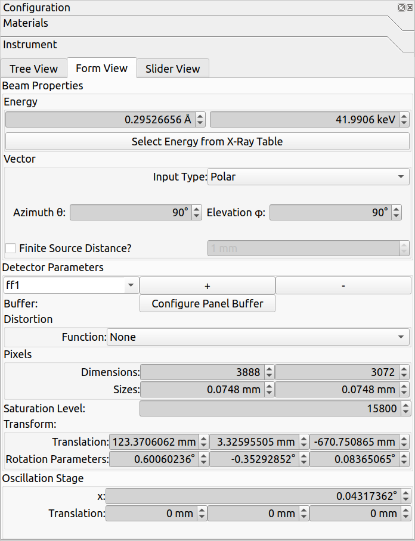

The form view uses widgets to display the instrument configuration, and it offers
some additional methods for configuring the instrument.

For instance, if the x-ray was produced by burning a metal foil, it may be selected
through the ["Select Energy from X-Ray Table" button](#x-ray-energy-selection).
The beam vector can be specified by either polar or cartesian
coordinates. Whether or not there is a finite source distance (used primarily for
[pinhole distortion methods](overlays.md#pinhole-distortion)) may be specified. A distortion
function may be applied (such as `GE_41RT`). And detectors can be added (with the
`+` button), removed (with the `-` button), or renamed (using the combo box in the
"Detector Parameters" section).

In the form view, a gray background for the widgets indicates that they are not
refinable (see [the refinements section](../calibration/refinements.md)) during
calibration.

### X-Ray Energy Selection

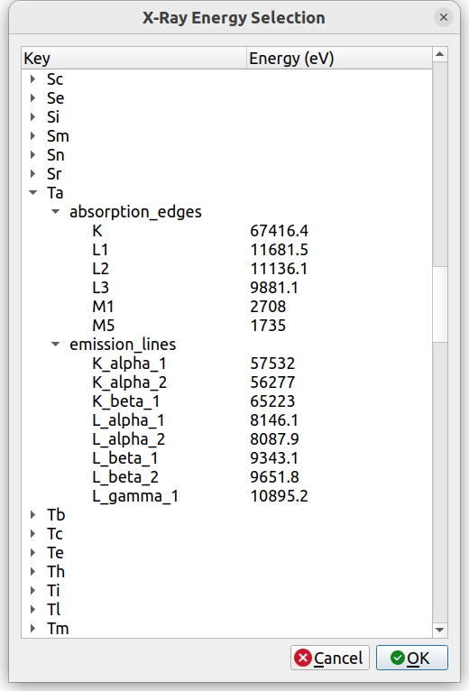

In the form view, if the "Select Energy from X-Ray Table" button is clicked, the
above dialog should appear.

If the x-ray was produced by burning a metal foil, the x-ray energy may be selected
through this dialog.

The displayed table provides absorption edges and emission lines for a variety of elements.
A single row can be selected to use the energy of that entry, or multiple rows can
be selected, in which case, their energies will be averaged together.

### Panel Buffers

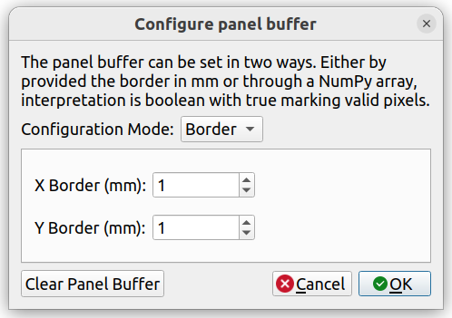

If `Configure Panel Buffer` is clicked, then the panel buffer options for the
currently selected detector will appear. The panel buffer is used to exclude some
pixels in the images from the view modes and various analysis methods.

The `Border` mode of the panel buffer indicates that pixels along the borders should
be excluded. The input is in `mm`, and the number of pixels excluded is computed
automatically from this.

Alternatively, a NumPy array (`.npy` file) may be provided. This is a 2D boolean
array that matches the shape of the detector exactly, and it explicitly indicates which
pixels should be kept/ignored. This array can be viewed by clicking `Show Panel Buffer`.

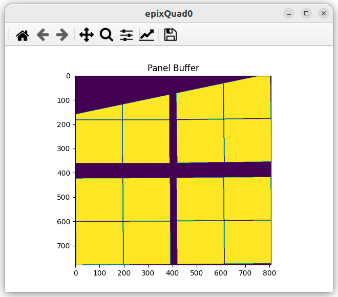

Purple pixels are excluded, and yellow pixels are included.

The panel buffer may also be cleared entirely by clicking `Clear Panel Buffer`.

## Slider View

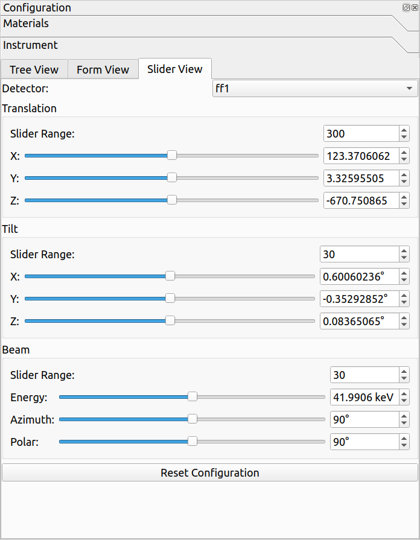

The slider view provides interactive sliders for editing detector and beam parameters.
For editing detector parameters, the detector must be specified in the combo box at the
top.

The "Slider Range" for each section indicates what the range of the slider will be.
Note that modifying the slider range will also reset the slider to the center of the
range (which is necessary to go beyond the original ranges).

One use case for the slider view is to roughly set the detector parameters manually
("eyeball" it), so that any automatic calibration afterwards is more likely to succeed.
For instance, if one detector is translated incorrectly, as shown below:

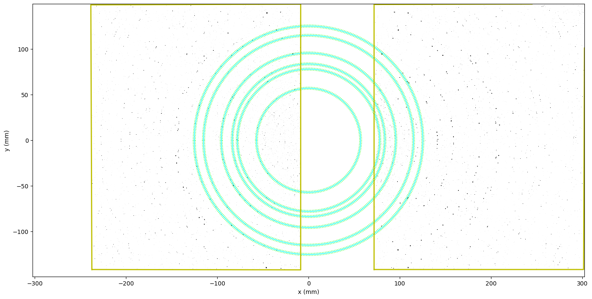

The sliders can be used to interactively move the detector to roughly the correct
position:

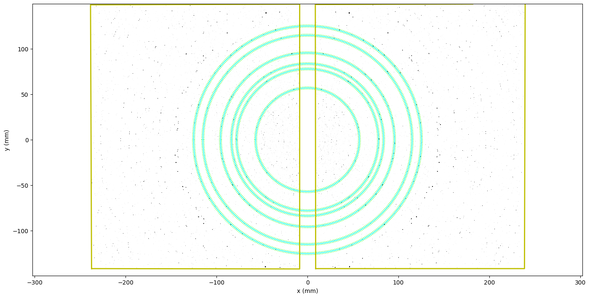

This can help ensure that calibration will succeed.

The `Reset Configuration` button at the bottom may be used to reset the
configuration (see [here](#resetting-the-instrument-configuration) for more
details).

*Note: increase the Cartesian pixel size (e.g., to 1) for faster interactivity*

## Additional Details

### Euler Angle Convention

Since the detectors are in 3D space, their tilt angles can be displayed and specified
using a variety of conventions. By default, HEXRDGUI uses the `Extrinsic XYZ` Euler
angle convention. This is modifiable, however, under `Edit->Euler Angle Convention`.

Currently, the other options are `None` (which uses the exponential map parameters),
and `Intrinsic ZXZ`.

The tree view, form view, and slider view will all display their detector tilt angles
using the selected Euler angle convention.

### Resetting the Instrument Configuration

When the instrument configuration is first loaded, it is saved internally, so that it
may be restored at any time by clicking the `Reset Configuration` button. This
feature is available in both the slider view, and via `Edit->Reset Instrument Config`.

### Detectors with subpanels

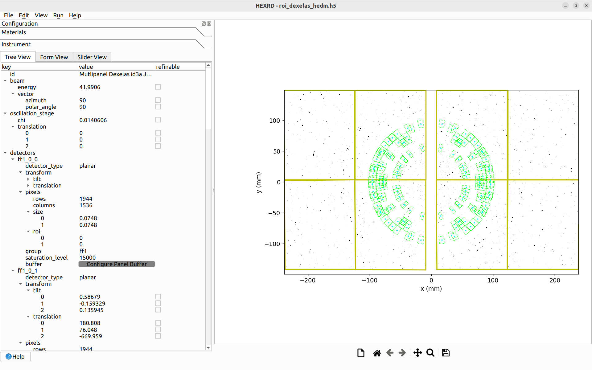

When a detector contains subpanels (e.g., Dexela, Pilatus, Eiger), the subpanels
are not always perfectly aligned with one another. This misalignment can
introduce greater inaccuracies when performing analysis on the data.

Treating the subpanels as separate detectors, where each subpanel has its own
tilt/translation (thus allowing each subpanel to take into account any misalignment),
has been shown to improve the quality of calibration and
accuracy of subsequent analysis. HEXRDGUI provides a special way to do this
(see [here](https://github.com/HEXRD/examples/blob/master/state_examples/Dexelas_HEDM/roi_dexelas_hedm.h5) for the example used in this section).

First, an instrument config needs to be created that contains a separate detector
entry for each subpanel. For example, see here two subpanels (`ff1_0_0` and
`ff1_0_1`) out of the four subpanels for a single Dexela panel (`ff1`):

```yaml
detectors:
  ff1_0_0:
    pixels:
      rows: 1944
      columns: 1536
      size: [0.0748, 0.0748]
      roi: [0, 0]
    group: ff1
    saturation_level: 15000
    transform:
      tilt: [0, 0, 0]
      translation: [66, 76, -670]
  ff1_0_1:
    pixels:
      rows: 1944
      columns: 1536
      size: [0.0748, 0.0748]
      roi: [0, 1536]
    group: ff1
    saturation_level: 15000
    transform:
      tilt: [0, 0, 0]
      translation: [181, 76, -670]
```

If the image data is already split up into separate subpanels, each subpanel can
just be treated as a separate detector with no other special considerations
(analysis can be performed as usual).
However, the image data most likely contains the data from each subpanel stitched
together. In this case, we need to define regions in the image data for each
subpanel.

In the configuration, each subpanel entry should contain an `roi`
(region-of-interest) entry under
`pixels`, which indicates the `start` in pixel (`ij`) coordinates
for that subpanel within the larger panel image.
The `rows` and `columns` should be equal to the size of the subpanel
(not the whole panel). These are used to determine how many pixels to read
past the start `roi` values. Dexela detectors are `3888x3072`, and contain 4
subpanels, where each subpanel is `1944x1536`. For Dexela detectors, the ROIs
for subpanels `ff1_0_0`, `ff1_0_1`, `ff1_1_0`, and `ff1_1_1` are `[0, 0]`,
`[0, 1536]`, `[1944, 0]`, and `[1944, 1536]`, respectively.

Once the `roi` is set up properly, a `group` key must be present as well, which
indicates which panel each subpanel belongs to. For Dexela detectors, this usually
means `ff1_0_0`, `ff1_0_1`, `ff1_1_0`, and `ff1_1_1` are all in group `ff1`. The
`group` key can be anything, as long as all subpanels within the same panel contain
the same `group` key.

When the `roi` and `group` keys are present for each detector, the
[Simple Image Series Loader](images.md#simple-image-series) may be used to load
in the two larger panel images. The software will automatically detect that it is
set up for subpanels, and allow the user to load in the larger panel images
(rather than a smaller image for each subpanel).

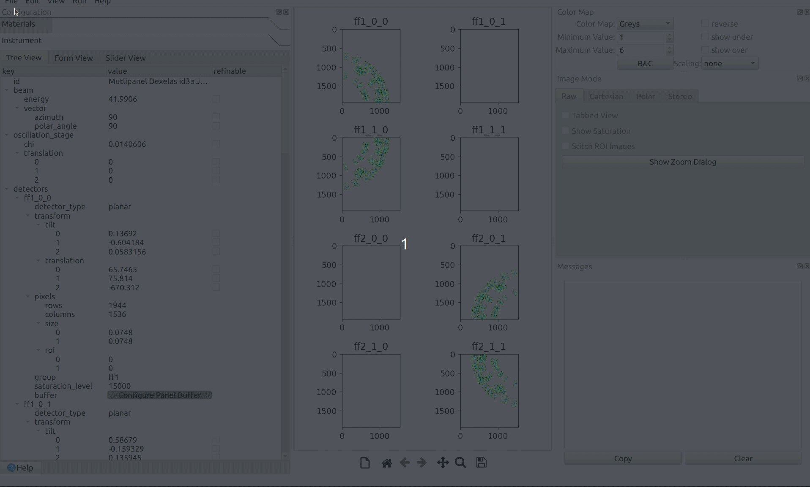

The files may be loaded with or without aggregation (depending on the
Simple Image Series settings).

After loading, a few special options for this subpanel setup are present within
HEXRDGUI. With the [raw view](../views.md#raw-view) active, a checkbox appears
in the raw view options titled "Stitch ROI Images". If checked, the images will
be stitched together, with their `group` label at the top.

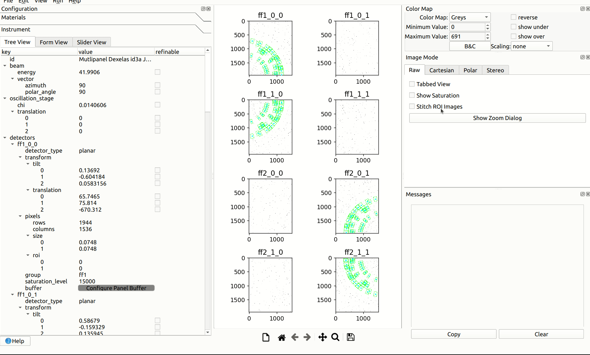

After the subpanels have been stitched together, the mouse hover information at
the bottom of the window also displays the current subpanel that the mouse is
hovering over.

The other raw view settings (including `Tabbed View`,
`Show Saturation`, and `Show Zoom Dialog`) all automatically take into account this
stitched setting. This is helpful for visualizing the data from the whole panels
(as loaded). However, all calculations (including the simulated overlays displayed
on the raw view) still treat each subpanel as a separate detector.

Another special option appears in the [slider view](#slider-view) labeled
"Lock ROI Group Transformations". If checked, translating/rotating one subpanel
via a slider will translate/rotate all other subpanels in the same group by the
same amount (for rotation, the subpanels will be rotated about the center of
the subpanels).

*Note: increase the Cartesian pixel size (e.g., to 1) for faster interactivity*

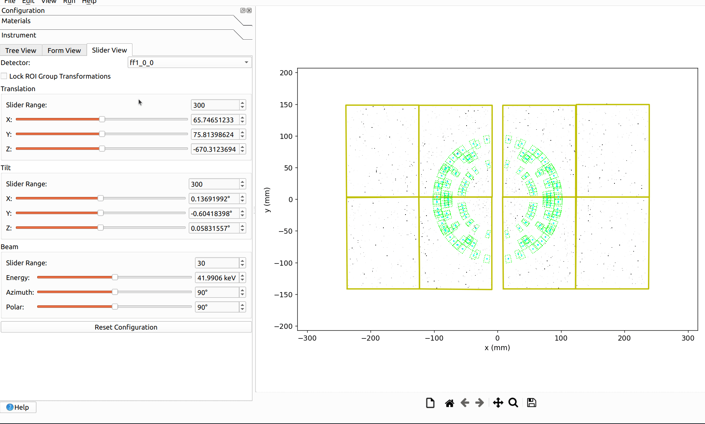

The [HEDM workflow](../hedm/overview.md) can be performed as usual, where each
subpanel will be treated as a separate detector.

In the near future, we plan to allow for additional constraints to be placed
between subpanels when performing instrument calibration, so that the relative
translations/tilts between subpanels may be fixed.
