# Creating Masks

## Raw and Polar View

The tools listed below are available to use in either the raw or polar view modes.

### Ellipse and Rectangle
The ellipse/rectangle masking tool provides a way to easily draw rectangular or ellipsoidal bounds around selected regions. This can be found in the `Edit` menu: `Edit` -> `Masks` -> `Draw` -> `Ellipse/Rectangle`.

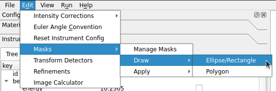

To add a new mask, select the shape that you would like to draw from the drop-down menu in the dialog, then left-click and drag to draw the bounds. Drawn shapes can be adjusted if needed - simply select the shape (the current selection will be highlighted red) and then left-click and drag (or use the keyboard arrow keys) to translate the shape. To rotate, hold shift and left-click or hold shift and use the keyboard arrows.

While rectangle/ellipse masks can be rotated and translated, they cannot be resized. If you find that you need to completely re-do a mask (or simply remove an unnecessary one) use the `undo` option.

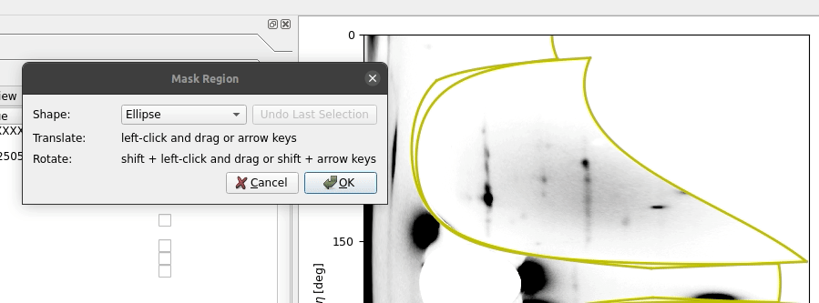

Once all masks have been added select `OK` to apply them.

### Polygon
The polygon masking tool offers a way to select more irregular regions to mask and can be found in the `Edit` menu: `Edit` -> `Masks` -> `Draw` -> `Polygon`.

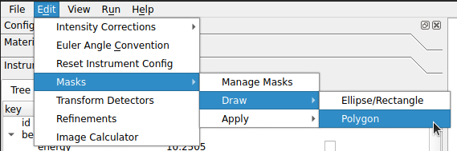

For more complex masking needs the polygon tool is very useful. Regions are defined by left-clicking to create a series of points, which will form the boundary of the mask. All values within the boundary will be what is masked. Once the region has been completely selected you can start a new selection by right-clicking anywhere to indicate you are done with the current region. When you begin adding new points now they will be a new color now to indicate that you are defining a new region.

Selecting `OK` will apply the masks to the image.

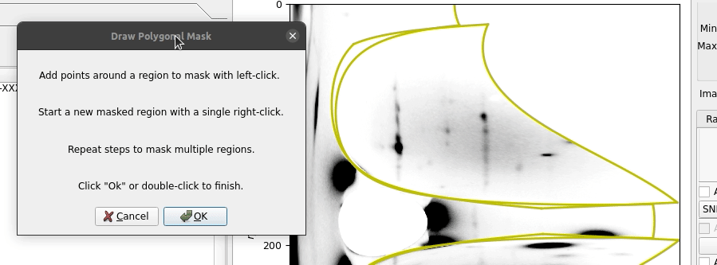

### Pinhole
To apply Pinhole masking go to `Edit` -> `Masks` -> `Apply` -> `Pinhole`.

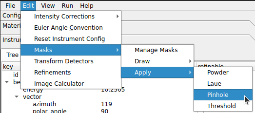

For instruments with a pinhole setup the pinhole masking tool provides a very simple way of masking extraneous x-ray diffraction information. The radius and thickness inputs simply represent the radius and thickness of the pinhole. The default values represent the typical setup but either can be adjusted if needed.

### Threshold
The threshold masking tool can be found under `Edit` -> `Masks` -> `Apply` -> `Threshold`.

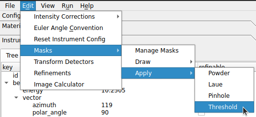

The dialog allows two input values to define the range of valid (unmasked) data and the `Apply` button must be used to accept the current input values. `Restore Defaults` will clear any applied threshold masking. The `-inf` and `inf` strings are also valid inputs to include/exclude all values.

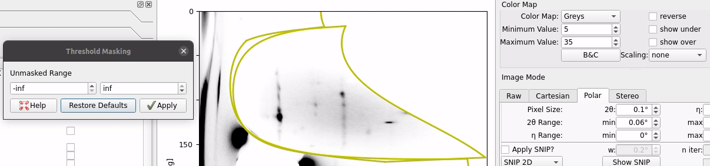

## Polar View Only

### Laue Spots
When in the Polar View and the Laue overlay is applied the Laue spots can be easily masked with the option under `Edit` -> `Masks` -> `Apply` -> `Laue`.

### Powder Rings
When in the Polar View and the powder overlay is applied the powder rings can be easily masked with the option under `Edit` -> `Masks` -> `Apply` -> `Powder`.

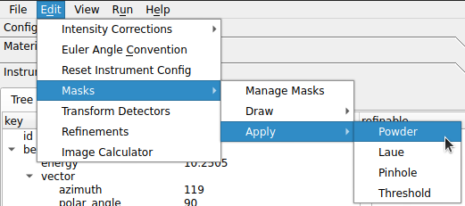

# Managing Masks

Found under `Edit` -> `Masks` -> `Manage Masks`, the mask manager is a very useful tool for editing, importing, exporting, and removing masks.

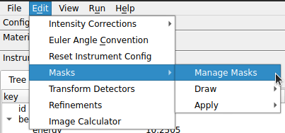

Existing masks can be re-named by double-clicking the `Name` field and they can be removed via the `Remove Mask` button next to each mask. The applied masking can be toggled on or off without removing the mask by checking or unchecking the `Visible` checkbox.

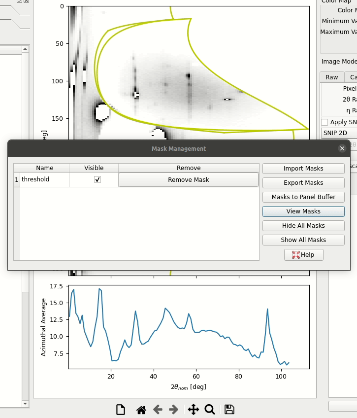

All of the current masks can be exported to an HDF5 file (using the `Export Masks` button) and existing files can be imported via the mask manager (using the `Import Masks` button). The names of masks and their visibility state will be remembered.

Masks can also be quickly shown or hidden with the `Hide All Masks` and `Show All Masks` options and a binary view of the masked regions is available through the `View Masks` button.

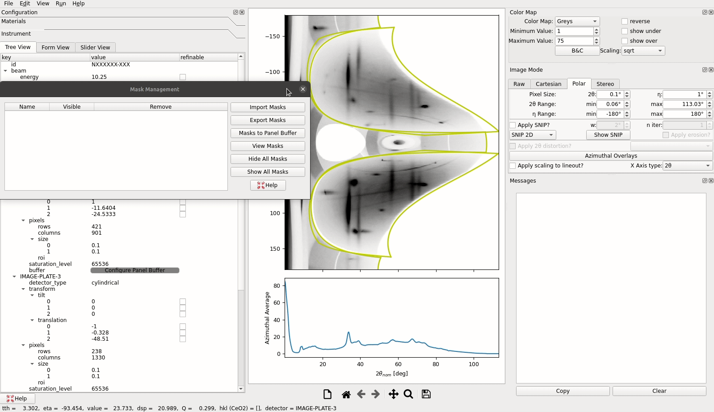

The `Masks to Panel Buffer` allows masks to be combined with the [panel buffer](instrument/#panel-buffers).
