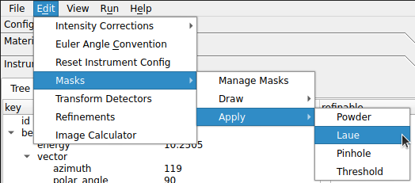

# Masking

<iframe width="1008" height="567" src="https://www.youtube.com/embed/iUzKD8C0DXg?si=2vMFJyuPBks84I-H" title="YouTube video player" frameborder="0" allow="accelerometer; autoplay; clipboard-write; encrypted-media; gyroscope; picture-in-picture; web-share" allowfullscreen></iframe>

## Raw and Polar View

Most masks may be applied while the main canvas is in either the raw or polar
[view modes](../views.md). Applied masks are still visible in the
stereographic view. However, applied masks **are not** currently visible
in the Cartesian view.

### Ellipse and Rectangle
The ellipse/rectangle masking tool provides an easy way to mask by drawing rectangular or ellipsoidal bounds around a region. This can be found in the `Edit` menu: `Edit` -> `Masks` -> `Draw` -> `Ellipse/Rectangle`.

To add a new mask, select the shape that you would like to draw from the drop-down menu in the dialog, then left-click the main canvas and drag to draw the bounds. Drawn shapes can be adjusted if needed - simply select the shape (the current selection will be highlighted red) and then left-click and drag (or use the keyboard arrow keys) to translate the shape. To rotate, hold shift and left-click or hold shift and use the keyboard arrows.

While rectangle/ellipse masks can be rotated and translated, they cannot be resized. If you find that you need to completely re-do a mask (or simply remove an unnecessary one) use the `undo` option.

Once all masks have been added, click `OK` to apply them.

### Polygon
The polygon masking tool offers a way to select more irregular regions to mask and can be found in the `Edit` menu: `Edit` -> `Masks` -> `Draw` -> `Polygon`.

For more complex masking needs, the polygon tool is very useful. Regions are defined by left-clicking the main canvas to create a series of points that define the boundary of the mask. All pixels within the boundary will be masked. When a region is complete, a new region may be started by right-clicking the main canvas. As new points are added, they will now be a different color to indicate that a new region is being defined.

Click `OK` to apply the masks to the image.

### Pinhole
To apply a pinhole mask, navigate to `Edit` -> `Masks` -> `Apply` -> `Pinhole`.

For samples with a pinhole, the pinhole masking tool provides a very simple way to mask invalid regions. The radius and thickness parameters define the radius and thickness of the pinhole.

### Threshold
The threshold masking tool can be found under `Edit` -> `Masks` -> `Apply` -> `Threshold`.

This dialog provides two input values to define the range of valid (unmasked) data. Click the `Apply` button to apply the current input values. `Restore Defaults` will clear any applied threshold masking. The `-inf` and `inf` strings are also valid inputs.

## Polar View Only

The following masks may only be applied in the polar view.

### Laue Spots
If the [Polar View](../views.md#polar-view) is active and there is at least one
Laue overlay, the Laue spot regions can be easily masked by selecting `Edit` -> `Masks` -> `Apply` -> `Laue`.

This can be useful, for instance, if you wish to mask out Laue spots in your
image, and you also know the material and crystal parameters that produced the
spots.

### Powder Rings
If the [Polar View](../views.md#polar-view) is activate and there is at least one
powder overlay, the powder overlay ranges can be easily masked by selecting `Edit` -> `Masks` -> `Apply` -> `Powder`.

This can be useful, for instance, if you wish to mask out Debye-scherrer rings
in your image, and you also know the material that produced them.

## Managing Masks

Located under `Edit` -> `Masks` -> `Manage Masks`, the mask manager is a very useful tool for editing, importing, exporting, and removing masks.

Existing masks can be renamed by double-clicking the `Name` field, and they can be removed by clicking the `Remove Mask` button next to each mask. The applied masking can be toggled on or off without removing the mask by toggling the `Visible` checkbox.

All of the current masks can be exported to an HDF5 file by clicking the `Export Masks` button. Masks may be imported from a file by clicking the `Import Masks` button. The names of masks and their visibility state will be remembered.

Masks can be quickly shown or hidden by clicking the `Show All Masks` and `Hide All Masks` buttons. A binary view of the masked regions may be displayed by clicking the `View Masks` button.

Most of the masking techniques described on this page are designed for masking
out regions in data from individual experiments.
Some detectors, however, have dead pixels or regions that need to be masked for
every experiment. For that, [panel buffers](instrument.md#panel-buffers) are
usually the best tool to use. However, if you have a panel buffer that needs
to be fine-tuned, you may first create a mask for that region, then click
the `Masks to Panel Buffer` button to write the masks to the panel buffer.
