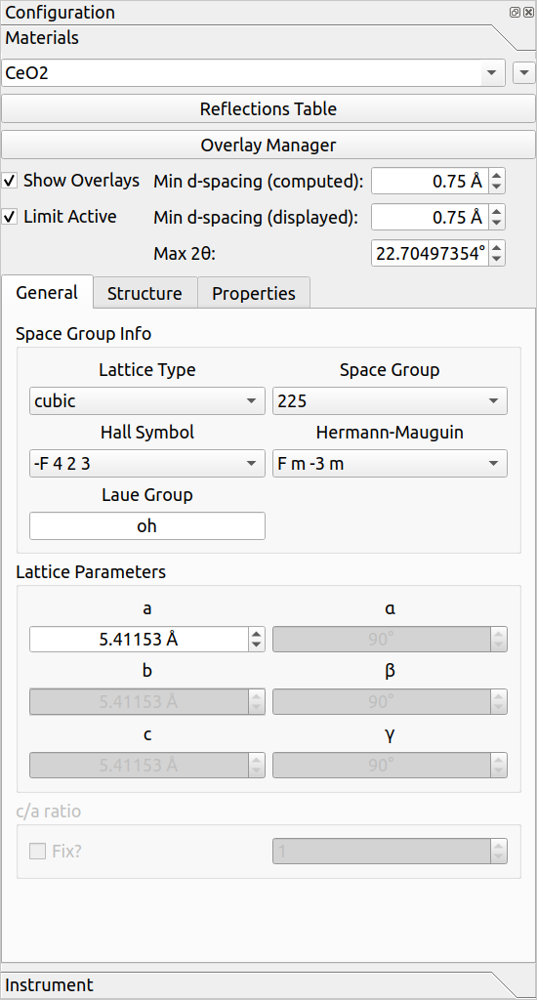
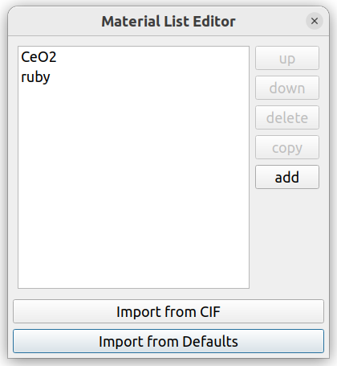
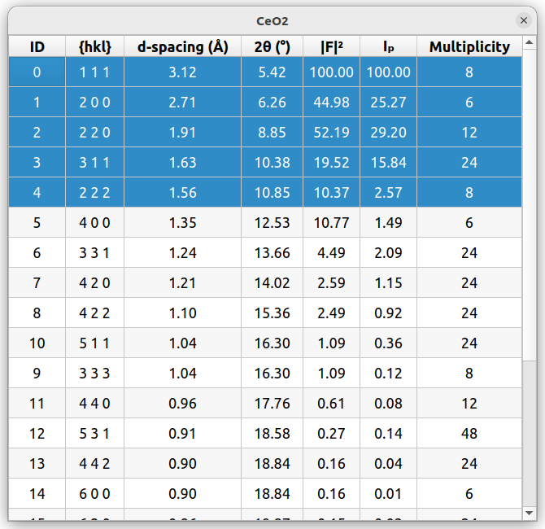

# Materials

Materials can be used in HEXRDGUI for a variety of purposes, including calibration
and drawing overlays.

## Loading and Saving

Materials may be loaded from an HDF5 file via `File->Open->Materials`.
This will replace all current materials with the ones from the file.
An example materials file may be found [here](https://github.com/HEXRD/hexrdgui/blob/master/hexrd/ui/resources/materials/materials.h5).

Similarly, materials may be written to an HDF5 file via `File->Save->Materials`.

Individual materials may be created and imported through the
[Material List Editor](#material-list-editor).

## Materials Panel

The materials panel provides many editable settings for materials.

The material name displayed in the combo box at the top (in this case, `CeO2`)
is the material that is currently being edited and used for any material-specific
options, such as the `Reflections Table`, General settings, etc. If you are
editing material settings, be sure you have the correct material selected!

The tool button to the far right on the same row opens up the
[Material List Editor](#material-list-editor), which can be used to add/delete
materials.

The `Overlay Manager` button opens up the global
[Overlay Manager](overlays.md#overlay-manager) settings. See
[overlays](overlays.md) for more details about overlays.

`Show Overlays` is a global option to turn on/off overlays in the canvas. It
applies to all materials, including the currently selected one.

The `Min d-spacing (computed)` is the minimum d-spacing that is actually computed
in HEXRD for the selected material. Reflections with a lower d-spacing will not be
computed. In addition, this number is used when computing
[Laue overlays](overlays.md#laue-overlays).

The `Min d-spacing (displayed)` will limit the selectable rows in the
[Reflections Table](#reflections-table). The `Max 2θ` below it is just
the `2θ` value corresponding to the `Min d-spacing (displayed)` (each
option edits the other). If `Limit Active` is unchecked, these two options
will be disabled.

### Material List Editor

The material list editor is accessible via the tool button in the top-right
corner of the materials panel (next to the current material name). This
editor allows reordering, deleting, copying, and adding new materials.

If a row is selected, the `up` or `down` buttons may be used for reordering,
`delete` deletes the material, and `copy` makes a deep copy of the material.
`add` creates a new default material. The materials may also be renamed in
this list.

Materials may be imported from CIF files as well by using the `Import from CIF`
button. HEXRDGUI also ships with a set of default materials which may be
imported via the `Import from Defaults` button at the bottom.

### Reflections Table

The reflections table may be used for a few reasons:

1. To view information about each available reflection
2. To show/hide the reflection for powder overlays
3. To select reflections to use in various steps in the [HEDM workflow](../hedm/indexing.md)

If a [powder overlay](overlays.md#powder-overlays) is visible for the selected
material, then only the reflections corresponding to the selected rows will be drawn.

Shift-click can be used to select multiple rows simultaneously, and ctrl-click may
be used to add/remove individual rows.

### General Settings

The general settings of the material include everything within the `General`
tab.

The `Space Group Info` section is used to select the space group. The `Lattice Type`
must first be used to select the correct lattice type, and then either the
`Space Group` number, `Hall Symbol`, or `Hermann-Mauguin` may be used to select
the space group within that lattice type.

The `Lattice Parameters` are automatically enabled/disabled depending on the selected
lattice type. For instance, for a `cubic` lattice type, only `a` will be enabled,
since all sides are the same and all angles are 90.

For tetragonal, trigonal, and hexagonal space groups, the `c/a` ratio may be fixed
in order to simplify exploration of values. If the `c/a` ratio is fixed, modifying
`a` or `c` will cause the other to update so to keep the ratio fixed, and modifying
the ratio value will cause `a` to change to reflect the new ratio value.

### Material Structure

FIXME: add content

### Material Properties

FIXME: add content
