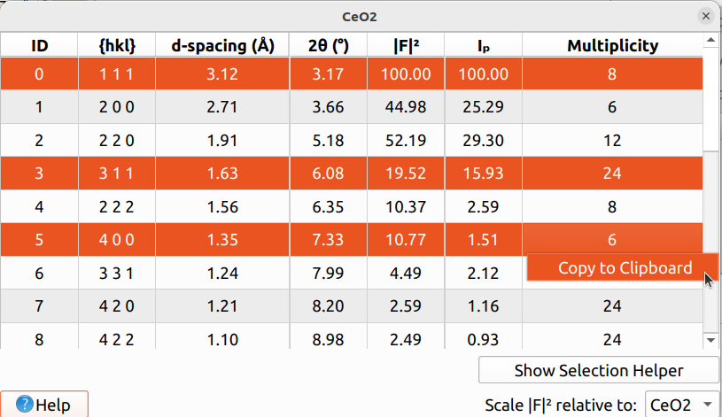
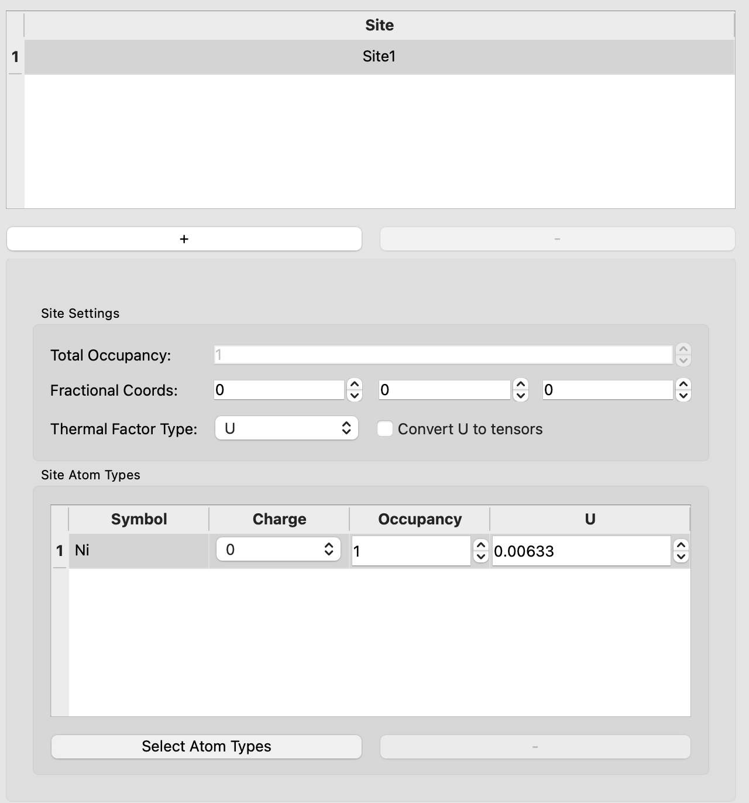
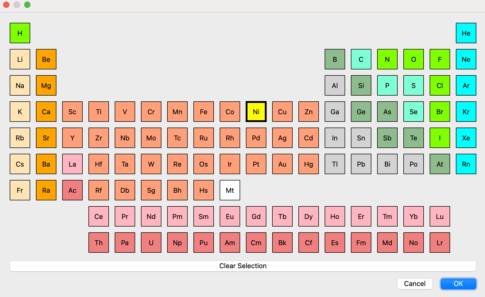
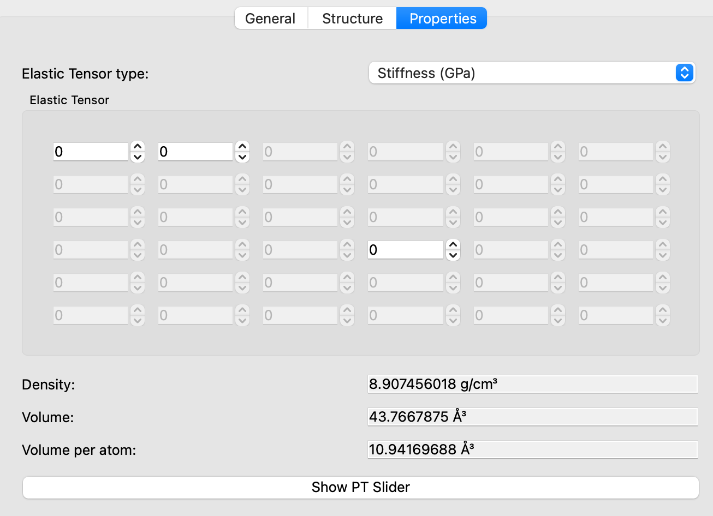
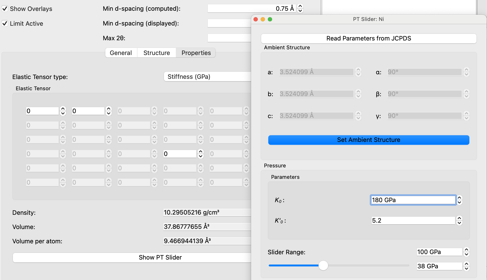

# Materials

Materials can be used in HEXRDGUI for a variety of purposes, including calibration
and drawing overlays.

## Loading and Saving

Materials may be loaded from an HDF5 file via `File->Open->Materials`.
This will replace all current materials with the ones from the file.
An example materials file may be found [here](https://github.com/HEXRD/hexrdgui/blob/master/hexrd/ui/resources/materials/materials.h5).

Similarly, materials may be written to an HDF5 file via `File->Save->Materials`.

Individual materials may be created and imported through the
[Material List Editor](#material-list-editor).

## Materials Panel


The materials panel provides many editable settings for materials.

The material name displayed in the combo box at the top (in this case, `CeO2`)
is the material that is currently being edited and used for any material-specific
options, such as the `Reflections Table`, General settings, etc. If you are
editing material settings, be sure you have the correct material selected!

The tool button to the far right on the same row opens up the
[Material List Editor](#material-list-editor), which can be used to add/delete
materials.

The `Overlay Manager` button opens up the global
[Overlay Manager](overlays.md#overlay-manager) settings. See
[overlays](overlays.md) for more details about overlays.

`Show Overlays` is a global option to turn on/off overlays in the canvas. It
applies to all materials, including the currently selected one.

The `Min d-spacing (computed)` is the minimum d-spacing that is actually computed
in HEXRD for the selected material. Reflections with a lower d-spacing will not be
computed. In addition, this number is used when computing
[Laue overlays](overlays.md#laue-overlays).

The `Min d-spacing (displayed)` will limit the selectable rows in the
[Reflections Table](#reflections-table). The `Max 2θ` below it is just
the `2θ` value corresponding to the `Min d-spacing (displayed)` (each
option edits the other). If `Limit Active` is unchecked, these two options
will be disabled.

### Material List Editor


The material list editor is accessible via the tool button in the top-right
corner of the materials panel (next to the current material name). This
editor allows reordering, deleting, copying, and adding new materials.

If a row is selected, the `up` or `down` buttons may be used for reordering,
`delete` deletes the material, and `copy` makes a deep copy of the material.
`add` creates a new default material. The materials may also be renamed in
this list.

Materials may be imported from CIF files as well by using the `Import from CIF`
button. HEXRDGUI also ships with a set of default materials which may be
imported via the `Import from Defaults` button at the bottom.

### Reflections Table


The reflections table may be used for a few reasons:

1. To view information about each available reflection
2. To show/hide the reflection for powder overlays
3. To select reflections to use in calibration methods
4. To select reflections to use in various steps in the [HEDM workflow](../hedm/indexing.md)

Shift-click can be used to select multiple rows simultaneously, and ctrl-click may
be used to add/remove individual rows. The rows may also be sorted by clicking on the
various columns at the top.

If a [powder overlay](overlays.md#powder-overlays) is visible for the selected
material, then only the reflections corresponding to the selected rows will be drawn.
These HKL selections also determine which HKLs are used for the various calibration
methods.

In the columns of the table, |F|² is the structure factor, and Iₚ is the powder
intensity. They are both normalized so that the maximum is 100.

Setting the min d-spacing in the [materials panel](#materials-panel) will affect
the number of rows in the reflections table. If an HKL falls below the
`Min d-spacing (computed)`, it will not be displayed in the table at all.
If an HKL falls below the `Min d-spacing (displayed)`, it will appear in the table,
but it will be grayed out and not selectable.

#### Copy to Clipboard

After selecting rows, if a row in the table is right-clicked, a context menu will
appear that provides an option to copy the selected rows to the clipboard:



If "Copy to Clipboard" is clicked, the clipboard will contain the
selected rows in CSV format. The above selection produces the following text
in the clipboard:

```
ID,{hkl},d-spacing (Å),2θ (°),|F|²,Iₚ,Multiplicity
0,1 1 1,3.12,3.17,100.00,100.00,8
3,3 1 1,1.63,6.08,19.52,15.93,24
5,4 0 0,1.35,7.33,10.77,1.51,6
```

This can be pasted into spreadsheet software, such as Microsoft Excel.

### General Settings

The general settings of the material include everything within the `General`
tab.

The `Space Group Info` section is used to select the space group. The `Lattice Type`
must first be used to select the correct lattice type, and then either the
`Space Group` number, `Hall Symbol`, or `Hermann-Mauguin` may be used to select
the space group within that lattice type.

The `Lattice Parameters` are automatically enabled/disabled depending on the selected
lattice type. For instance, for a `cubic` lattice type, only `a` will be enabled,
since all sides are the same and all angles are 90.

For tetragonal, trigonal, and hexagonal space groups, the `c/a` ratio may be fixed
in order to simplify exploration of values. If the `c/a` ratio is fixed, modifying
`a` or `c` will cause the other to update so to keep the ratio fixed, and modifying
the ratio value will cause `a` to change to reflect the new ratio value.

### Material Structure

The space group and lattice parameters of a material are sufficient to determine
list of allowed reflections and the $2\theta$ values for these reflections. 
However, in order to compute the correct structure factors, additional information
is required about the position of atoms in the unit cell. The `structure` tab lets
the user input this information. 



The following information is needed to fully define the atomic structure of a material:

1. fractional coordinates of the site
2. site occupancy
3. Debye-waller factor for the atoms

The user can select of remove a site. However, at least one site is required. The default
name of the site is `Site1`, `Site2` etc. These are editable fields and double-clicking on
the site will let the user edit its name as shown below


Each site has a unique position in the unit cell given by the fractional coordinates. The
user can specify this location in the `Fractional Coords` tab. Remember that the space group
symmetry introduces degeneracy in the different positions. For e.g. for an FCC crystal
the coordinates `[0, 0, 0]` is equivalent to `[1/2, 1/2, 0]`, `[1, 0, 0]`, `[1/2, 1, 0]`, $\cdots$ etc.

Within each site, the user can select the atom that sits on that site. The selection can be
made using the `Select Atom Types` button. The button opens a periodic table that lets the
user select the atom type at the site location as shown below:



Typically, one atom sits at each site.  However, 
It is possible for multiple atoms to occupy the same atomic site with fractional 
occupancy (summing up to 1). A relevant material system where this is the case are 
disordered alloys. In this case the user needs to select multiple atoms for the same
site position and set the occupancies correctly.

Finally, the thermal factor can either be specified as the `U` which represents the mean-squared displacement or `B` which is referred to as the B-factor in literature. The two numbers are related to each other via the relationship

$$
B = 8\pi^{2}U
$$

It is assumed that the temperature factors are isotropic by default. however, anisotropic thermal parameters can also be specified as a full tensor.

The structure tab also provides some helper functions to ensure accuracy of the material. The `remove duplicate atoms` is one such function. This button with check the equivalence of different sites and remove the ones which are too close to each other by crystal symmetry. Finally, if the user are happy with the changes made in the structure tab and want to apply those changes to the material, they need to press the `Apply` button. If the user is unhappy about the changes made, they can always go back to the starting structure using the `Reset` button.


### Material Properties

The properties tab has two primary functions:

1. Summarize the property of the material based on the space group, lattice parameters and atomic coordinates.
2. Let the user input other material properties such as the Elastic Tensor.

An example properties tab for ambient condition Nickel is shown below



The top panel can be used to specify the elastic constants of the material usig either the stiffness or compliance tensor. The units for the entries are in GPa or GPa$^{-1}$ respectively. Due to cubic crystal symmetry of Nickel, the Elastic Constant has only three independent variables, namely the $C_{11}$, $C_{12}$ and $C_{44}$. Depending on the crystal structure, the number of independent component of stiffness or compliance matrix will automatically be adjusted.

The space group, lattice parameters and atomic coordinates is used to compute the theoretical density (g/cm$^{3}$), the volume of the unit cell ($\AA^{3}$) and the volume of unit cell per atom ($\AA^{3}$). These quantities are displayed in the material properties tab as well.

The properties tab also implements a third order [Birch-Murnaghan (BM)](https://en.wikipedia.org/wiki/Birch–Murnaghan_equation_of_state) equation of state to compute the change in volume of the unit cell based on an input pressure-temperature condition. The `Show PT Slider` button opens up the window. A `JCPDS` (Joint Committee on Powder Diffraction Standards) file or manual input of BM EOS parameters is required. An example for Ni is shown in the image below:

 