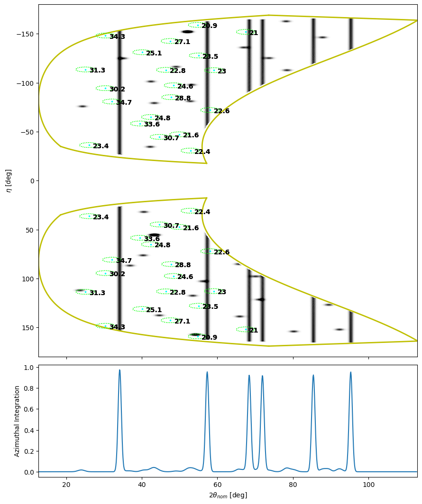

# Overlays

In HEXRDGUI, "overlays" are lines or spots drawn on top of the images that
represent different patterns found in the images. Specifically, there are three
main types of overlays in HEXRDGUI:

* [Powder](#powder-overlays)
* [Laue](#laue-overlays)
* [Rotation Series](#rotation-series-overlays)

These overlays are drawn in [all three view modes](../views.md). Each type of overlay
has the option to display tolerance ranges. And each type of overlay is used to perform
calibration. An example containing powder and Laue overlays in the polar
view is provided below:

The main entrypoint for accessing the overlay settings is through the overlay manager.

## Overlay Manager

The overlay manager dialog is used to manage the overlays found in the various views.
It is accessible through [the materials panel](materials.md#materials-panel):

The relevant button is boxed in blue. When that button is clicked, the overlay
manager dialog will appear:

The overlay manager displays a table where each row is a separate overlay. New overlays
may be added using the `Add` button. If a row is selected, it may be removed using
the `Remove` button, or its style may be edited via the `Edit Style` button (see the
[style editor](#overlay-style-editor) section for more details).

Within each row, the overlay's name, material, type, and visibility may be edited.
If a row is selected, more options for that overlay will be displayed at the bottom.
The options displayed will depend on the overlay type. See the sections for each
overlay type below for more information about these options.

### Overlay Style Editor

An overlay's drawing style in the canvas may be edited using the overlay style editor.
The button that opens the style editor is found in the
[Overlay Manager Dialog](#overlay-manager).

The types of style options depend on the overlay type. A powder overlay's settings appear
as the following:

The color, line style, and line width of either the main data lines or the ranges
lines may be edited here. Changes are reflected immediately in the canvas so that
the appearance may be seen, but changes are not actually saved unless the "OK"
button is pressed (pressing the "Cancel" button will revert to the previous settings).

A Laue overlay's settings appear as the following:

Note that because the main Laue data consists of spots instead of lines, there are marker
settings instead of line style settings.

Laue overlays also have the option to display labels (see [Laue overlays](#laue-overlays)).
The style of the labels may be edited here as well.

Rotation series overlay style settings are similar to Laue settings except that they
do not contain the option to edit label styles (since labeling is currently not an option
for them).

## Powder Overlays

Powder patterns arise from samples where there are many small crystals (powder-like) that
are oriented in random directions. The patterns appear as lines in the images, and can
either be straight or curved, depending on the view and whether or not distortions were
present.

An example of powder overlays being displayed in the [cartesian view](../views.md#cartesian-view)
may be seen in the 4-detector example below:

The blue, green, and red lines are the powder overlays. On the outer corners of the
detectors, you can see there are actual lines in the detector images. The
overlays are aligned on top of these lines. As such, this is an example of calibrated data.

Let's take a closer look at the overlays. Zooming into a region of the canvas and
enlarging the overlays (see [style editor](#overlay-style-editor)) results in the following image:

In this case, the blue solid lines are the simulated powder lines. The green dotted lines are
the ranges (defined by the width, see options below). The red dotted lines indicate that two
ranges were overlapping and were merged together to form one larger range.

### Powder Overlay Options

In the [overlay manager](#overlay-manager), if a row for a powder overlay is selected,
options similar to the following will appear at the bottom:

The first thing to note is the `Reflections Table` button. Clicking this will open up
a [reflections table](materials.md#reflections-table) for the powder overlay's material.

The powder overlay HKLs that are drawn are those whose rows are selected in the reflections table.
Modifying the selected rows in the reflections table will immediately update which HKLs
are drawn. These selected rows also determine which HKLs are used in calibration
methods. See [Reflections Table](materials.md#reflections-table) for more info.

*Note: the reflections table selections are saved on the material itself, so if you have
multiple powder overlays with the same material, modifying the selected reflections will
affect all of the powder overlays*

The next setting is `Enable Width`, along with the width value to the right of the checkbox.
If this is enabled, the specified width will be used to compute ranges around the simulated
data. These ranges are by default displayed using dotted lines, and can be merged if ranges
from two lines are overlapping (see closeup image above). These ranges are used in various
calibration methods (although some methods allow the ranges to be specified separately)

*Note: the width settings are also saved on the material itself, so if you have multiple
powder overlays with the same material, modifying the width settings of one will affect
the others*

In the `Distortion` group, a few different distortion types may be selected in order to
take into account distortions to the powder diffraction patterns in the images. The
simplest one is offset, which is a sample offset, in case the sample is displaced from the
origin. An offset with all zeros is equivalent to "no distortion". The
other option is `Pinhole Camera Correction` - see [Pinhole Distortions](#pinhole-distortions)
for more information.

`Clip with panel buffer?` is used to indicate whether the overlays should be clipped so
that they do not appear over excluded pixels (as specified by the
[panel buffer](instrument.md#panel-buffers)).

The `Refinements` section allows the user to set which material lattice parameters are
refinable during calibration. Note that this is also accessible in the refinements editor
(see [refinements](../calibration/refinements.md) for more details).

### Pinhole Distortions

Instruments that produce x-rays by burning a metal foil often require a pinhole
to restrict the x-rays that reach the detectors. The presence of the pinhole
can cause some distortion effects of the patterns and spots on the detector. A
few distortion methods are present in HEXRDGUI to help correct for these effects.

The pinhole distortion methods may be found in the overlay manager. After
selecting the row of a powder overlay, choose "Pinhole Camera Correction"
from the "Distortion" combo box. The "Correction Type" may then be selected below.

All of the pinhole distortion methods require a correct finite source distance
to be specified within the
["Form View" of the instrument configuration](instrument.md#form-view).

#### Sample Layer Distortion

The sample layer distortion is a correction based upon the difference in the
sample position and the pinhole position. The relevant options for it in the
GUI can be seen below:

An example of simulated TARDIS data with a sample layer distortion applied
is pictured below:

See [Polar View Distortion](#polar-view-distortion) for an example of using this
distortion to transform the polar view.

#### JHE Pinhole Distortion

The JHE (Jon H. Eggert) pinhole distortion arises from the following observation
from Eggert:

"In my PXRDIP and TARDIS Igor analysis package, I approximated this correction by
assuming that the pinhole diffraction arises from the center of the pinhole wall
opposite the image-plate pixel."

This method takes two parameters: the pinhole radius, and the pinhole thickness.

Both the JHE Pinhole Distortion and the Rygg Pinhole Distortion include a
button labeled "Apply Panel Buffers from Pinhole Dimensions". This button will
modify the [panel buffers](instrument.md#panel-buffers) so that pixels that fall
outside the pinhole dimensions will be excluded. This can be helpful because both
the pixel and overlay values outside of the pinhole dimensions are often invalid.

#### Rygg Pinhole Distortion

The Rygg pinhole distortion is fully described in [this paper](https://doi.org/10.1063/1.5129698).

It shares the same options as the JHE method, but also has an extra parameter for
the number of ϕ elements. Increasing the number of ϕ elements will improve
accuracy at the cost of greater computational expense.

The Rygg pinhole distortion is more complex and often more accurate than the JHE
pinhole distortion.

#### Polar View Distortion

The pinhole corrections may be used to transform the polar view. This essentially
distorts the polar view so that the curved overlays are now straight.

If a powder overlay exists in the overlay manager in which a pinhole correction
is applied, then a checkbox in the [polar view settings](../views.md#polar-view)
appears that allows an overlay to be selected:

The blue box in the image surrounds the relevant options.

If one of the overlays is selected, the pinhole distortion from that overlay is
used to distort the polar view. For instance, for the
[Sample Layer Distortion](#sample-layer-distortion) example provided above,
distorting the polar view using the "Ta powder" overlay results in the following:

Note that the Tantalum powder lines are now straight instead of curved.
The red lines (`gamma_Fe`) are transformed as well, and are almost straight (but
not quite).

This can be particularly helpful for calibration, and it can be done
for any overlay with a pinhole distortion.

## Laue Overlays

Laue overlays are spots resulting from an x-ray passing through a single crystal.
An example using simulated data can be seen below:

### Laue Overlay Options

Unlike the powder and rotation series overlays, Laue overlays are *not* affected
by selections in the reflections table. Instead, the spots that are generated
are based upon the `Min d-spacing (computed)` (see the
[Materials Panel](materials.md#materials-panel)) along with the min and max
energies specified in the Laue overlay options. An example of Laue overlay
options can be seen below:

As mentioned previously, the min and max energies (along with the
`Min d-spacing (computed)`) are what are used to determine which spots will be
generated.

Since the Laue overlays are spots, they have two width parameters: 2θ and
η. The shape of the width bounding box may either be an ellipse (default) or a
rectangle. Similar to the powder overlays, these width settings are used
during calibration methods.

*Note: Unlike the powder overlays, the width settings here are not saved on the
material, and thus every Laue overlay may have different width settings*

The Laue overlays also require crystal parameters to be specified. These
include the crystal's orientation, position, and stretch matrix. These parameters
may be entered manually or loaded via a `grains.out` file (or alternatively
loaded from the results of various steps in the [HEDM workflow](../hedm/indexing.md),
if available. These options appear if the `Load` button is clicked).

The `Slider` tab
enables interactive editing of the orientation and the position (the Laue overlays
in the canvas will update in real-time while the sliders are being modified).
And the `Refinements` tab allows crystal parameters to be flagged for refinement
during calibration. The refinement settings may also be found in the refinements
editor (see [refinements](../calibration/refinements.md) for more details).

Below the crystal parameters, the sample frame orientation may be specified.

Finally, a label for each spot may be optionally drawn in the canvas. The current
types of labels are HKL and Energy. Offset options are provided in order to specify
where the labels should be drawn relative to the spots in the canvas. The label
style settings may be edited in the [Overlay Style Editor](#overlay-style-editor).

An example of labeling the Laue overlays by energy may be seen below.

### Creating a Mask using Laue Overlays

Sometimes, Laue spots in the image arise from the presence of something
other than the sample, such as the material for a window (like LiF). If
that is the case, masking out these spots is often appropriate. This can
be done by first creating the Laue overlay with the correct settings so that
all relevant spots on the image are within the Laue overlay ranges, and then,
(within the polar view) clicking `Edit->Masks->Apply Laue Mask to Polar`.
This will mask out all pixels within visible Laue spot ranges.

## Rotation Series Overlays

Rotation series overlays represent patterns coming from a grain in a rotation series.
These overlays are particularly important for the HEDM workflow. They may
be drawn on either unaggregated or aggregated views of the data.

### Rotation Series General Settings

Similar to the powder overlays, but unlike the Laue overlays, selections in the
[reflections table](materials.md#reflections-table) are used to determine which
spots are drawn.

*Note: similar to the powder overlays, the reflections table selections are saved on the
material itself, so if you have multiple rotation series overlays with the same material,
modifying the selected reflections will affect all of the rotation series overlays*

An example aggregated view is provided below:

Zooming in on a region in the canvas reveals that, since this data is calibrated, the
rotation series overlays align with major spots in the image:

Options for these overlays appear as follows:

Since the image data was aggregated when it was loaded in (see
[Simple Image Series](images.md#simple-image-series) for more information about image
series aggregation), the `Aggregated` checkbox is disabled. Since the images were
aggregated, the overlays must be aggregated as well. However, if the images were not
aggregated, the overlays may be displayed on their correct frame. In this case, if
`Aggregated` is unchecked, then the `Omega Width` is used to determine whether or not
a spot should be drawn on a frame. An example is provided below:

Note that the bottom of the image indicates the selected frame, and provides the frame
index and the omega range for the frame. If the omega range of the spot (computed using
the spot's omega value and the `Omega Range` setting in the options) overlaps with the
center of the omega range of the frame, the spot will be drawn.

*Note: even if the overlay is aggregated, the Omega Width is still enabled because it is
used in [rotation series calibration](../calibration/rotation_series.md)*

The next option is the omega period. If the image data includes the omega information
(it must be loaded using the [Simple Image Series](images.md#simple-image-series) to do so),
the omega period can be pulled directly from the image series. In this case, it is
from 0 to 360 (although the spin boxes are grayed out, they display the correct values).
The `Use from Image Series` may be unchecked, however, and the settings edited manually if
needed. Note that this range must be equal to 360° - an error will be raised if it is not.

Similar to the Laue overlays, two width parameters are required: 2θ and η. Unlike the Laue
overlays, however, only rectangular ranges are allowed.

Similarly to the Laue overlays, crystal parameters must be specified. These may either
be entered manually or loaded in. If the `Load` button
is clicked, a grain may be selected from a `grains.out` file, from the most recent
[indexing results](../hedm/indexing.md), from the most recent
[fit grains results](../hedm/fit_grains.md), or from the most recent
[rotation series calibration results](../calibration/rotation_series.md).

Also similarly to Laue overlays, the crystal orientation and
position may be edited interactively in the `Slider` tab, and whether or not the crystal
parameters are refinable may be selected in the `Refinements` tab (the refinement settings
may also be accessed via the refinements editor - see [refinements](../calibration/refinements.md)
for more details).

### Eta and Omega Ranges

At the top of the rotation series options, note that in addition to a `General` tab, there
is also a tab to edit the eta and omega ranges.

This tab allows valid ranges of eta and omega values to be specified. This is particularly
useful if there is a range of eta or omega values that should not be included. For instance, if
you wish to exclude (`0`, `30°`) for eta, your eta ranges may be (`-180°`, `0`) for the first range,
and then (`30°`, `180°`) for the second range. This will result in the (`0`, `30°`) eta range being
excluded, as can be seen in the aggregated example below:

Ranges may be added using the `+` button at the bottom, and selected ranges may be removed
using the `-` button at the bottom.

If omega data is available in the image series (it must have been loaded using the
[Simple Image Series](images.md#simple-image-series)), then by default, the omega range
from the image series will be used. The user may override this, however, by unchecking
`Use from Image Series` and then creating ranges of valid omega values.

Optionally, the eta ranges may also be automatically generated by using the `Mask by Wedge`
button. This essentially creates ranges that exclude wedges around `-90°` and `270°`.
If clicked, a dialog will appearing asking for an `η Mask Width` in degrees (defaults to `5°`).
The resulting ranges will be (`-90° + width`, `90° - width`) and
(`90° + width`, `270° - width`). So, for example, choosing a width of `5°` will result in
ranges of (`-85°`, `85°`) and (`95°`, `265°`).

### Use in HEDM Workflow

Rotation series overlays are particularly important in the [HEDM workflow](../hedm/indexing.md).
After [`fit-grains`](../hedm/fit_grains.md) is completed, one rotation series overlay is
typically created for each grain (the grain results from `fit-grains` may be loaded by clicking
the `Load` button within the `Crystal Parameters` section). These rotation series overlays are
then used for [rotation series calibration](../calibration/rotation_series.md).
