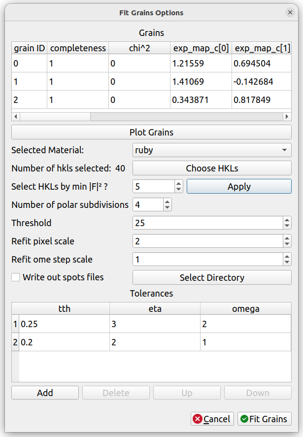
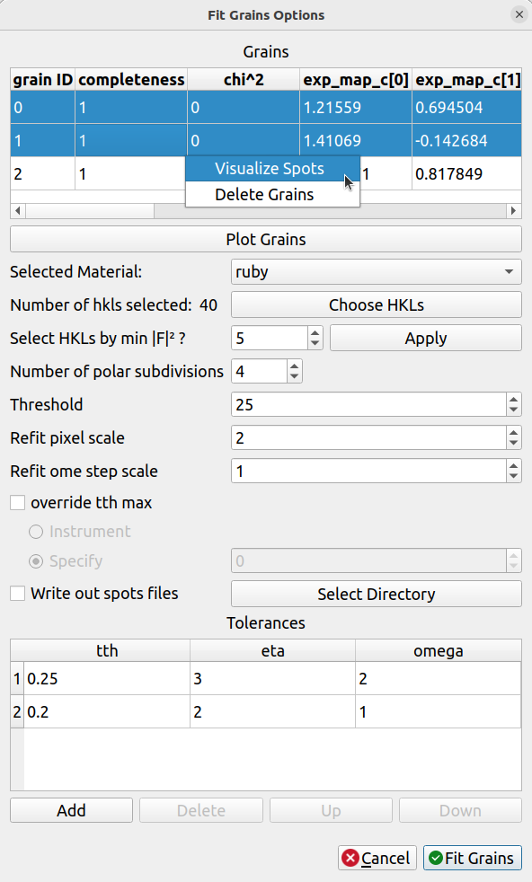
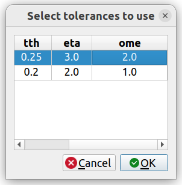
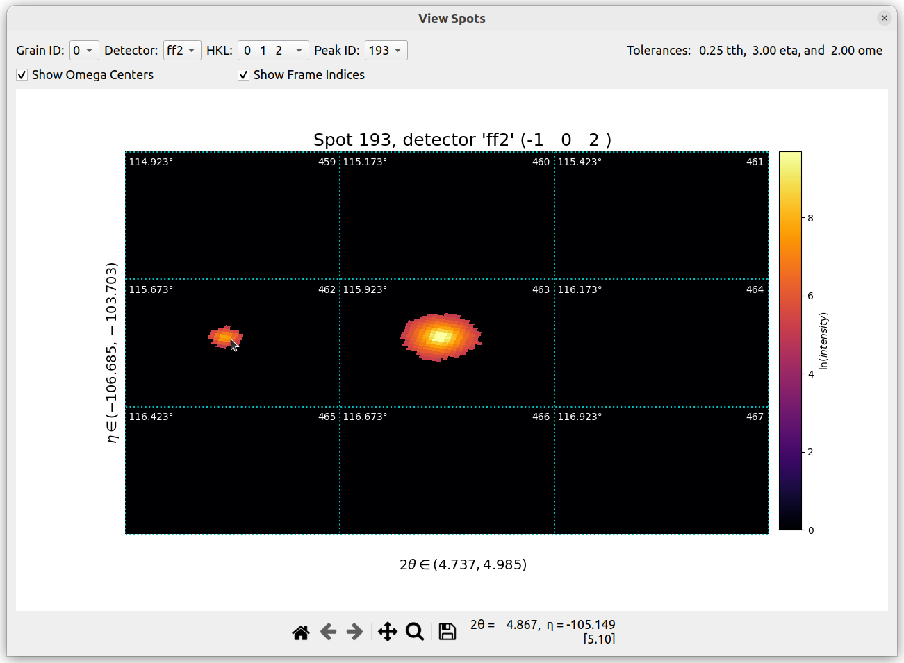
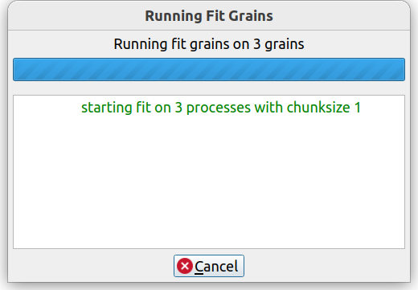
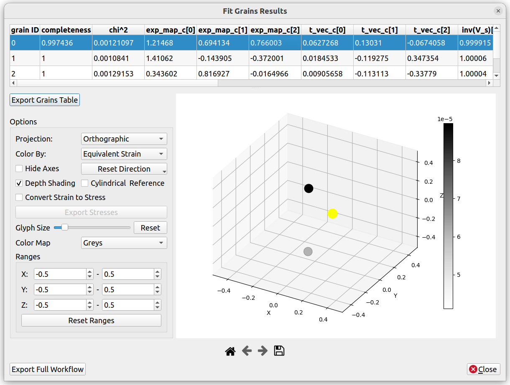

# Fit Grains

## Starting the Workflow

There are a few ways to start the Fit Grains workflow. If the
[indexing step](indexing.md) was performed, then the Fit Grains workflow
starts automatically after, and the [Fit Grains Options dialog](#fit-grains-options)
appears.

Alternatively, in the main window, `Run`->`HEDM`->`Fit Grains` may be selected.
In this case, input grains must be provided.
If Fit Grains was performed already in this session, there will be an option
to use the output grains from the most recent Fit Grains run.
If the [indexing step](indexing.md) was performed in this session, there will
be an option to use the grains from indexing. There are also options to
use grains from a `grains.out` file or from `accepted_orientations.dat`; if
either of these are chosen, make sure that there is a material in the
[materials panel](../configuration/materials.md#materials-panel) identical to
the material that was used to generate those grains.

## Fit Grains Options

At the top of the Fit Grains Options dialog is a table of grains that will
be the input to the Fit Grains algorithm. If these grains were produced from
the [indexing step](indexing.md), the only valid columns are the "grain ID"
and the `exp_map_c` (orientation) parameters; none of the other columns have
been computed, but they will be as a part of Fit Grains.

If some grains need to be removed,
rows in this table may be deleted right-clicking them, and then clicking
"Delete Grains".

### Plot Grains

The "Plot Grains" button enables you to plot the grains on top of eta-omega
maps in order to see how well the grains align with spots on the eta-omega
maps. This option is most useful if you skipped the indexing step (by loading
grains a different way), or if you wish to compare the grains with different
eta-omega maps than the ones that were used in the indexing step.
If "Plot Grains" is clicked, an NPZ file containing eta-omega maps must be
selected (this file may be
[exported from the Find Orientations dialog](indexing.md#export-options)).
Once selected, a dialog nearly identical to the [indexing results dialog](indexing.md#results)
will appear, enabling you to compare the grains to the eta-omega maps.

### Material

The "Selected Material" is the material that will be used in Fit Grains.
Click "Choose HKLs" to modify the HKLs that will be used
(see the [Reflections Table](../configuration/materials.md#reflections-table) for more information).
It is very typical to automatically select HKLs that are above
a certain structure factor. This can be done on the next row that says
"Select HKLs by min |F|²". Enter a minimum structure factor (note that this
is on a relative scale to 100, which is different than the command-line version
of HEXRD where the relative scale is to 1 instead), then click "Apply".
The HKLs that are above that structure factor will be automatically selected.

### Fitting Options

"Number of polar subdivisions" is the number of polar pixel grid subdivisions.

The "Threshold" should be set high enough so that background noise will not be
falsely identified as a spot, but low enough so that valid spots will not be
filtered out.

The "Refit" options are used to filter out reflections whose predicted values
are too far away from the actual centroid before performing a final fit at the
end. "Refit pixel scale" and "Refit ome step scale" are used to filter out
reflections whose centroid is too far away in pixels and omega value,
respectively. Then, a final fit is performed with the filtered reflections
before finishing.

If "Write out spots files" is checked, the raw spots data will be written
out in HDF5 format to the directory selected via the "Select Directory" button.
These files can be very large.

### Tolerances

The "Tolerances" table at the bottom of the dialog indicate the tolerances to
use when performing Fit Grains.

Fit Grains will be performed with these tolerances sequentially, row-by-row,
from top-to-bottom. The refined grain parameters created from the previous
row of tolerances will be used as input for the next row of tolerances, so
the tolerances should typically decrease in value with each new row,
which results in a tightening of tolerances and a more precise fit.

The tolerances need to be large enough to contain the spots. To get a
rough idea of these tolerances, a user could hover their mouse over a spot in
the main canvas image data to see the range of two theta and eta that it covers
(this will not help in estimating the omega tolerances, however). To verify
that the tolerances are satisfactory, a user is able to
[Visualize the Spots](#visualize-spots) for selected grains and a row of
tolerances. This is the best method for confirming that the tolerances are
satisfactory.

Rows may be added or removed via the "Add" and "Delete" buttons at the bottom
of the table. Rows may be sorted differently via the "Up" and "Down" buttons
at the bottom of the table.

## Visualize Spots

In order to verify that your current settings (including the tolerances) are
able to accurately identify the spots, the spots may be visualized. To do so,
highlight rows in the grains table at the top corresponding to the grains that
you wish to use, then right-click one of the highlighted rows. The option to
"Visualize Spots" should appear:

Next, a table will appear that is identical to the [Tolerances Table](#tolerances)
at the bottom of the options dialog.

Select a row in the table to use. These tolerances will be used when
identifying the spots. Then click "OK". The `pull_spots()` method in
HEXRD will then run to identify the spots. This can potentially take
a long time depending on the settings that were chosen.

After it finishes, the "View Spots" dialog will appear:

The displayed canvas contains multiple frames, where each frame corresponds
to a different omega value in the image series (the frames go in order from
left-to-right, then top-to-bottom). Each frame covers the same
two theta and eta range that are displayed on the axes
(hover your mouse over the frames and look at the
two theta and eta values in the mouse hover info to verify this).

If the two theta and eta tolerances were set correctly, one of the frames
should contain a single spot that covers most of the frame. This indicates
that the two theta and eta tolerances are satisfactory.
If there is more than one spot in the frame,
or if the spot appears very small, then the two theta and eta tolerances may
need to be tightened.

The omega tolerance affects how many frames will be
searched and displayed for each peak. There should be one frame with a large
spot, and this spot should shrink and disappear as the omega center increases
and decreases in neighboring frames. If there are extra frames at the
beginning and at the end which do not contain the main spot, then the omega
tolerance likely needs
to be tightened. If the spot doesn't disappear completely in the frames
displayed, then the omega tolerance likely needs to be loosened.

Different spots may be viewed by modifying the options at the
top: "Grain ID", "Detector", "HKL", and "Peak ID".

If a spot has a "Peak ID" that is negative, that means that the frames
either did not contain any signal, or that no spots were found. You are
still able to view those frames, though, if you select that "Peak ID".

Checking "Show Omega Centers" and "Show Frame Indices" will cause
the omega center value and the frame index, respectively, to appear
on each of the frames.

Once the tolerances have been verified, you may exit the "View Spots" dialog
and proceed to [run fit grains!](#running-fit-grains).

## Running Fit Grains

While Fit Grains is running, messages will be printed to the
progress dialog:

In case you realize that Fit Grains is going to take too long with the
options that were selected, there is a Cancel" button available. Clicking
this will return to the [Fit Grains Options dialog](#fit-grains-options)
so that you may modify the settings and run it again.

## Fit Grains Results

Once Fit Grains has completed, a dialog similar to the one below will appear:

### Grains Table

The table at the top contains the fitted grains, where each row corresponds to
a grain.

The `completeness` is a measurement of how many expected reflections were found
in the data. First, simulated reflections are computed using the grain
parameters. Then, the `completeness` is the ratio of the number of expected
reflections **found** in the data to the total number of expected reflections. A
higher `completeness` indicates that more expected reflections were found in the
data, and thus indicates a good fit. A value of 1.0 signifies that all expected
reflections were found in the data.

`Chi-squared` is a measure of the difference between the calculated and
measured g-vectors. A lower `chi-squared` value implies a better fit.

`exp_map_c` corresponds to the grain orientation, `t_vec_c` corresponds to
the grain positions, and `inv(V_s)` corresponds to the grain stretch matrix
(`ln(V_s)` is computed from `inv(V_s)`, and is provided for convenience).

These grain results may be exported via the "Export Grains Table" button. This
will export the grains in the HEXRD "grains.out" format, which is a txt format
that may be easily opened for viewing. After exporting, these grains may be
viewed again in future runs by clicking
"File"->"Open"->"Grain Fitting Results" (be sure that the material in
the [materials panel](../configuration/materials.md#materials-panel)
is correctly set to the same material before doing this).

### Grains Canvas

The canvas provides an interactive 3D plot of the grain positions (`t_vec_c`
in the grains table at the top). If rows in the grains table
are selected, the corresponding points in the plot will be highlighted.
Conversely, if points in the plot are left-clicked, their corresponding
rows in the table will be selected.

Many self-explanatory options are available for plotting, including projection,
coloring, direction, etc.

The "Color By" options include "Equivalent Stress" and "Hydrostatic Stress".
These are computed from the stretch matrix values in the grains table.

If "Cylindrical Reference" is checked, a cylindrical reference frame (ρ, φ, Y)
will be used for the 3D coordinates instead of cartesian coordinates.

If "Convert Strain to Stress" is checked, the elastic tensor for the material
is used to convert all "Color By ... Stress" options to "Color By ... Strain".
In order to use this, the elastic tensor for the material must be properly
set in the "Properties" tab of the
[materials panel](../configuration/materials.md#materials-panel). If this is
not set, when you check "Convert Strain to Stress", you will likely see a
"Singular matrix" error in the messages box.

Once "Convert Strain to Stress" has been checked, the computed stresses may
be exported via the "Export Stresses" button. This will write the stresses
to an NPZ file in a "stresses" key. This array has a shape of `(n, 6)`, where
`n` is the number of grains, and `6` are the Mandel-Voigt vector values
(similar to how they are presented in the grains table).

### Export Full Workflow

The "Export Full Workflow" button allows you to export your entire HEDM
workflow, including all settings chosen, for running it again using the
HEXRD command line. This can be particularly helpful if you would
like to repeat the same options for several other image series
(i. e., batch processing).

The button is enabled only if you proceeded
through the entire HEDM workflow, starting from [indexing](indexing.md).

When the button is clicked, you must select a directory where the files
will be exported. After selecting the directory, all necessary HEXRD
input files, including the images, instrument, materials, and the
workflow options will be exported.

You may then run `hexrd find-orientations workflow.yml`
and `hexrd fit-grains workflow.yml` to run through the same workflow in
the HEXRD command line. The output grains should be nearly identical
to those produced from HEXRDGUI (please notify us if that is not the case,
as there may be an issue we need to fix). The image files can then be swapped
out for other image files to run the same workflow on a different set of
image files. Scripts could be used to perform batch processing.

### After Fit Grains

After fit-grains is complete, note that you also have the
option to create [rotation series overlays](../configuration/overlays.md#rotation-series-overlays)
from the output grain data via the "Load" button in the rotation
series overlay editor.

A typical next step after running Fit Grains is to perform
[HEDM calibration](../calibration/rotation_series.md) in order to calibrate
your instrument (or any parameters you wish to mark as refinable) to the
grains data.
