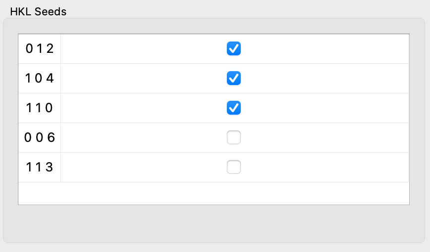
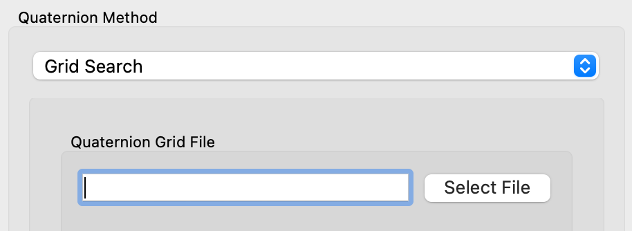

# Indexing


The first step in the HEDM workflow is to perform indexing in order
to determine the number of grains and their approximate orientations.

The indexing workflow follows this typical order:

1. Load in rotation series image data
2. Create or load a material that corresponds to the grain material
3. Generate or load Eta-Omega maps
4. Choose a method for generating quaternions
5. Generate the quaternions and visualize the results

## Rotation Series Data

To run the HEDM workflow, it is necessary to load rotation
series image data, in which there are multiple frames where each frame
corresponds to specific rotation angles (which are referred to as
"omega" values).

In order to correctly set up omega values for an image series, it
is necessary to load in the data using either the
[Simple Image Series Loader](../configuration/images.md#simple-image-series)
or the more advanced [Image Stack Loader](../configuration/images.md#image-stack).
Performing aggregation on the data is optional - the original
unaggregated image stack will be used during the HEDM workflow either
way (and performing aggregation can sometimes be more helpful for visualization
in the canvas). While loading in the data, please ensure that the omega values are
set correctly. See [here](../views.md#unaggregated-image-series) for more
information about visualizing unaggregated image series data.

## Setting up the Material

A material must have been created or loaded that corresponds to
the grain material. See the [materials](../configuration/materials.md)
section for more information.

For our example, we will use ruby, which is already provided in the
[state file](https://github.com/hexrd/examples/tree/master/state_examples/Dexelas_HEDM).

## Generating Eta-Omega Maps

An Eta-Omega map is generated by selecting a specific HKL that has
an associated two-theta value, finding all pixels in the image stack
that intersect with this two-theta value, sorting these pixels using
their corresponding eta and omega values, and then plotting the
resulting image.

This provides an image that shows all pixels that intersected with that
two-theta value. And we can use these images to determine the number of
grains and their orientations.

To start, click `Run->HEDM->Indexing`. A dialog will appear that allows
you to select how the Eta-Omega maps will be generated.


First, you must select your grain material via the "Selected Material"
option (if your grain material is
not in the drop-down list, see [Setting up the Material](#setting-up-the-material)).
The material's HKLs will be used to determine which two-theta values
are needed for the Eta-Omega maps.

After the grain material has been selected, the "Method" option
allows you to choose to either generate new Eta-Omega maps,
or load them from a file (note that if you load Eta-Omega maps
from a file, you **must** make sure that the material that was used
to generate them exactly matches your selected material, as they must
match, but we do not check in the program that they match).

### Selecting HKLs to Use

If you select to generate the Eta-Omega maps, you must then choose which
HKLs to use. Typically, you want to choose a few HKLs that have the
strongest signal in your image data. If you need help selecting these,
make sure your grain material is selected in the [materials panel](../configuration/materials.md#materials-panel),
and then, in the main canvas, hover your mouse over the spots with the
strongest signals in order to see which HKLs they are associated with
(pixel information, including any HKLs associated with that pixel,
is provided in the bottom-left corner of the main window
as the mouse is hovered over pixels in the main canvas).

The `Choose HKLs` button opens up the selected material's
[reflections table](../configuration/materials.md#reflections-table),
where the HKLs may be selected.

### Thresholding the Data

Next, you can choose whether or not to threshold your data. If a threshold
is selected, when the Eta-Omega maps are generated, any pixels that fall
below the threshold value will be set to zero. This can be helpful in
eliminating background noise if your signal values are much greater than
your background values. If you need help selecting a threshold value,
switch to the [raw view](../views.md#raw-view) in the main canvas, optionally
zoom in to a specific region, and hover your mouse over the signal and
the background (pixel information, including the intensity, is provided
in the bottom-left corner of the main window as the mouse is hovered over
pixels in the main canvas). Be sure to set the threshold high enough to
remove background noise but low enough so that signal values do not get
set to zero.

## Find Orientations


The goal of Find Orientations is to generate a list of grains
with their approximate orientations that correctly account for
the prominent spots in the rotation series image data.

There are [various ways](#quaternion-methods)
to generate the grains, but each way
utilizes the [Eta-Omega Maps](#generating-eta-omega-maps)
that were generated earlier.

These grains are then used as the input to [Fit Grains](fit_grains.md).

### Quaternion Methods

The orientations of the grains can be represented as quaternions (or "fibers").
The quaternion method, then, is the method that will be used to
find/create these quaternions, which will subsequently complete
the indexing step.

In the top-left corner of the dialog, the quaternion method may be
selected. Many options throughout the whole dialog change depending
on the selected quaternion method. The methods are listed below:

* [Seed Search](#seed-search) - automatically find quaternions through a blob detection algorithm
* [Grid Search](#grid-search) - test quaternions in a user-defined grid
* [Hand Picked](#hand-picked) - manually create quaternions by interacting with the Eta-Omega maps

#### Hand Picked


Perhaps the simplest way to create the quaternions is to pick them
by hand. This method works well when you can visually see the spots
in the canvas, but the [seed search methods](#seed-search) have some
issue correctly identifying them.

To do so, first select "Hand Picked" from the "Quaternion Method"
options in the top-left corner.

Then, in the canvas, right-click on a spot to generate the fiber.
Several markers will appear in the canvas, indicating where the
spots should be located for that HKL. The markers should all be
covering spots in the image.

Next, on the right-hand side of the dialog, change the "Displayed hkl"
to be a different one. The markers will most likely not align with the
spots on this image.

On the left-hand side of the dialog, move the slider. The markers in the
image should update as the slider is moved. Continue moving the slider
until all markers lie on top of spots in the image. Feel free to adjust
the "Fiber Step" to a smaller value to allow for finer adjustments of
the slider. Use the arrow buttons on the right for very fine adjustments.

Once the markers line up over spots on the second HKL image, the fiber
is complete! Click "Add Fiber" to add it to the list of picked fibers.


If you select a row in the "Picked Fibers" table, markers will be drawn
for that fiber on the main canvas. If the fiber appears incorrect, then
after selecting the row, click "Delete Selected" to delete it.

After the first fiber is completed, right-click on another spot in the
canvas to begin the process again by generating another fiber. Repeat
this process until all of the spots have markers over them. Then click
the "OK" button to finish!

#### Seed Search


The seed search method uses a blob detection algorithm in order to
generate a list of trial quaternions/fibers. The steps for the seed
search method are as follows:

1. Generate trial fibers using the blob detection method
2. Compute the completeness of each trial fiber using the [Omega and Eta Tolerances](#omega-and-eta-tolerances)
3. Perform [clustering](#clustering-parameters) to filter out fibers with low completeness and to combine similar fibers
4. View and confirm the [indexing results](#results)

There are three available methods for blob detection:
[Label](#label), [Blob Dog](#blob-dog-and-blob-log),
and [Blob Log](#blob-dog-and-blob-log).

##### Label

The label method for blob detection utilizes scipy's [`ndimage.label()`](https://docs.scipy.org/doc/scipy/reference/generated/scipy.ndimage.label.html#scipy-ndimage-label)
method followed by [`ndimage.center_of_mass()`](https://docs.scipy.org/doc/scipy/reference/generated/scipy.ndimage.center_of_mass.html#scipy-ndimage-center-of-mass)
in order to compute blob centers.

This method has two parameters: "Filter Radius" and "Threshold".
Prior to scipy's label method, the "Filter Radius" (as FWHM)
is used to apply a Laplace filter with
[`ndimage.filters.gaussian_laplace()`](https://docs.scipy.org/doc/scipy/reference/generated/scipy.ndimage.gaussian_laplace.html#scipy-ndimage-gaussian-laplace).
Values below the "Threshold" are then filtered out before proceeding
to scipy's label method.

To verify that the selected method and options are correctly identifying
the spots, see the [Label Spots Checkbox](#label-spots-checkbox).

##### Blob Dog and Blob Log

The Blob Dog and Blob Log methods utilize scikit-image to perform
blob detection. See the
[Blob Dog Documentation](https://scikit-image.org/docs/stable/api/skimage.feature.html#skimage.feature.blob_dog)
and the
[Blob Log Documentation](https://scikit-image.org/docs/stable/api/skimage.feature.html#skimage.feature.blob_log)
for more information about the methods and for
more details about the available options.

To verify that the selected method and options are correctly identifying
the spots, see the [Label Spots Checkbox](#label-spots-checkbox).

##### Label Spots Checkbox

The "Label Spots" checkbox can be used to display markers for the trial
quaternions that the currently selected blob detection method and its
corresponding settings generates.


This can be very helpful to ensure that the blob detection method is
working properly before proceeding. Feel free to modify the blob
detection settings while the checkbox is checked, and the markers should
update immediately.

The "Label Spots" checkbox can also be helpful in determining which
[HKL Seeds](#hkl-seeds) ought to be used. Change the "Displayed hkl"
to look through each one.

##### HKL Seeds



The "HKL Seeds" indicate which Eta-Omega maps are to be used for
generating the trial orientations/fibers.

To determine which Eta-Omega maps should be used, look through
each one by changing the "Displayed hkl" setting. We will
typically want to select Eta-Omega maps that have strong signals
for the spots.

##### Omega and Eta Tolerances


After trial quaternions/fibers are generated, the completeness of
each is computed using the omega and eta tolerances.

The "Eta Mask" is used to mask out eta values near the omega rotation
axis. The eta ranges that will be used are computed with the mask
like so:

```python
(-90 + mask, 90 - mask)
(90 + mask, 270 - mask)
```

Note that the [Indexing Threshold](#indexing-threshold) is also
used for computing the completeness of each trial fiber.

##### Clustering Parameters


After the completeness of each trial quaternion/fiber is computed,
clustering is performed. In the clustering step, quaternions/fibers
below a specified completeness are filtered out, and then similar fibers
are grouped (or "clustered") together to become single fibers.

There are three parameters available in the clustering step:

* Completeness - the minimum completeness of fibers to be considered.
                 Fibers below this completeness are filtered out.
* Radius - the max radius at which fibers should be grouped together.
* Algorithm - the clustering algorithm to use.

The three DBScan algorithms all utilize scikit-learn's [DBSCAN](https://scikit-learn.org/stable/modules/generated/sklearn.cluster.DBSCAN.html)
method, but they differ in the input parameters provided. "DBScan"
provides Euclidean input points. "ORT-DBScan" provides Euclidean
orthographic input points. Both "DBScan" and "ORT-DBScan" use a
minkowski metric. "SPH-DBScan" is a spherical DBScan that uses
pairwise distances for input.

The "FClusterData" algorithm utilize's scipy's [fclusterdata](https://docs.scipy.org/doc/scipy/reference/generated/scipy.cluster.hierarchy.fclusterdata.html).

Once the [indexing results](#results) are generated, if you
wish to re-run the clustering step using different parameters,
you may do so [via an option in the main window](#rerun-clustering).
This also provides an option to explicitly specify the minimum
number of samples to use, and an option to load an entirely different
set of orientations to use for the clustering.

#### Grid Search



The grid search method is very similar to the seed search method,
except that instead of generating trial quaternions/fibers through
blob detection, the trial quaternions/fibers are explicitly specified
in a file.

The file should be a NumPy `.npy` file, and the array it contains must
have a shape of `(4, n)`, where `n` is the number of trial quaternions.
So each column of the array is a separate quaternion.

See [Omega and Eta Tolerances](#omega-and-eta-tolerances) and
[Clustering Parameters](#clustering-parameters) for more details about
the other options.

### Filtering


Filtering options are provided to apply row-wise median and
gauss-laplace filtering in order to remove streak artifacts.

If "Apply filtering?" is checked, the row-wise median is
subtracted. If "Apply Gaussian Laplace?" is checked, a laplace
filter using Gaussian second derivatives is also applied that uses
the provied FWHM.

### Export Options


The "Export" button in the Find Orientations dialog allows you to
export the eta-omega maps as NPZ files. These eta-omega maps may
then be loaded in the [Generating Eta-Omega Maps](#generating-eta-omega-maps)
step. This can be done to avoid generating the Eta-Omega maps again.

If "Write scored orientations?" is checked, then "Select Directory"
should also be clicked to select the directory where the
scored orientations will be written. An NPZ file will be written
out to the directory that contains all trial quaternions/fibers
(in a 'test_quaternions' key) along with their computed completeness
values (in a 'score' key).

### Indexing Threshold


In the color map editor, the "Minimum Value" spinbox is highlighted,
indicating it has more use than just editing the color map. It is also
used to set the threshold used when computing the completeness of each
trial quaternion/fiber.

### Results

Once the indexing is complete, the results will appear in the
"Indexing Results" dialog.


This dialog allows you to confirm that the indexing was successful
before proceeding to [Fit Grains](fit_grains.md). The dialog displays
the Eta-Omega maps with the markers from the indexing results drawn on
top of them.

The Eta-Omega maps for different HKLs may be viewed by changing the
"HKL" setting. "Show results?" can be toggled to confirm that the
markers appear over prominent spots in the image. "Show all grains?"
can be unchecked, and a specific grain ID selected, in order to view
the markers for a specific grain.

#### View Grains

If "View Grains" is clicked, a table will appear that shows the grain
information from indexing:


Note that the only valid columns in the table view are the "grain ID"
and the "exp_map_c" (exponential map) parameters, which describe the
orientation. All of the other columns get computed during [Fit Grains](fit_grains.md).

The orientation parameters in this table are also only approximations
that will be refined further during [Fit Grains](fit_grains.md). But
viewing the current orientation parameters can still be helpful in
determining whether indexing was successful.

If the indexing was successful, click "OK",
and the [Fit Grains](fit_grains.md) workflow will automatically begin
with the results of the indexing.

If the indexing was not successful, click "Cancel". This will return
to the [Find Orientations Dialog](#find-orientations) so that you may
select different options and try again.

After indexing is complete, note that you also have the
option to create [rotation series overlays](../configuration/overlays.md#rotation-series-overlays)
from the indexing grain data via the "Load" button in the rotation
series overlay editor.

### Rerun Clustering

If you have already performed the indexing workflow, and you would
like to re-run it but only modify the [clustering parameters](#clustering-parameters),
then you may click `Run->HEDM->Re-run Clustering`. The following
dialog will appear:


In this dialog, you may select the same clustering parameters found
in the [Find Orientations Dialog](#find-orientations).
In the Find Orientations Dialog, the minimum number of samples is
computed automatically, but you may specify it explicitly here. You
may also load scored orientations to use explicitly for the clustering
input rather than using the ones previously generated in the indexing
workflow.

When you click "OK", only the clustering step is re-ran using
the new clustering parameters. After the clustering step is
finished, the [Indexing Results Dialog](#results) will appear
again with the results from the new set of clustering parameters.
