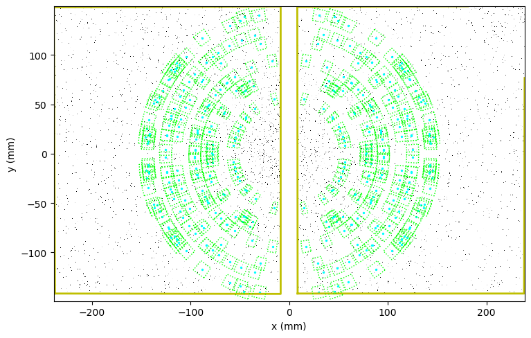

# Overview

HEXRDGUI contains a far-field high-energy diffraction microscopy (FF-HEDM)
workflow in order to compute grain information from monochromatic
rotation series data as well as calibrate instrument parameters to the data.

The three main steps are provided below, along with descriptions and
links to the corresponding documentation.

* [Indexing](indexing.md) (find-orientations) - determine the number of grains and their approximate orientations
* [Fitting](fit_grains.md) (fit-grains) - fit the grains more precisely to the image data
* [Calibration](../calibration/rotation_series.md) - calibrate an instrument and grains using the fitted grain data

The images provided in the documentation were created using the state
file example found [here](https://github.com/hexrd/examples/tree/master/state_examples/Dexelas_HEDM).
That directory contains a state file and the image series data. Feel
free to use that example to follow along.
