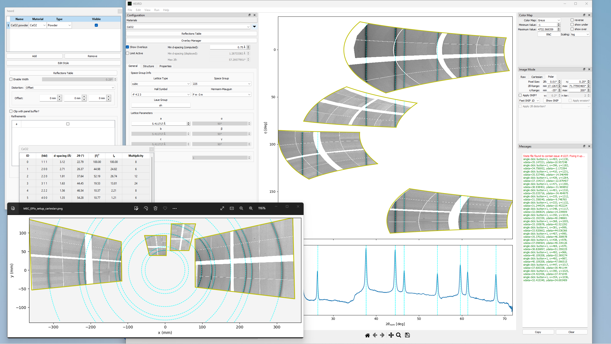

# Introduction

Welcome to the HEXRDGUI documentation!

HEXRDGUI is a cross-platform open source application for analyzing and
visualizing X-ray diffraction image data. Build upon the Highly Extensible
X-Ray Diffraction ([HEXRD](https://github.com/hexrd/hexrd)) Python library along with several scientific
Python libraries, HEXRDGUI provides many interactive workflows for
visualizing and processing diffraction images using the generic
multi-detector instrument model in HEXRD.

## Getting Started

Visit the [Installing](installing.md) page for instructions on installing
HEXRDGUI. Once installed, visit the pages on:

 * [Instrument Configuration](configuration/instrument.md)
 * [Materials](configuration/materials.md)
 * [Image Loading](configuration/images.md)
 * [View Modes](views.md)

## About

The HEXRDGUI project was founded by
Joel V. Bernier at [LLNL](https://www.llnl.gov/) and Paul Shade
at [AFRL](https://www.afrl.af.mil/) along with
[Patrick Avery](https://www.kitware.com/patrick-avery/),
[Brianna Major](https://www.kitware.com/brianna-major/),
Chris Harris, and Marcus Hanwell at [Kitware](https://kitware.com/).

HEXRDGUI has had many contributors over the years, including but not
limited to:

* Saransh Singh at [LLNL](https://www.llnl.gov/)
* Donald E. Boyce
* [John Tourtellott](https://www.kitware.com/john-tourtellott/) at [Kitware](https://kitware.com/)

HEXRDGUI has been generously funded through subcontracts with
[UDRI](https://udayton.edu/udri/index.php) and [LLNL](https://www.llnl.gov/).

Contributions are welcome through the main [GitHub project page](https://github.com/hexrd/hexrdgui).

The GitHub page offers a more complete list of contributors, releases, issue tracking,
and more.
