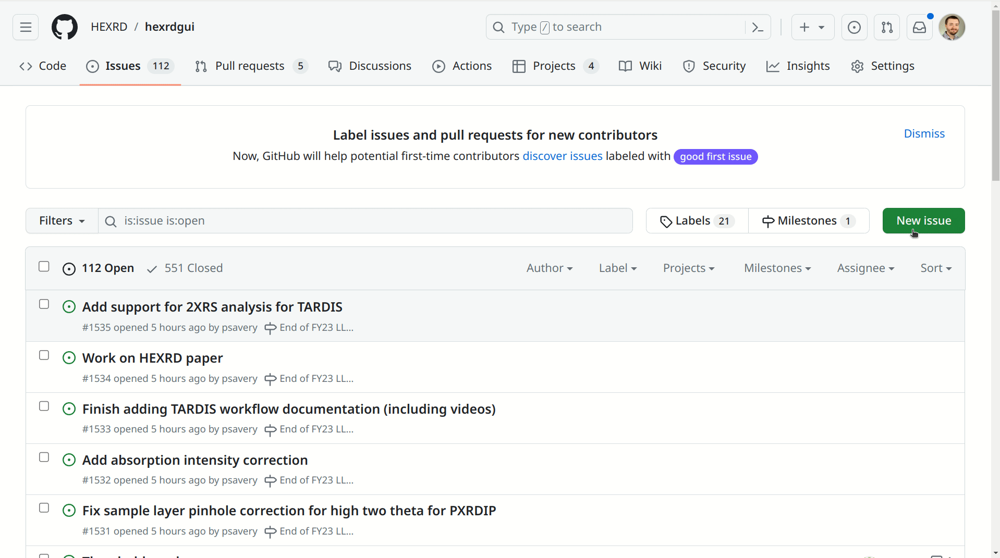

# Issues

## Submitting Issues on GitHub

If you encounter an issue using HEXRDGUI, we would like to hear about it!

Please navigate to the [GitHub Issues page](https://github.com/HEXRD/hexrdgui/issues),
click "New issue", create a title, and leave a comment, as shown below:

If you encountered an error while running HEXRDGUI, please paste the error into
the issue, as it will be very helpful to the developers for tracking it down.

Please be as descriptive as possible. Feel free to attach a video/screenshot.
And, if you can, please include an example state file where the issue occurred.
Issues can often be fixed much faster if the developers are able to reproduce
them.

## Discussions

If you have a question that is not necessarily an issue, please navigate to the
[GitHub Discussions page](https://github.com/HEXRD/hexrdgui/discussions) and ask it
there. We will respond promptly!
