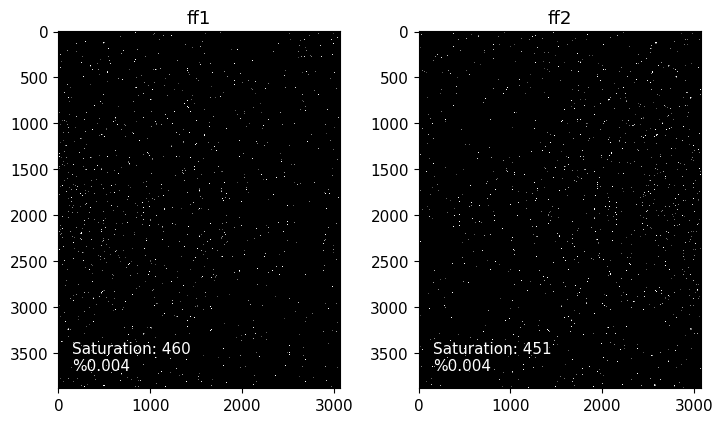
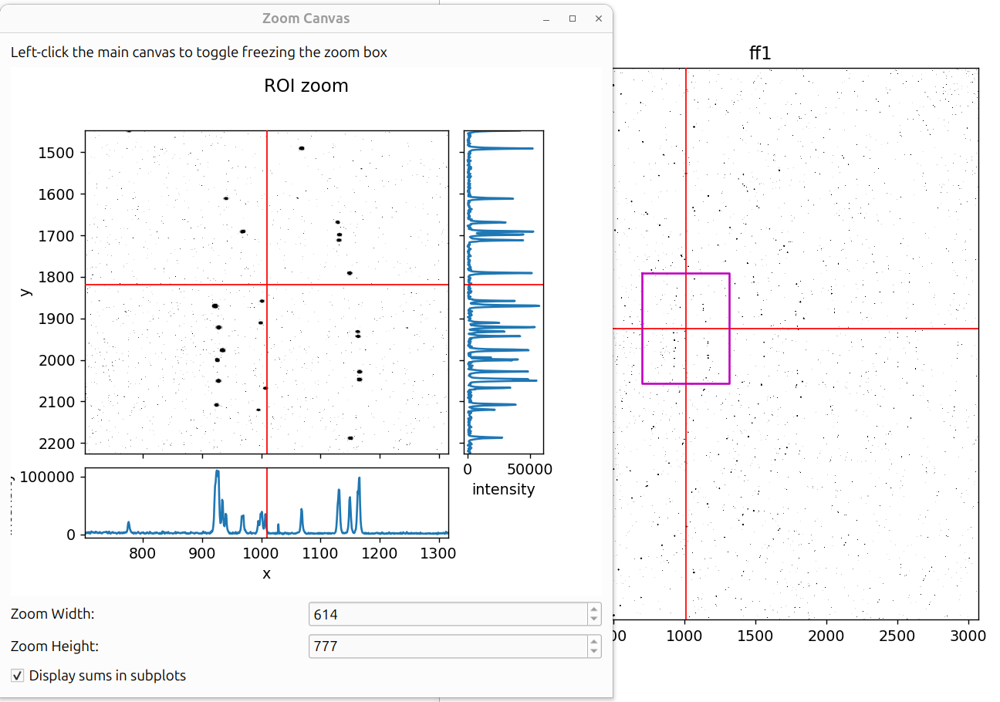
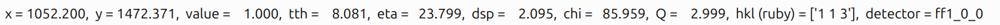
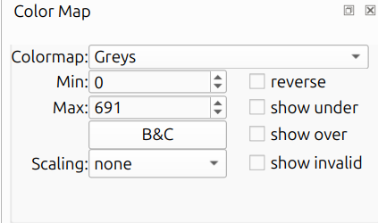
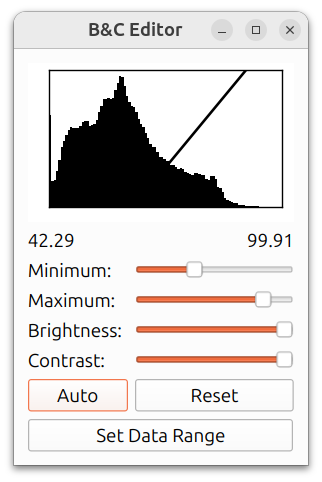

# View Modes

HEXRDGUI includes various ways to visualize detector data, including a raw
view and several different projections (Cartesian, Polar, and Stereo).

The type of view is switched by simply clicking on the corresponding tab
in the "Image Mode" widget, which is by default on the right of the
application.

## Raw View

The raw view is a basic view of all detector images loaded in.
If there is more than one image, the detector images will by default
be displayed in two columns.

### Raw View Options

The following options are available in the Image Mode panel for the
raw view:

- **Tabbed View**: Display each detector image in a separate tab
  rather than side by side.
- **Show Saturation**: Displays the number and percentage of pixels
  at or above the detector's saturation level as text on each detector
  image, like so:

  

- **Stitch ROI Images**: Stitch subpanel images into larger detector
  images (see [Stitching Raw Images](#stitching-raw-images) below).
  This option only appears if an instrument with subpanels is loaded.
- **Show Zoom Dialog**: Opens a zoom dialog that provides a magnified
  view of the region around the cursor. See
  [Zoom Dialog](#zoom-dialog) below.

### Zoom Dialog

Clicking "Show Zoom Dialog" opens an interactive zoom window.

The zoom dialog shows:

- **ROI zoom** (left): A magnified view of the area around the cursor,
  with a histogram of intensity values below it.
- **Intensity Sums**: pixel intensity sum plots across rows (right)
  and columns (bottom)
- **Zoom Width / Height**: Controls the size of the zoom region in
  pixels.

Left-click the main canvas to toggle freezing the zoom box in place.

### Stitching Raw Images

It is common in HEXRDGUI to take into account misalignments between
subpanels by treating them as separate detectors. By default,
visualizing the images in the raw view will display all subpanel
images separately, like so:

However, it can be helpful to view all subpanel images "stitched" into
a larger, single detector image, as if the detector were perfectly
flat. This is often the same as the image that the detector software
outputs itself.

To do this, the instrument configuration must have a `group` defined
for each subpanel. The groups should be the name of the detector that
each subpanel is a part of (for instance, `ff1_0_0` and `ff1_0_1` are
both subpanels for detector `ff1`, so the group should be `ff1`).

Additionally, each detector must have an `roi` specified under the
`pixels` category that identifies the start pixels of the subpanel
region. For example, `roi: [0, 1536]` means that the subpanel region
starts at pixel `0` in `i` and `1536` in `j`. The end pixels of the
region are determined automatically from the `rows` and `columns`.

If the `group` and `roi` are defined for each detector, a checkbox
will appear in the raw Image Mode that is labeled "Stitch ROI Images".
If checked, the subpanel regions will be stitched together into larger
images like so:

Note that projections onto the detectors such as overlays (powder,
rotation series, etc.) still take into account any subpanel
misalignment and adjust their coordinates on the stitched images
accordingly.

## Cartesian View

The Cartesian projection displays detector images in their real-space
positions, as if you were at the sample looking out at the detectors.
The images are projected onto a virtual plane at a configurable
distance. This is useful for seeing how data from multiple detectors
joins together. Gaps and overlaps between detectors become immediately
apparent, and powder diffraction rings appear as smooth curves across
the full angular range.

### Cartesian View Options

- **Pixel Size**: The pixel size in mm for the virtual projection
  plane. Smaller values produce higher resolution but take longer to
  generate.
- **Distance**: The distance from the X-ray source to the virtual
  projection plane.
- **Rotate x / Rotate y**: Rotate the virtual plane normal around
  the X or Y axis. This tilts the virtual plane for different
  projection angles.

## Polar View

The Polar projection maps detector images into 2&theta; vs. &eta;
coordinates. In this view, powder diffraction (Debye-Scherrer) rings
appear as **vertical straight lines**, making it easy to assess
alignment and calibration quality. This is the primary view for powder
calibration workflows
([Fast Powder](calibration/fast_powder.md),
[Structureless](calibration/structureless.md)) and
[WPPF](calibration/wppf.md).

An azimuthal lineout (integrated intensity vs. 2&theta;) is displayed
below the main polar image.

### Polar View Options

**Pixel Size:**

- **2&theta;**: Angular resolution in the 2&theta; direction. Smaller
  values produce higher resolution but take longer to generate.
- **&eta;**: Angular resolution in the &eta; (azimuthal) direction.
  Smaller values produce higher resolution but take longer to generate.

**Range:**

- **2&theta; Range**: The minimum and maximum 2&theta; angles displayed.
- **&eta; Range**: The minimum and maximum &eta; angles displayed.
  The min and max are synchronized to maintain a maximum span of 360
  degrees.

**SNIP Background Subtraction:**

- **Apply SNIP?**: Enable SNIP (Statistics-sensitive Non-linear
  Iterative Peak-clipping) background subtraction.
- **Algorithm**: Choose between "Fast SNIP 1D", "SNIP 1D", or
  "SNIP 2D".
- **w**: Width parameter for the SNIP algorithm.
- **n iter**: Number of iterations for the SNIP algorithm.
- **Show SNIP**: Display the SNIP background subtraction result.
- **Apply erosion?**: Apply binary erosion to eliminate edge artifacts
  in the SNIP result.

**2&theta; Distortion:**

- **Apply 2&theta; distortion?**: Apply 2&theta; distortion correction
  from an overlay that has Pinhole Camera Distortion enabled.
- **Overlay dropdown**: Select which overlay to use for the distortion
  correction.

**Lineout and Axis Options:**

- **Select Detectors for Lineout**: Choose which detectors to include
  in the azimuthal lineout.
- **Azimuthal Overlays**: Open a manager for azimuthal overlay
  settings on the lineout plot.
- **Offset**: Rotate azimuthal overlays by this amount.
- **X Axis type**: Choose the x-axis units: "2&theta;" (degrees) or
  "Q" (inverse angstroms).
- **Apply scaling to lineout?**: When checked, the scaling from the
  color map is also applied to the lineout.

**Other:**

- **Waterfall Plot**: Create a waterfall plot from the image series.
  This generates a polar view image for every frame and stacks them.
  Only available when the image series has between 2 and 20 frames.

### Switching Between X-Ray Sources

For instruments with multiple X-ray sources (2XRS configurations), a
dropdown menu appears in the polar view options that allows you to
switch which beam's projection is displayed. Each beam produces a
different mapping from detector pixels to angular coordinates, so
switching between sources shows how the data looks relative to each
beam.

## Stereographic View

The Stereographic (Wulff) projection maps diffraction data onto a 2D
stereographic circle. This view is useful for texture analysis and
pole figure interpretation. Overlays are projected onto the
stereographic circle alongside the data, allowing direct comparison
of observed and simulated diffraction patterns.

### Stereographic View Options

- **Stereo Size**: The number of pixels used for both width and height
  of the projection.
- **Show Stereo Border?**: Whether to draw the border around the valid
  stereographic region. Pixels beyond the border are NaN.

## Unaggregated Image Series

When rotation series data is loaded, a toolbar appears at the bottom
of the main canvas with controls for navigating individual frames.

The toolbar includes:

- **Slider**: Drag to scrub through frames in the rotation series.
- **Frame Number Editor**: Type a specific frame number to jump
  directly to it.
- **Back/Forward Buttons**: Step through frames one at a time.
- **Omega Range Display**: Shows the omega rotation range
  corresponding to the current frame. The omega range is only
  displayed if the image series contains omega metadata.

This is essential for inspecting rotation series data frame-by-frame
before running [HEDM workflows](workflows/hedm/overview.md). You can
verify that spots appear and disappear at the expected omega angles,
check for detector artifacts in individual frames, and ensure the
omega values are set correctly.

## Mouse Hover Information

When hovering the mouse over image data in any view, detailed
crystallographic and spatial information is displayed at the bottom of
the canvas.

The fields displayed depend on the view mode:

**Raw, Cartesian, and Stereographic views:**

- **x, y**: Pixel coordinates on the detector (raw) or virtual plane
  (Cartesian/Stereo).
- **value**: The pixel intensity at the cursor position.
- **tth**: Two-theta (2&theta;) scattering angle in degrees.
- **eta**: Azimuthal angle (&eta;) in degrees.
- **dsp**: d-spacing in angstroms, computed from 2&theta; and the beam
  wavelength.
- **chi**: Angle between the diffraction plane normal (g-vector)
  and the sample normal.
- **Q**: Magnitude of the scattering vector in inverse angstroms,
  computed from 2&theta; and the beam energy.
- **hkl**: Miller indices of planes at this 2&theta; for the active
  material.
- **detector**: The detector name (shown when multiple detectors are
  present).

**Polar view:**

- **tth**: Two-theta angle in degrees (from the x-axis).
- **eta**: Azimuthal angle in degrees (from the y-axis).
- **value**: Pixel intensity at the cursor position.
- **dsp, chi, Q, hkl**: Same as above.
- **detector**: The detector name (shown when multiple detectors are
  present).

When hovering over the azimuthal lineout plot (below the main polar
image), only **tth**, **intensity**, and **Q** are shown.

## Color Map

The color map editor controls how image intensities are mapped to
colors.

- **Colormap**: The matplotlib colormap used for display (e.g., Greys,
  viridis, plasma).
- **Min / Max**: The data range for color mapping. Values at or below
  Min map to the bottom of the colormap; values at or above Max map to
  the top. These are auto-populated based on percentile analysis of the
  data.
- **B&C**: Opens the Brightness & Contrast editor (inspired by the
  one in ImageJ). See
  [Brightness & Contrast Editor](#brightness--contrast-editor) below.
- **Scaling**: Applies a mathematical transformation to the data before
  colormap application. Options are:
    - **none**: No transformation (raw values).
    - **sqrt**: Square root scaling, useful for emphasizing lower values.
    - **log**: Logarithmic scaling, useful for compressing wide dynamic
      range.
    - **log-log-sqrt**: Extreme compression for very wide dynamic range.
- **reverse**: Inverts the colormap gradient.
- **show under**: Colors values below the minimum as blue.
- **show over**: Colors values above the maximum as red.
- **show invalid**: Colors invalid (NaN) pixels with a user-selected
  color. A color picker dialog appears when this is checked.

### Brightness & Contrast Editor

The Brightness & Contrast (B&C) editor, inspired by the one in
ImageJ, provides an interactive way to adjust the color mapping
range. At the top is a histogram of the image data, with a
diagonal line indicating the current mapping from intensity values
to display colors. The numbers below the histogram show the
current minimum and maximum values.

- **Minimum / Maximum**: Sliders to adjust the lower and upper
  bounds of the color mapping range. These correspond to the
  Min / Max fields in the color map editor.
- **Brightness**: Shifts both the minimum and maximum together,
  making the overall image brighter or darker.
- **Contrast**: Adjusts the width of the mapping range. Higher
  contrast narrows the range, making differences in intensity
  more visible.
- **Auto**: Automatically sets the minimum and maximum based on
  percentile analysis of the image data.
- **Reset**: Restores the minimum and maximum to the full data
  range.
- **Set Data Range**: Sets the minimum and maximum to the absolute
  minimum and maximum values in the image data.
