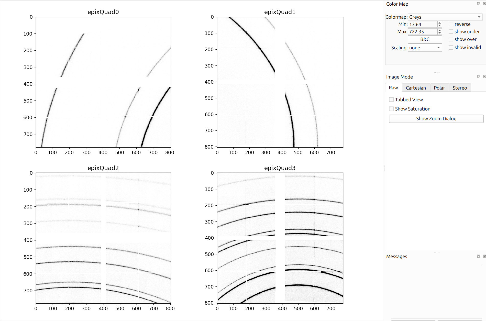
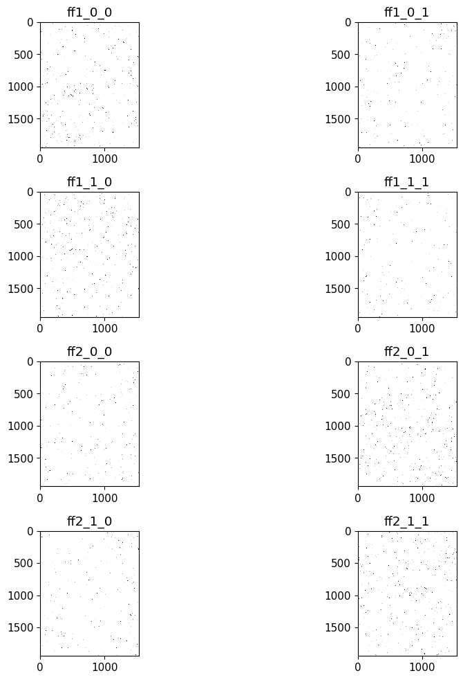
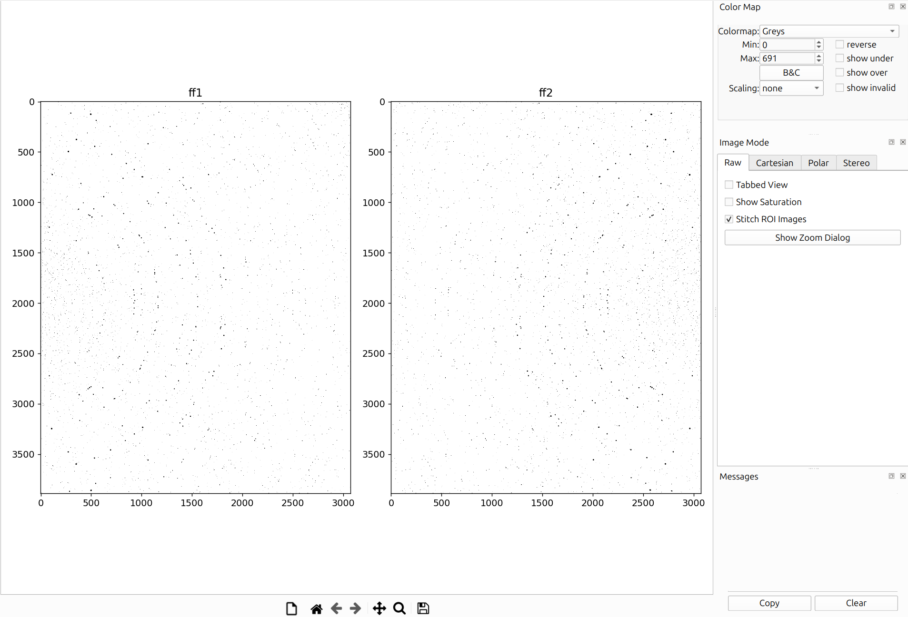
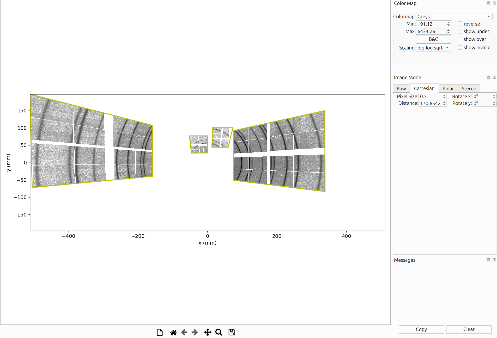
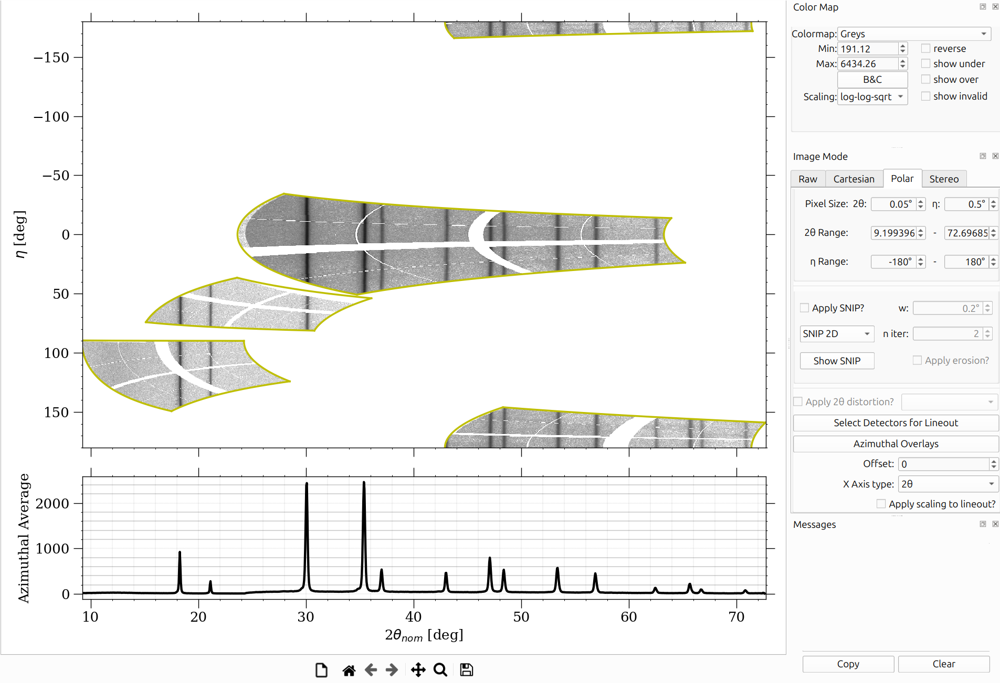
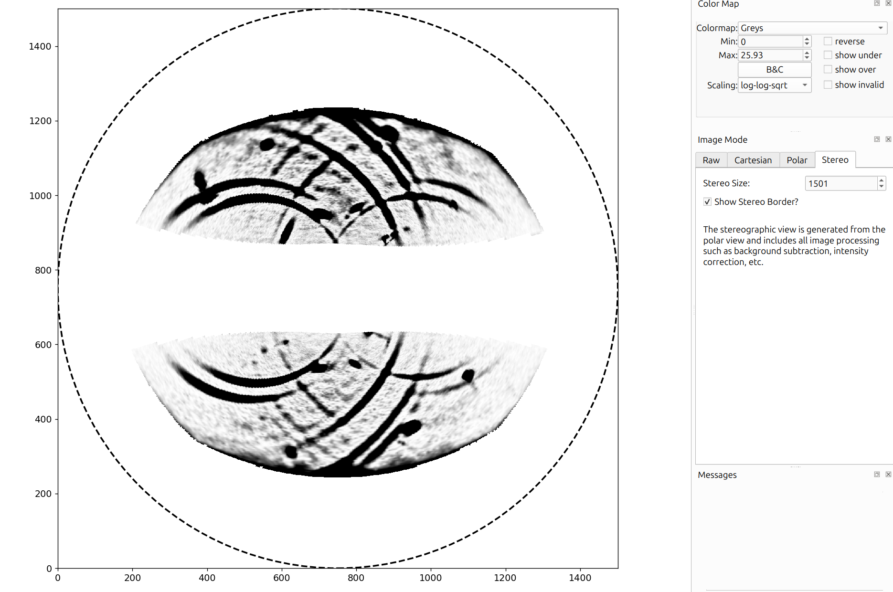
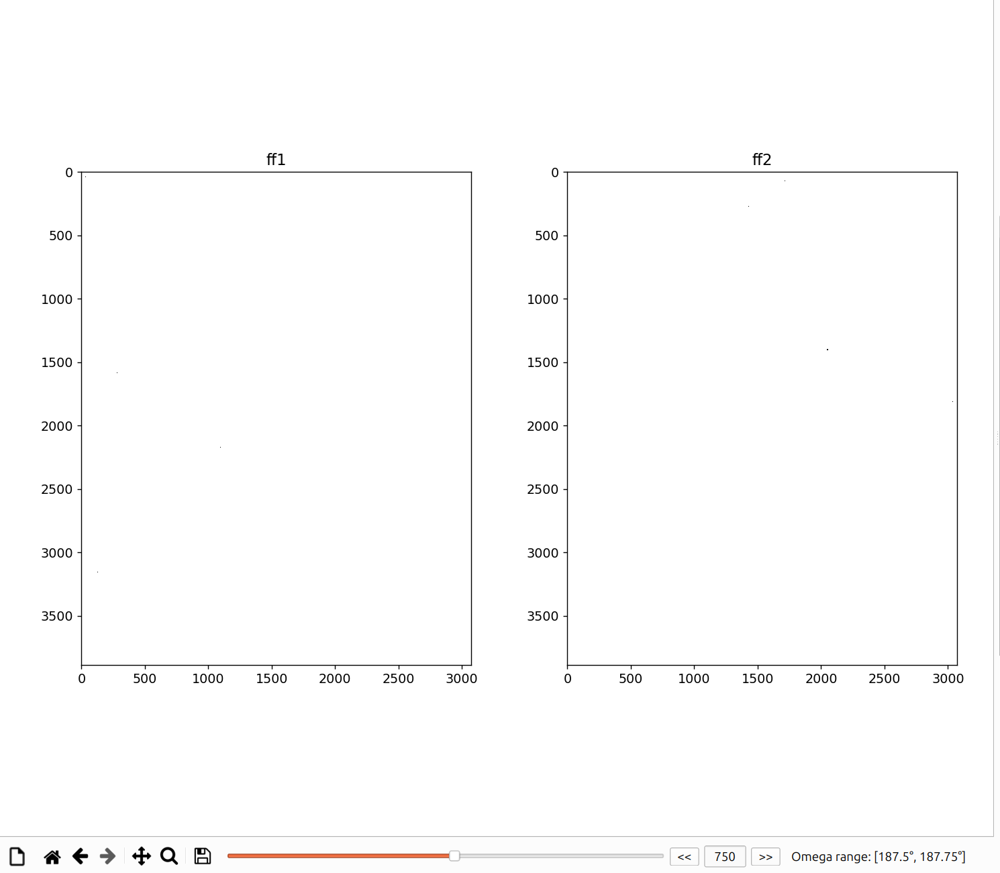

# View Modes

HEXRDGUI includes various ways to visualize detector data, including a raw
view and several different projections (Cartesian, Polar, and Stereo).

The type of view is switched by simply clicking on the corresponding tab
in the "Image Mode" widget, which is by default on the right of the application.

## Raw View

The raw view is a basic view of all detector images loaded in.

### Stitching Raw Images

It is common in HEXRDGUI to take into account misalignments between subpanels
by treating them as separate detectors. By default, visualizing the images in
the raw view will display all subpanel images separately, like so:

However, it can be helpful to view all subpanel images "stitched" into a larger,
single detector image, as if the detector were perfectly flat. This is often
the same as the image that the detector software outputs itself.

To do this, the instrument configuration must have a `group` defined for each
subpanel. The groups should be the name of the detector that each subpanel is
a part of (for instance, `ff1_0_0` and `ff1_0_1` are both subpanels for detector
`ff1`, so the group should be `ff1`).

Additionally, each detector must have
an `roi` specefied under the `pixels` category that identifies the start pixels
of the subpanel region. For example, `roi: [0, 1536]` means that the subpanel
region starts at pixel `0` in `i` and `1536` in `j`. The end pixels of the region
are determined automatically from the `rows` and `columns`.

If the `group` and `roi` are defined for each detector, a checkbox will appear in
the raw `Image Mode` that is labeled `Stitch ROI Images`. If checked, the subpanel
regions will be stitched together into larger images like so:

Note that projections onto the detectors such as overlays (powder, rotation series,
etc.) still take into account any subpanel misalignment and adjust their coordinates
on the stitched images accordingly.

## Cartesian View

The Cartesian projection maps detector images into a flat 2D angular space
using 2&theta; and &eta; coordinates. This is useful for seeing how data
from multiple detectors joins together. Gaps and overlaps between detectors
become immediately apparent, and powder diffraction rings appear as smooth
curves across the full angular range.

## Polar View

The Polar projection maps detector images into 2&theta; vs. &eta;
coordinates. In this view, powder diffraction (Debye-Scherrer) rings appear
as **horizontal straight lines**, making it easy to assess alignment and
spot deviations. This is the primary view for powder calibration workflows
([Fast Powder](calibration/fast_powder.md),
[Structureless](calibration/structureless.md)) and
[WPPF](calibration/wppf.md).

### Switching Between X-Ray Sources

For instruments with multiple X-ray sources (2XRS configurations), a
dropdown menu appears in the polar view options that allows you to switch
which beam's projection is displayed. Each beam produces a different
mapping from detector pixels to angular coordinates, so switching between
sources shows how the data looks relative to each beam.

## Stereographic View

<!-- Screenshot needed: stereographic (Wulff) projection view showing diffraction data -->

The Stereographic (Wulff) projection maps diffraction data onto a 2D
stereographic sphere. This view is useful for reciprocal space
visualization, texture analysis, and pole figure interpretation. Overlays
are projected onto the stereographic sphere alongside the data, allowing
direct comparison of observed and simulated diffraction patterns in
reciprocal space.

## Unaggregated Image Series

When rotation series data is loaded, a toolbar appears at the bottom of the
main canvas with controls for navigating individual frames.

<!-- Screenshot needed: bottom toolbar showing slider, frame number editor, and back/forward buttons -->

The toolbar includes:

- **Slider**: Drag to scrub through frames in the rotation series.
- **Frame Number Editor**: Type a specific frame number to jump directly
  to it.
- **Back/Forward Buttons**: Step through frames one at a time.
- **Omega Range Display**: Shows the omega rotation range corresponding
  to the current frame.

This is essential for inspecting rotation series data frame-by-frame before
running [HEDM workflows](hedm/overview.md). You can verify that spots
appear and disappear at the expected omega angles, check for detector
artifacts in individual frames, and ensure the omega values are set
correctly.
