# FIDDLE

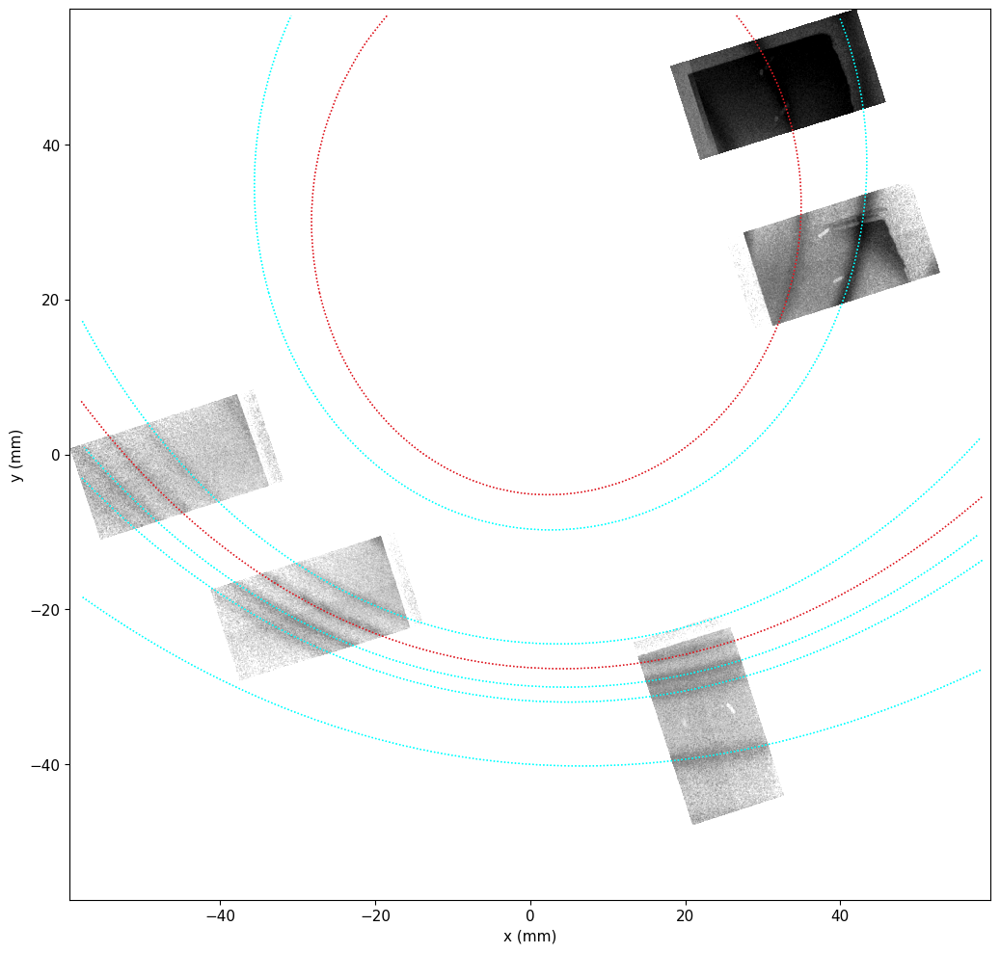

The Flexible Imaging Diffraction Diagnostic for Laser Experiments
(FIDDLE) is a time-resolved x-ray diffraction diagnostic at the National
Ignition Facility (NIF) for observing phase changes at
an ultrafast scale. The current Icarus sensors record 2 ns images and are
tunable for collecting x-rays in the tens of nanoseconds scale.

Because FIDDLE incorporates multiple detectors, HEXRD's flexible geometry
model is an ideal fit for FIDDLE analysis. In this tutorial, we cover all
steps within the FIDDLE analysis workflow, from importing data to calibration,
and analyzing lineouts.

## Loading FIDDLE Data

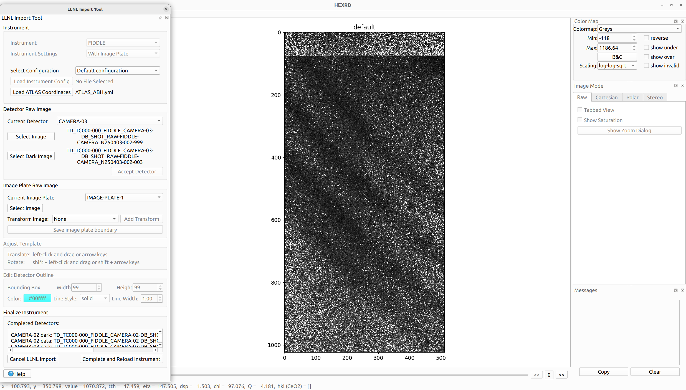

FIDDLE data is loaded using the
[LLNL import tool](../../configuration/images.md#llnl-import-tool).

To load a FIDDLE dataset, start the HEXRDGUI application,
and navigate to `File->Import->LLNL Import Tool`. For the
`Instrument`, select `FIDDLE`.

If you have image plate data that you would like to include,
select `With Image Plate` in the instrument settings. If not,
select `Without Image Plate`.

If you have ATLAS coordinates, load them in via `Load ATLAS Coordinates`.
ATLAS coordinates are used to set initial detector positions,
which ought to be quite close (within 2 mm) of their true positions.

### Camera Images

Next, load the detector images. In the `Detector Raw Image` section,
click `Select Image` to open a file dialog.

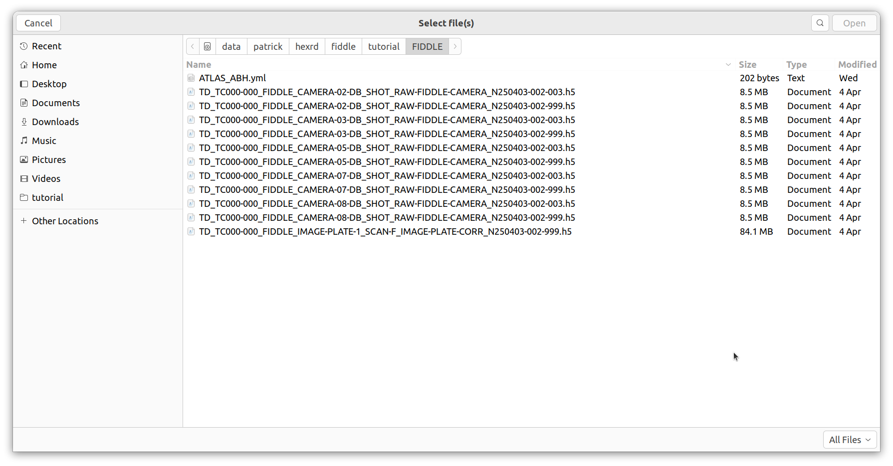

FIDDLE files are named such that the data file names end
with `-999`, dark file names end with any other number, and image
plate file names contain `IMAGE-PLATE` within their name. It is
recommended that you place all of these files within a single directory,
so that HEXRDGUI can automatically identify and pair files with detectors.

If all files are within the same directory, you only need to select a
single camera file. Afterward, all data and dark files for all cameras
will be paired automatically. You can verify this was done correctly by
observing the file name next to each `Image` and `Dark Image`, and in
case any were paired incorrectly, you may correct them.

### Image Plate

Next, if you selected `With Image Plate` earlier, click `Select Image`
within the `Image Plate Raw Image` section, and select the image plate file.

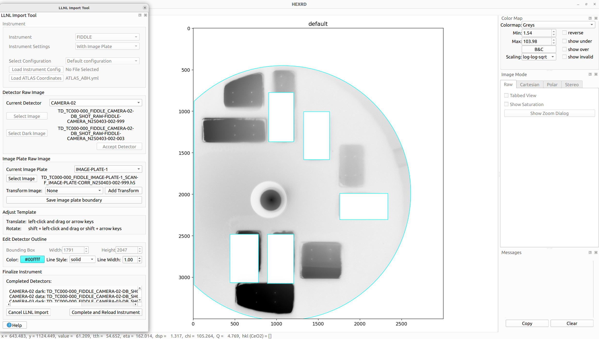

The image plate template can be dragged using the mouse, and fine adjustments
can be made using keyboard arrow keys, as described in the
[LLNL import tool section](../../configuration/images.md#edit-detector-outline).

Once the template is properly aligned, click `Save image plate boundary` to
save the position.

Next, click `Complete and Reload Instrument` in order to finish the FIDDLE
import!

### Median Filter

A median filter is typically applied to FIDDLE data in order to
reduce noise. Immediately after clicking `Complete and Reload Instrument`
in the previous section, a `Median Filter` option will appear, allowing one
to select the kernel size. You may select a kernel size and click `OK`.
Alternatively, if you do not wish to apply a median filter, simply click
`Cancel`.

The median filter may be modified by toggling it off/on via
`Edit->Intensity Corrections->Apply Median Filter`.

### Physics Package

After selecting the median filter option, the Physics Package Editor
opens automatically. This editor may also be accessed and
enabled/disabled via the menu option `Edit->Physics Package`.

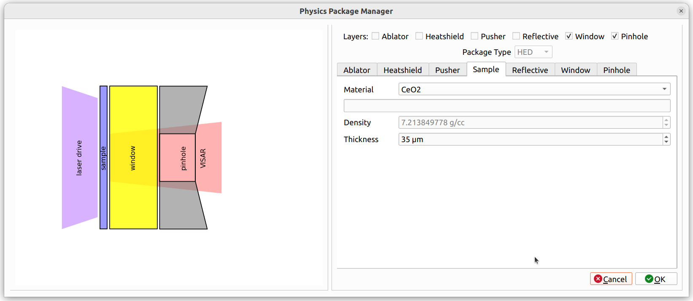

You should configure all information about your physics package within
this editor. For our example, the sample is ceria with 35 micron
thickness, the window is LiF with 150 micron thickness, and the
pinhole is Mo with 100 micron thickness and a 400 micron diameter.

These physics package settings are used in a variety of places, including
2θ corrections to diffraction caused by the layer sizes and positions, so
it is important that they are set correctly.

Once your configuration is complete, click `OK`.

### Pixel Solid Angle Correction

As shown earlier, a median correction is often applied to the data. In
addition to that, it is important to apply a pixel solid angle correction.
That can be done via
`Edit->Intensity Corrections->Apply Pixel Solid Angle Correction`.

## Visualizing FIDDLE Data

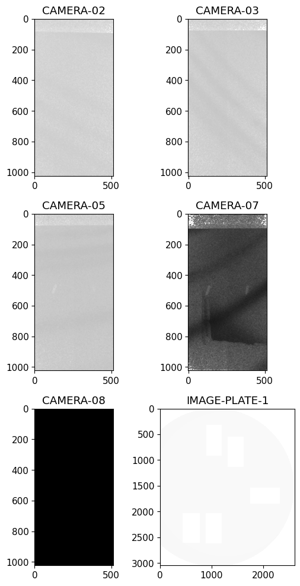

An image of each detector (and image plate)
is initially displayed in the raw view. The colormap settings
may be adjusted to better visualize different images.

Due to the very different pixel value ranges on the different cameras and
image plate, it can be difficult to select colormap settings which allow you
to visualize them all simultaneously. But alternatively, they may be viewed
individually via the `Tabbed View` setting.

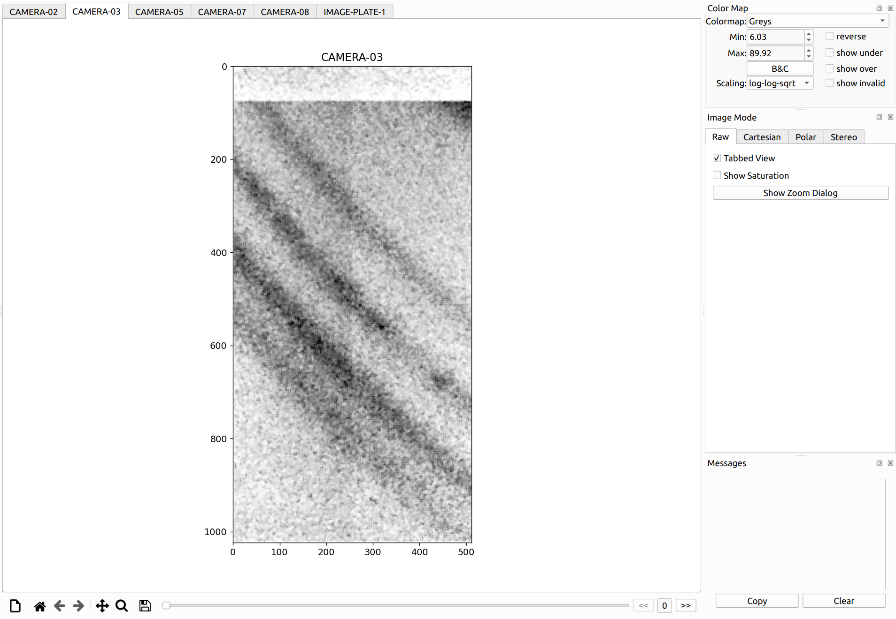

The slider seen at the bottom of the image, along with the arrow buttons and
number to the right of the slider, allows one to change the frame number.
There are 4 frames in this case, each occurring over separate 2 nanosecond
intervals. One can move the slider, click the arrow keys, or edit the frame
number to view the data at a different time step (note that the image plate
will be identical since it is an accumulation over all time steps).

The Cartesian view may be used to visualize how the detectors and image plate
appear physically if one looked toward them from the origin.

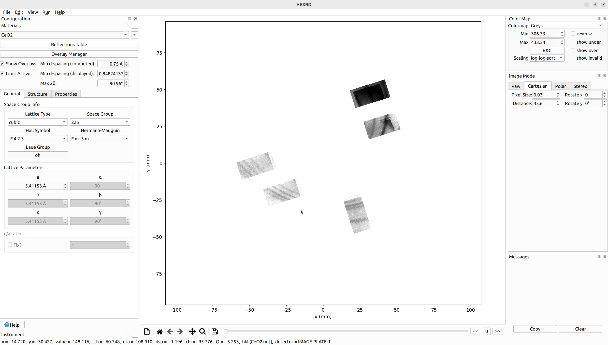

The polar view warps the images into an η vs 2θ projection, with an
azimuthal lineout at the bottom.

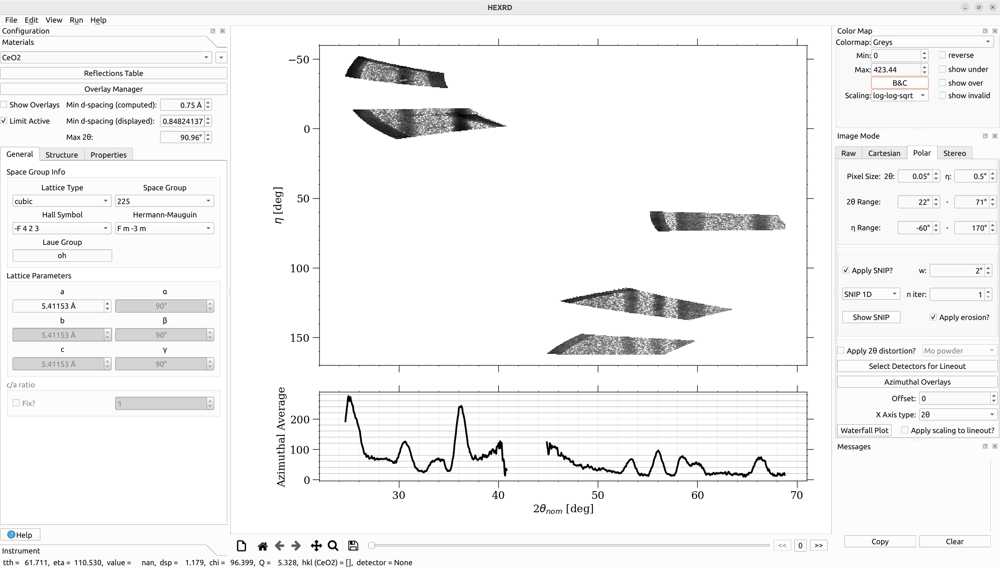
*Polar View. Image plate removed.*

For the image above, I decreased the pixel sizes (which increases the
resolution), adjusted the 2θ and η ranges to closely surround the detectors,
and applied a SNIP 1D filter with erosion.

One can observe features in the azimuthal lineout below. However, the peaks
will be more accurately placed, and often thinner, after
[calibration](#calibrating).

## Material Configuration

Setting up the materials allows us to project simulated powder patterns onto
the detector images.

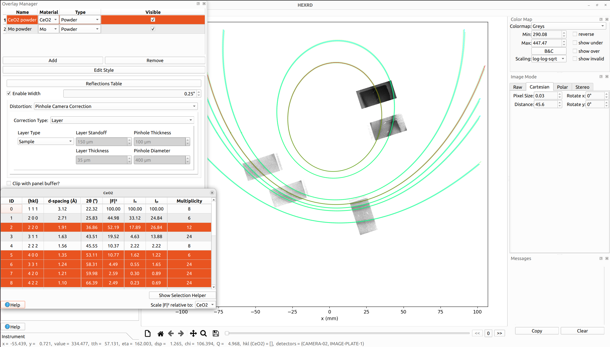
*CeO2 is green. Mo is red.*

For this example, I loaded CeO2 and Mo from the default materials list,
created a CeO2 powder overlay with a sample layer distortion correction
(since CeO2 is in the sample layer), and an Mo powder overlay with a
pinhole (Rygg) correction (since Mo is the pinhole).

I also edited the style of Mo to be red in color, and I only selected
HKLs which intersected with FIDDLE cameras. Note that the
predictions are somewhat close to the actual data, although this will
be refined further during calibration.

For more details about material and overlay setup,
see the [Materials](../../configuration/materials.md) and
[Overlays](../../configuration/overlays.md) sections.

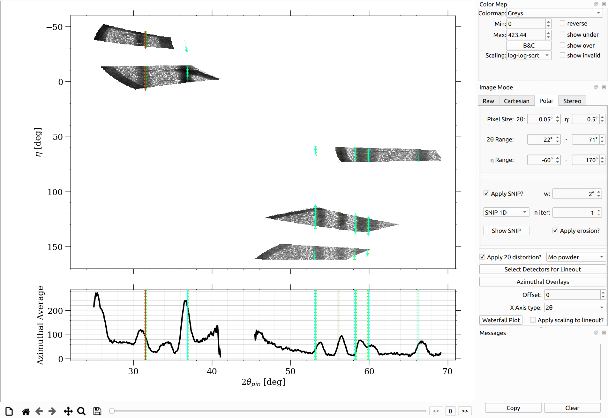
*CeO2 is green. Mo is red. Image plate is removed.*

In the polar view, one is also able to apply a 2θ distortion to the
entire polar view image by checking `Apply 2θ distortion?` and selecting
a specific overlay that has a 2θ distortion setting.

In the above image, Mo powder was selected for applying the 2θ distortion,
which results in the Mo powder lines being straight, while the CeO2 powder
lines are curved.

Since this example is not yet properly calibrated, the predictions don't
line up perfectly with the peaks in the azimuthal lineout below. But the
predictions are still close enough to approximately see which peak belongs
to which reflection! We will be calibrating next to improve this.

## Masking Artifacts

In order to improve the quality of the azimuthal lineout, artifacts within
the polar image can be interactively masked out. These artifacts may be
from the actual data (such as LiF spots) or from image processing
algorithms.

In this case, some artifacts were produced from the SNIP background
subtraction algorithm. We are able to mask the artifacts out by drawing
polygonal masks around them, like so:

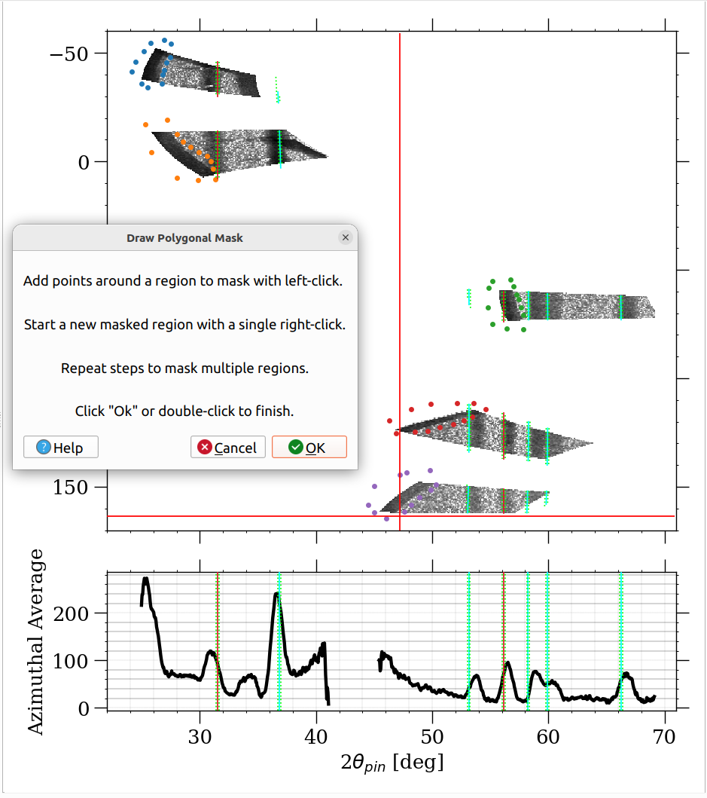

After applying the polygonal masks, the artifact regions no longer appear
within the azimuthal lineout, like so:

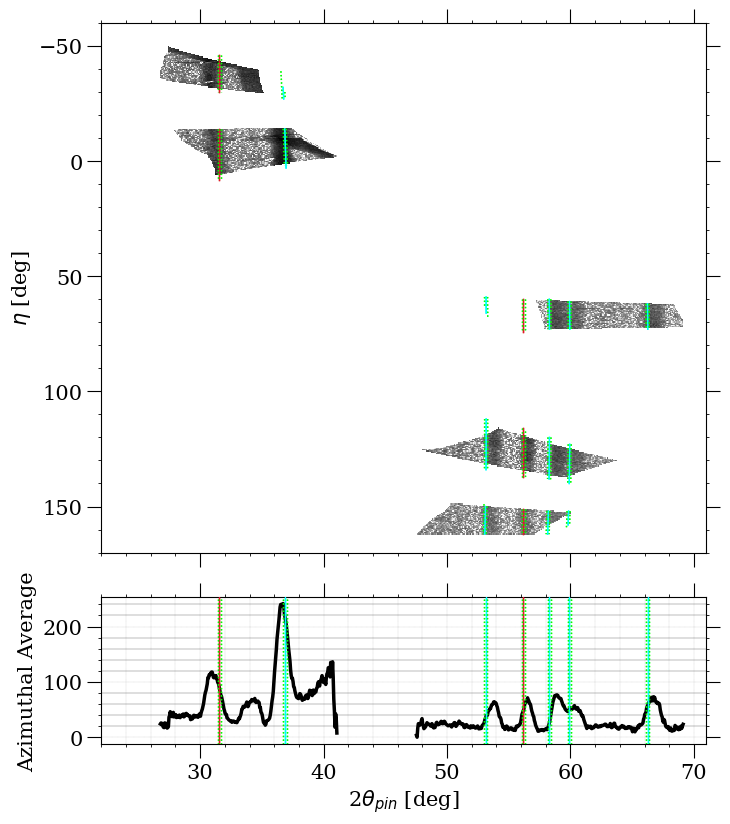

For a more detailed discussion about masking, see the
[Masking Section](../../configuration/masking.md).

## Calibrating

During calibration, we modify parameters (including instrument
and material) in order to align the simulated patterns with the data.
We are able to calibrate using multiple simulated patterns simultaneously,
which take into account the 2θ distortion from their layer, and can be powder
or Laue diffraction patterns.

For the FIDDLE diagnostic, we already know the relative positions between the
different detectors with high certainty, and the instrument should already
be configured so that the detectors have these relative positions. So we do
not want to allow individual detectors to change their translation/tilt alone.
Fortunately, HEXRD does allow us to constrain the relative positions of the
detectors, though.

In this example, we will only refine the x-ray beam vector and the whole
instrument translation vector. We will calibrate these by using reflections
from both the CeO2 sample and Mo pinhole simultaneously.

### Removing the image plate

We will not be using any data from the image plate during calibration, so it
is best to remove it. In order to remove the image plate, first click the
`Instrument` tab on the left-hand side of the application, select
`Form View`. In the `Detector Parameters` section, select `IMAGE-PLATE-1`,
then click `Remove Detector`.

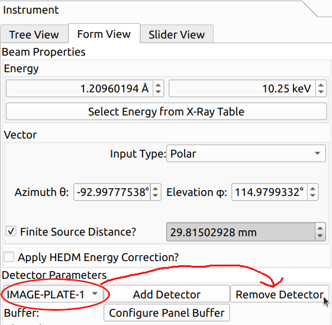

For this example, removing the image plate makes colormap scaling easier,
because the image plate values tended to be in a lower range than the values
on the cameras.

### Selecting points

Calibrating parameters requires accurate points to be picked where the
diffraction data lies. Except when performing a
[structureless calibration](../../calibration/structureless.md)
(in which case the materials are undefined), each point picked is associated
with a material and an HKL - which appear in the diffraction data as
a line for powder or a spot for Laue.
The calibration itself adjusts parameters to align the simulated diffraction
patterns with the picked points as much as possible. So it is important
to pick points accurately.

In this example, points will be picked along the powder diffraction
patterns for the two materials: the CeO2 sample and the Mo pinhole.
The calibration will then adjust parameters so that the simulated diffraction
lines occur as close to the picked points as possible.

To begin, you must be visualizing the data in the polar view (since that
will be used for point picking).
Then click `Run->Calibration->Composite (Laue and Powder)`.

For point picking, you have the options to automatically pick points,
hand pick points, or load picks from a file. Since the signal-to-noise
ratio is not very high for FIDDLE, automatic point picking may not work that
well. Additionally, the simulated patterns need to be closer to the
diffraction data for automatic point picking to also work well (the data
must be within the range boundaries of the overlays).

For this example, we will hand pick points for the two powder patterns.
For more information about this hand picking, see
[Composite (Laue and Powder)](../../calibration/composite_laue_and_powder.md).

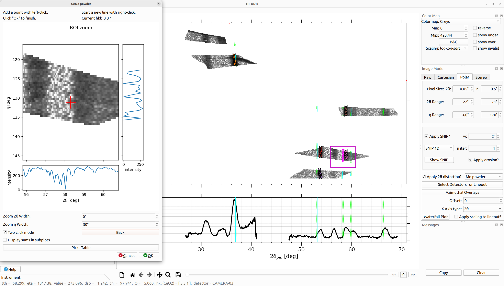

Note that if you have low confidence in any HKLs or points, you may simply
skip over the HKLs or remove the points. You are able to calibrate using
only a subset of the HKLs, and only a few selected points.

Once points have been picked, they are automatically saved internally in
HEXRDGUI. If you start calibration again, you can select `Current` to re-use
the previously picked points. They are also saved within HEXRDGUI state files
and can be reused as well if you save a state file and load it in another
session.

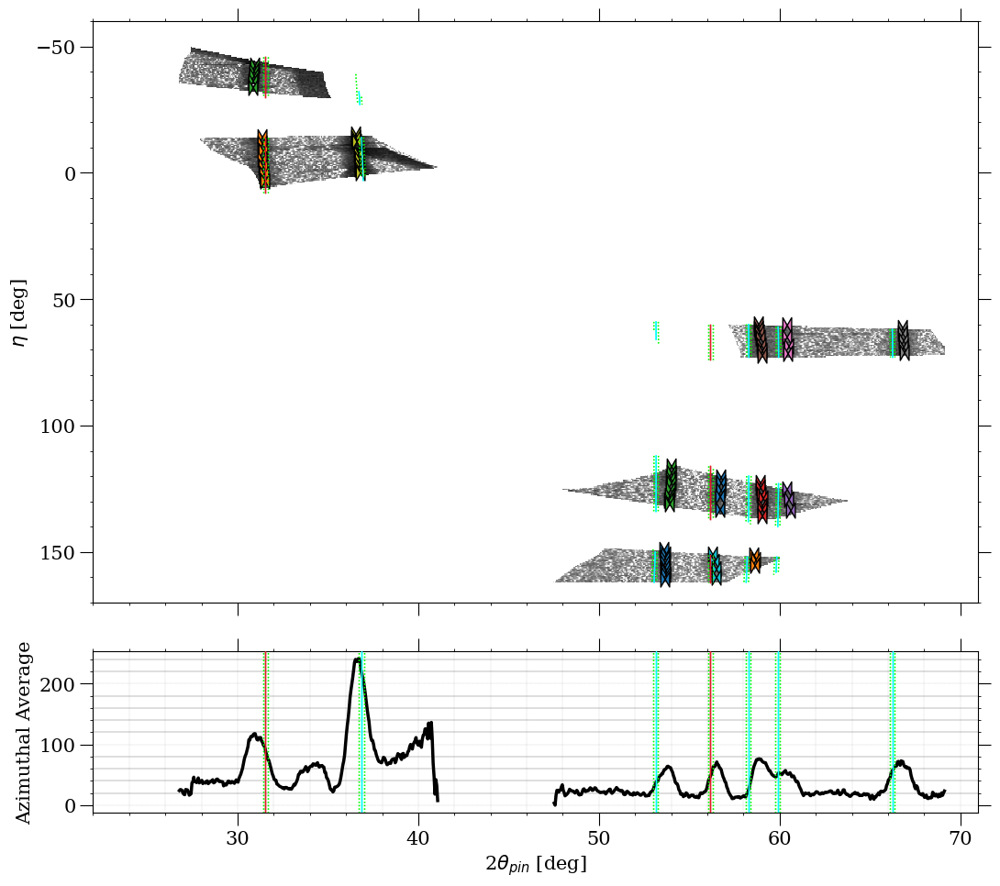

### Refining Parameters

After picking points, the calibration dialog will appear. In this dialog,
you may mark parameters to Vary, edit boundary conditions, and
even edit the values themselves.

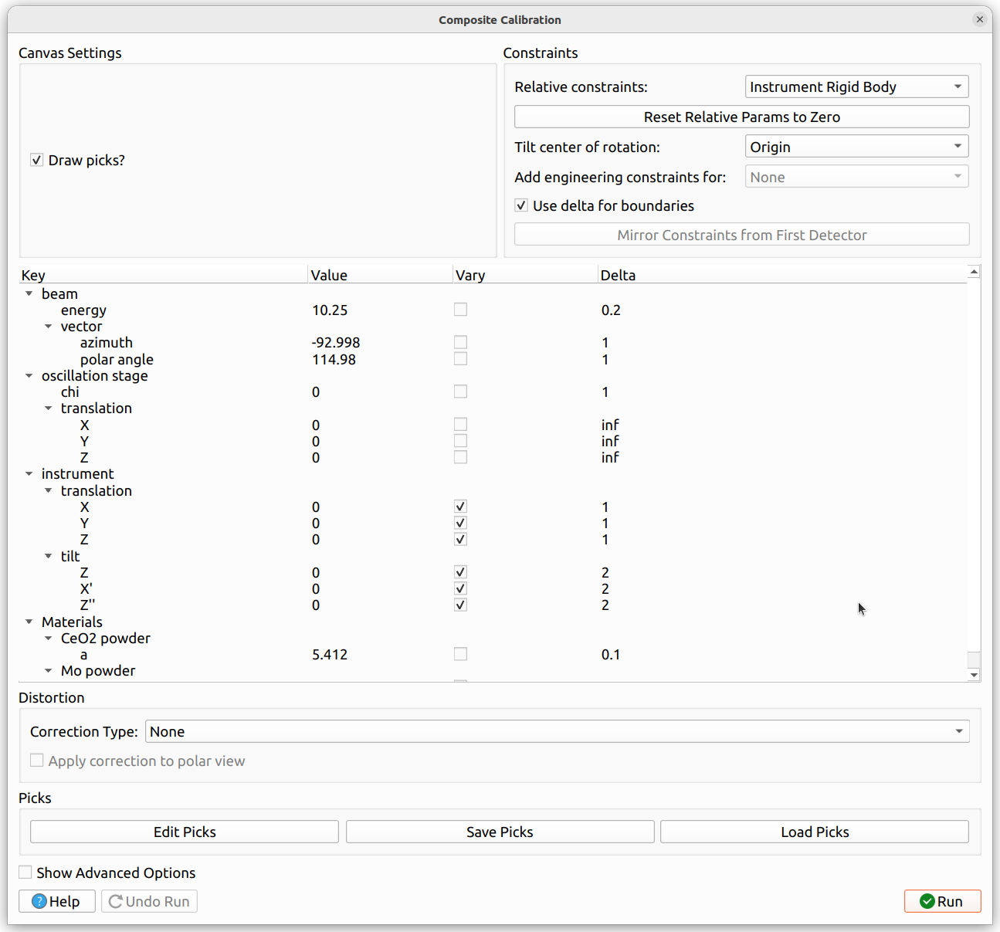

As mentioned earlier, for the FIDDLE instrument, the relative positions
between the detectors should not change. Thus it is important
that the `Relative constraints` setting in the top-right corner is set
to `Instrument Rigid Body`, which keeps the relative positions between
the detectors constant.

Also, for FIDDLE, take care to not click the
`Reset Relative Params to Zero` button unless you really intend to do so,
because the deviations of the relative translation and tilt parameters
from their original values (as defined by the Atlas coordinates) is
a very important set of parameters to record after the calibration.

If you also plan to modify the instrument tilt parameters (which we will
not be doing for this example), it is important that the
`Tilt center of rotation` be set to `Origin`, because for the FIDDLE
diagnostic, the experiment necessitates that any kind of tilt in the
instrument must be caused by a rotation about the origin (NOT the mean
instrument center or detector center).

Calibrating correctly can be an art, and requires you to know the approximate
acceptable ranges of different parameters. Oftentimes, it is better to calibrate
only a few parameters at a time - the ones you believe need the greatest
refinement. Since HEXRDGUI does not know the approximate acceptable ranges of
the parameters, it will happily modify parameters to anything (even to
unrealistic values) that reduces the residual, if you allow it!

For this example, we will start by refining only the X, Y, Z translation
values. Mark only those as `Vary`, then click `Run`. Note that the `Delta`
values will decrease as the parameter values change, in order to prevent the
parameter values from wandering away from the original boundaries in future
runs. Feel free to increase the delta boundary if you wish to allow the
parameter to change value further.

After initially refining just the X, Y, Z translation values, uncheck them
and refine only the beam vector (the azimuth and polar angle). Then refine
all 5 parameters together simultaneously.

As you perform these steps, you should observe the cost function decreasing,
which indicates a better fit from the calibration.

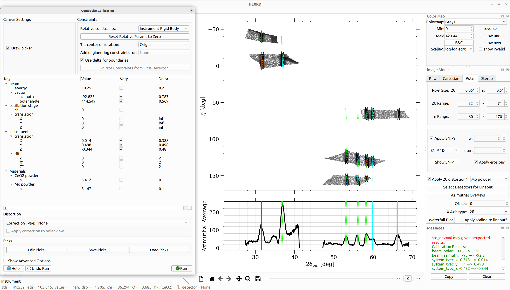

As can be seen in the calibrated image above, the simulated projections within
the azimuthal lineout are much closer to the peak positions.

After the calibration is satisfactory, the various parameters (including the
rigid body translation X, Y, Z) ought to be recorded for later use. A HEXRDGUI
state file can also be saved, which will remember the parameters.

### Slider view (manual refinement)

As an alternative to performing automatic calibration, the rigid body
translation values X, Y, and Z can be interactively edited by using
slider widgets within the `Slider View` of the `Instrument` panel on
the left-hand side.

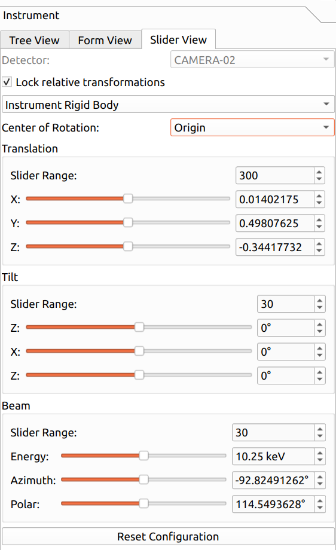

Note that for FIDDLE, you **should** check `Lock relative transformations`,
select `Instrument Rigid Body`, and select `Origin` for the center of rotation
before modifying anything, because these are the settings that match what
the FIDDLE experiment necessitates.

Once those settings are selected, the translation and tilt settings ought to
match the same values as those in the calibration. Just as you ought to do
in the calibration, you should keep track of these and record them once they
are satisfactory.

Note also that, in order to speed up the rendering and thus improve the
interactivity when using the slider widgets, it is advisable to reduce the
resolution of the image (in the polar view or cartesian view settings,
increase the pixel sizes). This will improve the interactivity significantly,
and then you may increase the resolution again after you are finished.

## Lineout and Waterfall Plot

### Select Detectors for Lineout

In the polar view settings, the `Select Detectors for Lineout` button allows
specific detectors to be used for generating the azimuthal lineout. This can
be helpful if one detector doesn't seem to contain useful information for
the lineout, but you want to keep it in the display (for example, the image
plate).

### Waterfall Plot

In the polar view settings, if the `Waterfall Plot` button is clicked, a
waterfall plot is automatically generated from the azimuthal lineouts of
the different frames.

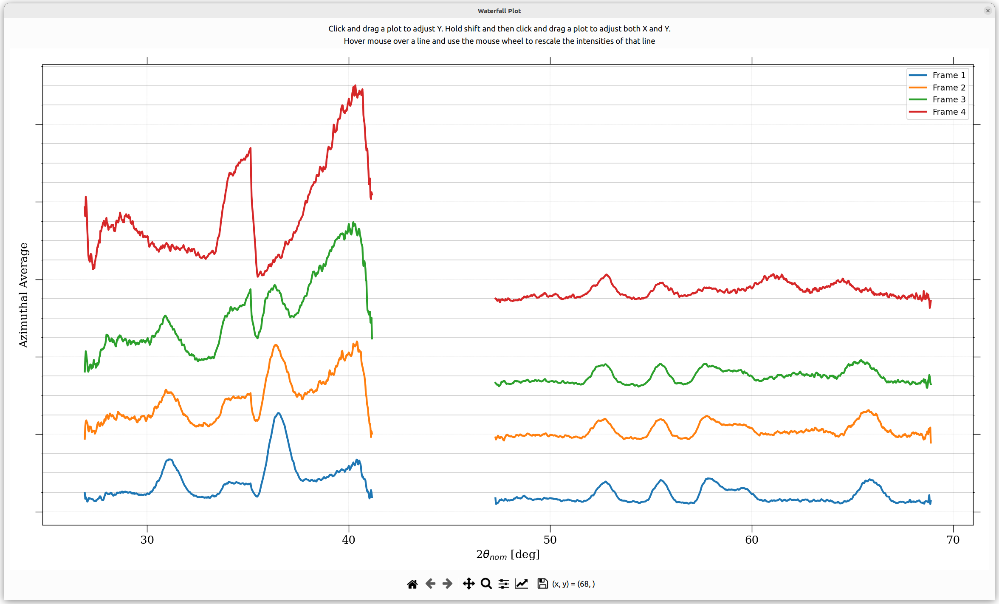

The individual plots can be moved up/down by left-clicking and dragging
them. They may also be rescaled by using the mouse wheel. And, if the plots
need to be adjusted left/right (which is rare, considering that the x-axis
will no longer match the plot), holding shift while left-clicking and
dragging can be done.

Because this particular example was not shot, the changes in this waterfall
plot are mainly due to different sources of noise (including noise in the
x-ray background and timing). However, in general, generating waterfall plots
in HEXRDGUI can provide a very helpful visualization which informs how peaks
change throughout the different time steps of FIDDLE.

Note, the `Waterfall Plot` option only appears in the GUI if there are
between 2 and 10 frames of image data.
